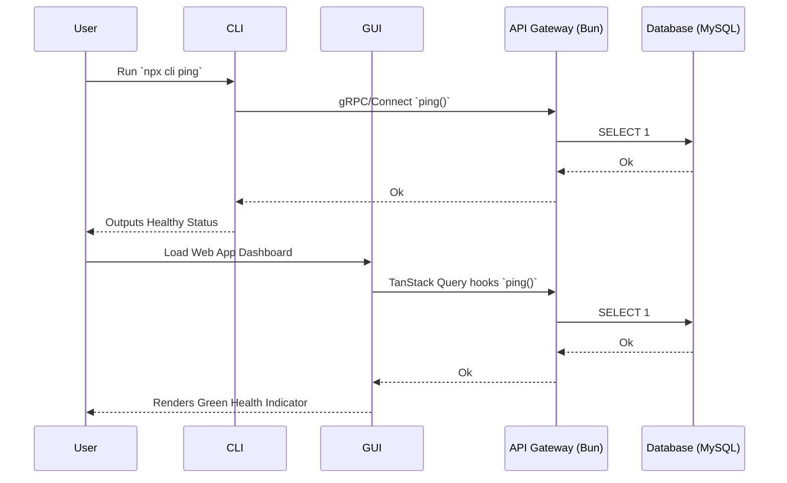

# Architecture Design — Core API & Database Foundation

## System Context & Approach
This epic introduces the core data plumbing linking the Tasker CLI, React GUI, and Bun backend in the bounded `Health` context, acting as a vertical slice tracer bullet to validate our communication stack.

## Key Component Changes
- **API (TypeSpec):** Defines the `HealthService` with a `ping()` method inside `packages/shared-contract`, emitting strictly typed `.ts` and `.go` Connect-RPC clients.
- **Database (MySQL/Drizzle):** Establishes the `apps/backend/db` connection pool and sets up the foundational `schema_migrations_test` to verify drizzle-kit connectivity against a local `docker-compose` MySQL edge.
- **Messaging (NATS):** Out of scope for this foundation slice.
- **Search (OpenSearch):** Out of scope.

## Data Flow Diagram

## Architecture Decision Records (ADRs)
- [ADR-0001: Adopting Connect-RPC over Standard REST](ADR-0001-connect-rpc.md)
- [ADR-0002: Modular Connection Pooling with Drizzle](ADR-0002-drizzle-connection.md)

## Migration & Deployment Impact
Requires DevOps/local developers to spin up a basic MySQL 8.x Docker container mapping port `3306` before running integration tests.
