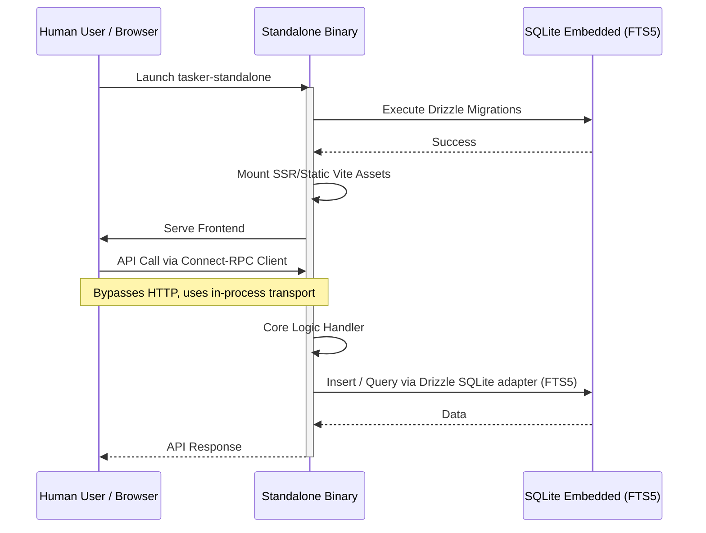

# Architecture Design — Single-Bundle Portable Deployment

## System Context & Approach
This epic introduces the capability to compile both the frontend (React/Vite) and backend (Bun/Connect-RPC) into a single standalone executable using `bun build --compile`. It provides an abstraction over the transactional and search data layers, allowing the application to conditionally use an embedded `bun:sqlite` database with the FTS5 extension instead of relying on external MySQL and OpenSearch clusters. This architectural shift significantly improves the local development experience and enables zero-config standalone deployments for end users.

## Key Component Changes
- **API (TypeSpec/Connect-RPC):** Implementation of an in-process RPC transport that bypasses `Bun.serve` and directly invokes backend handlers when executing in standalone mode, avoiding network port usage.
- **Database (MySQL/Drizzle):** Introduction of the Data Storage Abstraction layer to dynamically switch between `drizzle-orm/mysql2` (Production) and `drizzle-orm/bun-sqlite` (Standalone). Drizzle schema extended to output SQLite dialect migrations.
- **Search (OpenSearch):** Abstraction of complex text queries to utilize standard SQL `MATCH` queries mapped to SQLite FTS5 (Full-Text Search) virtual tables.
- **Bundling (Bun/Vite):** Configuration of a build pipeline combining the Vite `dist` output with the Bun backend code, packaging it inside the single executable binary (`tasker-standalone`).

## Data Flow Diagram

## Architecture Decision Records (ADRs)
- [ADR-0001: Data Storage Abstraction with bun:sqlite and FTS5](ADR-0001-database-search-abstraction.md)
- [ADR-0002: In-Process Connect-RPC Transport for Standalone Mode](ADR-0002-in-process-rpc.md)

## Migration & Deployment Impact
- **Database Migrations:** The standalone application will automatically execute SQLite dialect migrations on startup to initialize the local database schema.
- **No External Dependencies:** The resulting artifact, `tasker-standalone`, will require zero external infrastructure aside from file-system boundaries for the local `.sqlite` file.
