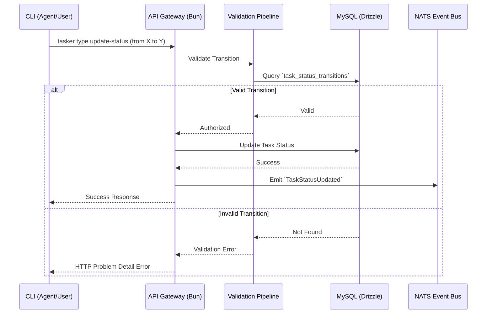

# Architecture Design — Task Types & State Machines Management

## System Context & Approach
This epic introduces highly customizable Task Types and Status State Machines to the Tasker MVP Phase 1. Leveraging the Domain-Driven Design (DDD) principles defined in `architecture.md`, the new entities (`task_types`, `task_statuses`, `task_status_transitions`) will reside within the `Tasks` Bounded Context.

State machines are evaluated backend-side using Zod before issuing database updates. Allowed transitions are strictly enforced, supporting CQRS flow where writes invoke validation logic and subsequently emit domain events.

## Key Component Changes
- **API (TypeSpec):** 
  - `createTaskType`, `updateTaskType` namespaces added.
  - RPC endpoints to fetch available statuses and transitions for a given `task_type`.
- **Database (MySQL/Drizzle):**
  - `task_types`: `id`, `org_id`, `project_id` (nullable), `name`.
  - `task_statuses`: `id`, `task_type_id`, `name`.
  - `task_status_transitions`: `id`, `task_type_id`, `from_status_id`, `to_status_id`.
- **Messaging (NATS):**
  - Publish: `TaskTypeCreated`, `TaskTypeUpdated` events published upon successful DB commit.
- **CLI Ecosystem (Human & Agent DX):**
  - New Cobra CLI group `cli schema task-type [ID]` exposing dual-surface capabilities.

## Data Flow Diagram

## Architecture Decision Records (ADRs)
- [ADR-0001: Relational State Machine Schema](ADR-0001-state-machine-schema.md)

## Migration & Deployment Impact
- **Database Migration:** Requires a new Drizzle migration to generate the three interconnected tables. Seed scripts must be updated to insert default `Epic` and `Task` types plus basic `Todo -> In Progress -> Done` states.
