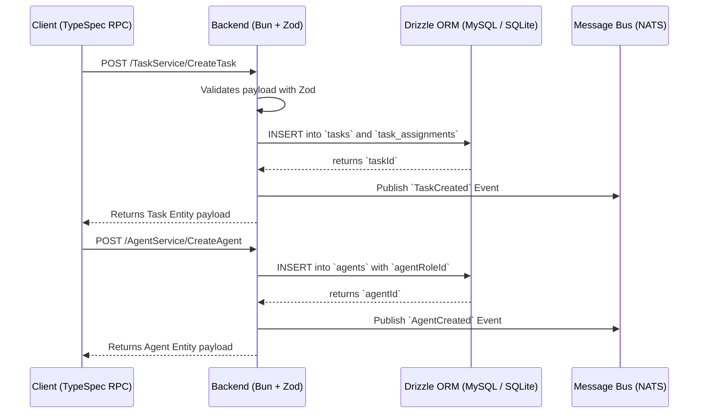

# Architecture Design — Task and Agent Management

## System Context & Approach
This epic introduces two vital bounded contexts into the backend: `Tasks` and `Agents`. It follows Domain-Driven Design (DDD) by isolating schemas, handlers, and logic inside `src/modules/tasks` and `src/modules/agents`. These entities enable the foundational interaction model where Agents process Tasks asynchronously driven by the underlying NATS event bus.

The transition from mocked prototypes to actual persistent data stores aligns with our CQRS focus: synchronous state mutability securely transacts via Drizzle on MySQL/SQLite, emitting NATS domain events (`TaskCreated`, `AgentCreated`) to downstream consumers like OpenSearch indexing and async pipelines.

## Key Component Changes
- **API (TypeSpec):** Add `TaskService` and `AgentService` definitions to `main.tsp`.
- **Database (MySQL/Drizzle):** Refine `agents`, `agent_roles`, and `tasks` tables. Add cross-reference tables `task_assignments` and `task_reviewers` to govern agent/user capabilities over specific tasks.
- **Messaging (NATS):** Introduce robust event schemas for `TaskCreated` and `AgentCreated` topics. Handlers publish these upon successful persistence.
- **Search (OpenSearch):** Events are intended to be indexed natively, though out of scope for custom UI.
- **Backend Application Router:** Mount `/src/modules/tasks/tasks.handler.ts` and `/src/modules/agents/agents.handler.ts` explicitly within the Bun router structure.

## Data Flow Diagram

## Architecture Decision Records (ADRs)
- [ADR-0001: Separate Bounded Contexts for Tasks and Agents](ADR-0001-separate-bounded-contexts.md)
- [ADR-0002: Publish CQRS NATS Events for Created Entities](ADR-0002-publish-cqrs-nats-events.md)

## Migration & Deployment Impact
Requires standard Drizzle schema migrations (`drizzle-kit generate` & `drizzle-kit push`/`migrate`). Both `sqlite` and `mysql` Drizzle instances require updates to `schema.*.ts`. Standalone compilation uses `schema.sqlite.ts` statically so ensure schemas overlap congruently.
