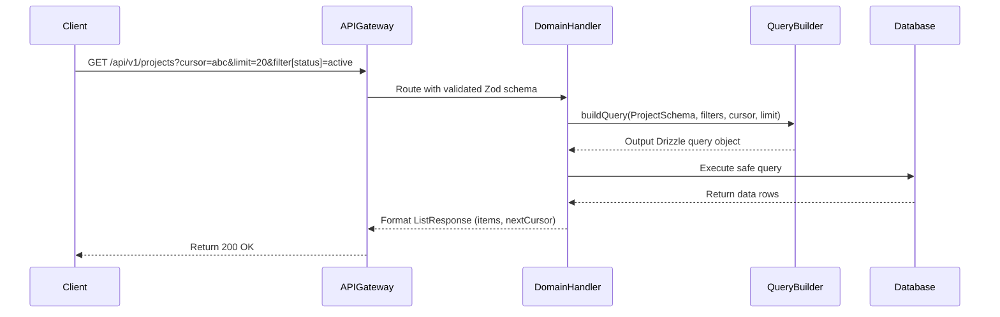

# Architecture Design — Advanced Discovery and Search

## System Context & Approach
This architecture introduces standardized, robust discovery capabilities (cursor-based pagination, dynamic sorting, and multi-field filtering) into the Tasker platform. It directly supports scalable read operations for Organizations, Projects, Tasks, Artifacts, and Comments bounded contexts without loading large datasets into memory, adhering to the CQRS principles.

## Key Component Changes
- **API (TypeSpec):** `Array<T>` returns will be updated to standard `ListResponse<T>` wrappers containing items, cursors, and metadata. `ListRequest` mixins will be defined in `main.tsp`.
- **Database (MySQL/Drizzle):** A `QueryBuilder` class/utility will replace duplicated where/orderBy/limit logic, translating API filters to Drizzle AST seamlessly while preventing SQL injections.
- **Messaging (NATS):** No structural changes; basic listing is synchronous via API Gateway to Read models.
- **Search (OpenSearch):** Not required for this phase.

## Data Flow Diagram

## Architecture Decision Records (ADRs)
- [ADR-0001: Standardized Cursor Pagination](ADR-0001-cursor-pagination.md)
- [ADR-0002: General Query Builder Implementation](ADR-0002-query-builder.md)

## Migration & Deployment Impact
Existing endpoints that return simple arrays will be a breaking change to consumers expecting arrays. Consumer applications (GUI/CLI) must be concurrently updated to parse `items` and `nextCursor` properties. Database indexes may need to be added to support common sort/filter columns.
