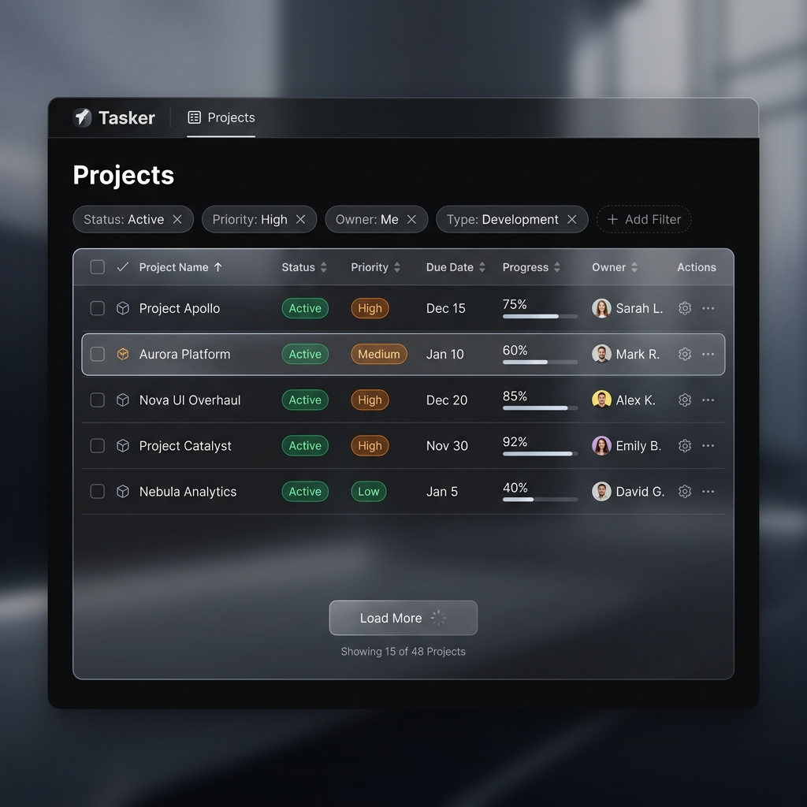
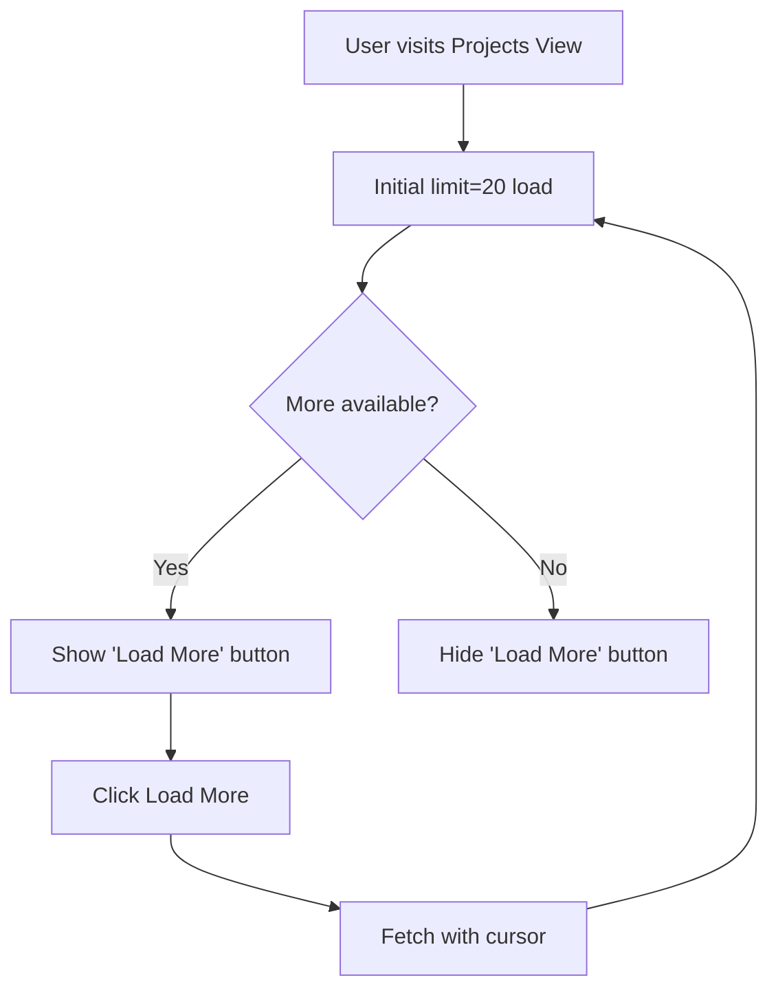
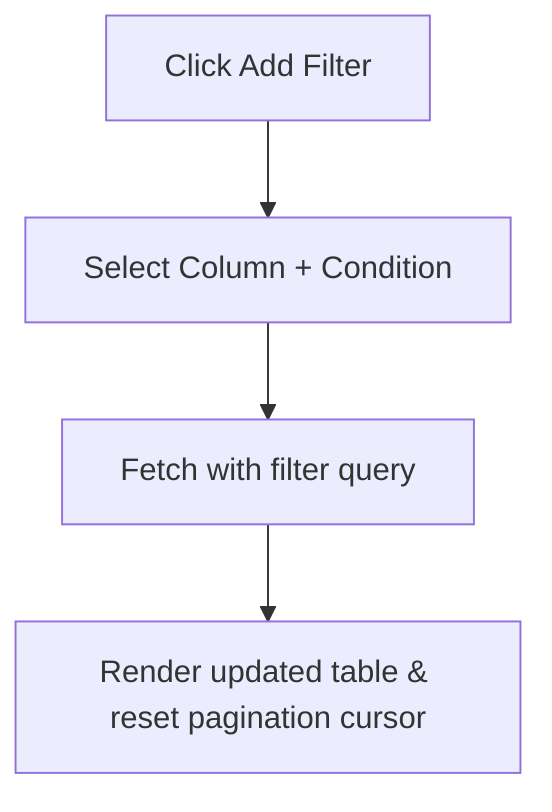

# UX Design — Advanced Discovery and Search

## Design Context
This provides high-fidelity designs for the new cursor-based paginated data tables that support dynamic sorting and multi-field filtering across Tasker. It follows the Tasker global dark mode styling and addresses enterprise requirements for scaling to thousands of results smoothly.

## Screen Inventory

### 1. Paginated Project List Table
- **Purpose:** Allow users to browse projects efficiently without loading massive lists into memory.
- **Key Elements:** Filter row, sortable column headers, generic table rows, and the "Load More" cursor control.
- **States:** Default | Loading | Empty | Error | Success
- **Accessibility Notes:** Filters are navigable via standard tab indexing.
- **Component Mapping:** `DataTable`, `FilterChips`, `LoadMoreButton`
- **Mockup:**
  

## UX Flows

### Primary Flow: Paginated Navigation

### Secondary Flow: Filtering

## Interaction Specifications
| Element | Trigger | Action | Feedback |
|---------|---------|--------|----------|
| Column Header | Click | Sort by ASC/DESC | Sort arrow changes direction, data reloads |
| Filter Chip [X] | Click | Removes filter | Table refreshes without filter parameter |
| Load More | Click | Fetches next page | Loading spinner icon replaces text |

## Responsive Considerations
On mobile, table columns beyond the most critical 2-3 are hidden. Filters appear inside an accordion or modal dialog.
