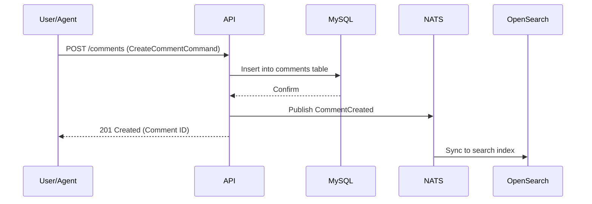

# Architecture Design — Comments and Markdown Support

## System Context & Approach
This epic introduces a unified commenting and markdown rendering system across Tasker. It follows the existing Domain-Driven Design (DDD) by creating a distinct `Comments` bounded context or extending `Tasks` and `Artifacts`. It utilizes CQRS for high-throughput AI inputs while ensuring non-blocking reads for users via NATS to OpenSearch syncing.

## Key Component Changes
- **API (TypeSpec):** Add `Comment` models and endpoints (`POST /comments`, `GET /comments`). Polymorphic mapping via `target_type` (Task|Artifact) and `target_id`. Add endpoints for AI internal text notes attached to Tasks.
- **Database (MySQL/Drizzle):** Add a `comments` table. Add a `task_notes` table for dedicated AI reasoning streams.
- **Messaging (NATS):** Emit `CommentCreated`, `CommentUpdated`, `CommentDeleted`, and `TaskNoteAppended` events.
- **Search (OpenSearch):** Index comments to enable full-text search across all conversations in the system.

## Data Flow Diagram

## Architecture Decision Records (ADRs)
- [ADR-0001: Polymorphic Comments vs Distinct Tables](ADR-0001-polymorphic-comments.md)
- [ADR-0002: Distinct AI Notes vs Specific Comment Type](ADR-0002-distinct-ai-notes.md)

## Migration & Deployment Impact
Requires Drizzle migrations for new `comments` and `task_notes` tables. No complex data migrations since these are new features.
