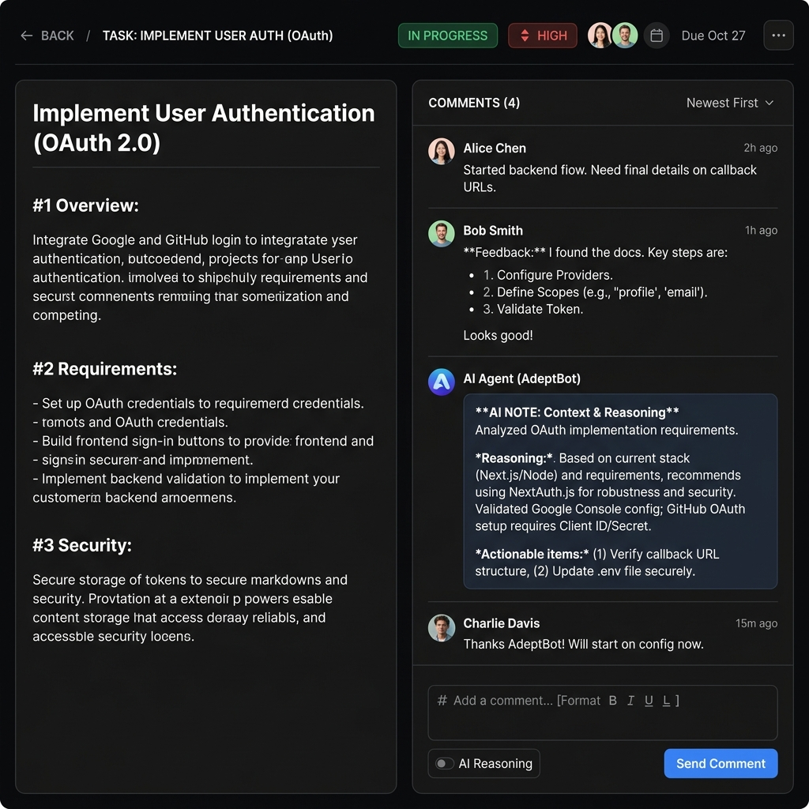
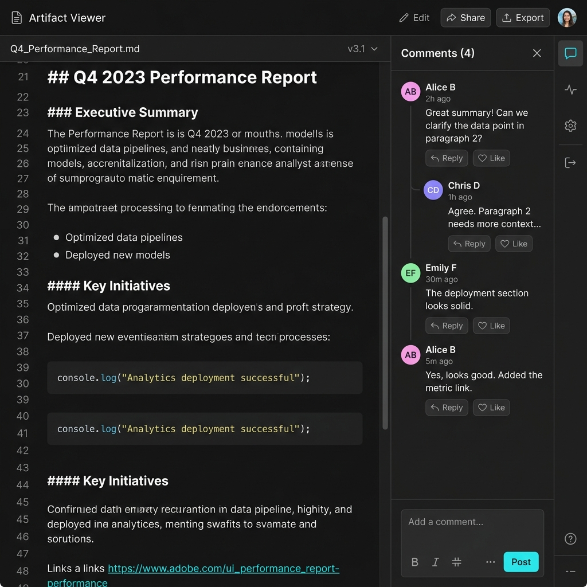
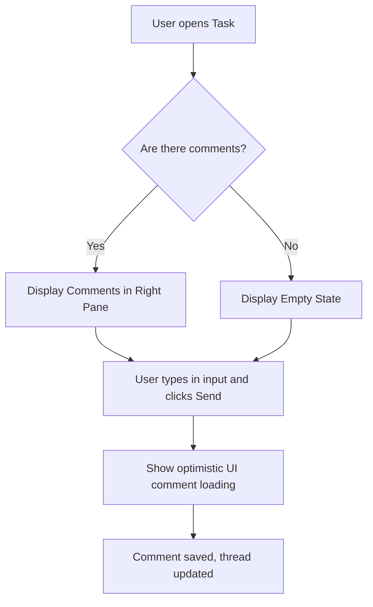

# UX Design — Comments and Markdown Support

## Design Context
This design introduces threaded commenting and markdown rendering to the Task Details and Artifact Viewer screens. It targets both human users (need rich text, avatars) and AI Agents (need distinct visual styling for reasoning outputs).

## Screen Inventory

### 1. Task Detail Comments
- **Purpose:** Allow humans and agents to discuss tasks. Display AI reasoning distinctively.
- **Key Elements:** Markdown renderer for description, right-side comment pane, AI reasoning distinct background/styling, rich text input.
- **States & Storybook:** Default, Empty (no comments), Loading (submitting comment), Error (submission failed).
- **Accessibility Notes:** Focus ring on the comment input. Screen reader announcements for new comments. High contrast for AI vs human text distinction.
- **Component Mapping:** `Card`, `Avatar`, `Button`, `Textarea` from Shadcn.
- **Mockup:**
  

### 2. Artifact Viewer Comments
- **Purpose:** Contextual discussion specifically placed alongside artifacts.
- **Key Elements:** Main document viewer (Markdown), sliding drawer/panel on the right.
- **States & Storybook:** Open Panel, Closed Panel, Single Comment, Thread.
- **Accessibility Notes:** Panel state must toggle `aria-expanded` and trap focus appropriately if it acts as a modal, though as a side-panel it should seamlessly float.
- **Component Mapping:** `Sheet` (for sliding panel), `ScrollArea`.
- **Mockup:**
  

## UX Flows

### Primary Flow: Viewing and Adding a Comment

## Interaction Specifications
| Element | Trigger | Action | Feedback |
|---------|---------|--------|----------|
| Comment Input | Click / Focus | Expand input box | Box gains primary ring color |
| Send Button | Click | Submits comment | Optimistic UI renders comment immediately with disabled state |

## Agentic Behavior & Feedback
- **Transparency:** AI Notes are distinctly badged and colored differently than human comments to build trust and clearly separate agent reasoning from human input.
