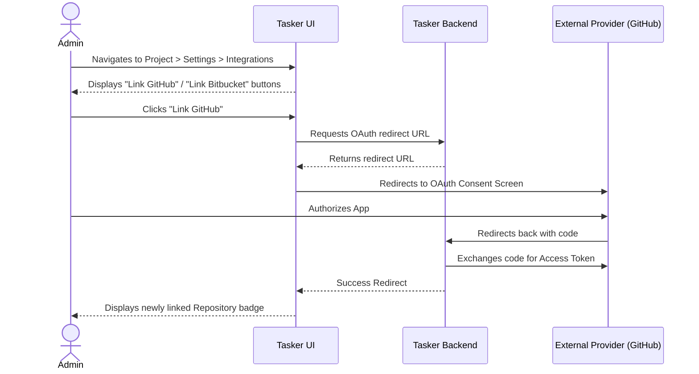
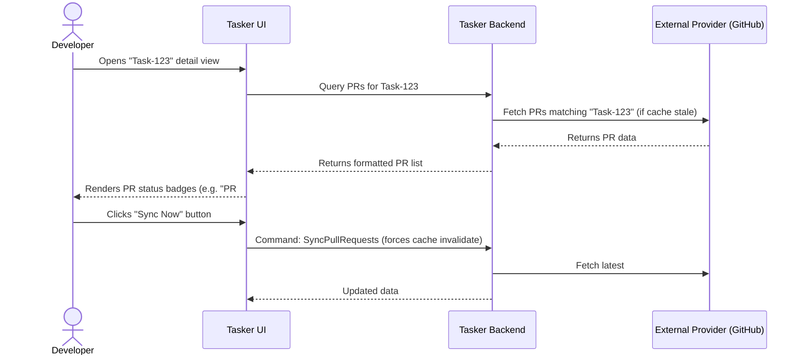

# UX Design: Repository Integration and Auth

## Overview
This document outlines the user experience for linking external repositories (GitHub/Bitbucket) to Tasker Projects, and how synced Pull Requests are surfaced within the Task Workbench.

## 1. User Flows

### Flow A: Linking a Repository to a Project
Users with `Project Admin` roles can link repositories.



### Flow B: Syncing and Viewing Pull Requests
Tasks display live badges reflecting the remote PR states.



## 2. Mockups

### Screen 1: Project Integration Settings
**Path**: `/projects/{projectId}/settings/integrations`

```html
<div class="flex flex-col gap-6">
  <h2 class="text-xl font-bold">Integrations</h2>
  <p class="text-muted-foreground text-sm">Connect your project to external version control systems to automatically track code deployments.</p>

  <div class="border rounded-md p-4 flex items-center justify-between">
    <div class="flex items-center gap-4">
      <div class="w-10 h-10 rounded-full bg-secondary flex items-center justify-center">
        <!-- GitHub Icon -->
      </div>
      <div>
        <h3 class="font-semibold">GitHub</h3>
        <p class="text-xs text-muted-foreground">Status: <span class="text-green-500">Connected to org/repo</span></p>
      </div>
    </div>
    <button class="px-4 py-2 text-sm font-medium border text-destructive border-destructive rounded-md hover:bg-destructive/10">
      Unlink
    </button>
  </div>

  <div class="border rounded-md p-4 flex items-center justify-between">
    <div class="flex items-center gap-4">
      <div class="w-10 h-10 rounded-full bg-secondary flex items-center justify-center">
        <!-- Bitbucket Icon -->
      </div>
      <div>
        <h3 class="font-semibold">Bitbucket</h3>
        <p class="text-xs text-muted-foreground">Status: Not Connected</p>
      </div>
    </div>
    <button class="px-4 py-2 text-sm font-medium bg-primary text-primary-foreground rounded-md hover:bg-primary/90">
      Connect
    </button>
  </div>
</div>
```

### Screen 2: Task Details (PR Badges)
**Path**: `/tasks/{taskId}`

```html
<div class="flex flex-col gap-4 w-full md:w-80 border-l p-4 bg-background">
  <h3 class="font-semibold text-sm">Development</h3>
  
  <div class="flex items-center justify-between">
    <span class="text-xs text-muted-foreground">Pull Requests</span>
    <button class="text-xs text-primary hover:underline">Sync Now</button>
  </div>

  <div class="flex flex-col gap-2">
    <!-- PR Status: Merged -->
    <a href="https://github.com/..." class="group flex items-center gap-2 p-2 border rounded-md hover:bg-secondary transition-colors">
      <span class="w-2 h-2 rounded-full bg-purple-500"></span>
      <div class="flex flex-col">
        <span class="text-sm font-medium group-hover:underline">feat: repository integration (#42)</span>
        <span class="text-xs text-muted-foreground">Merged 2 hours ago</span>
      </div>
    </a>

    <!-- PR Status: Open -->
    <a href="https://github.com/..." class="group flex items-center gap-2 p-2 border rounded-md hover:bg-secondary transition-colors">
      <span class="w-2 h-2 rounded-full bg-green-500"></span>
      <div class="flex flex-col">
        <span class="text-sm font-medium group-hover:underline">fix: sync worker tests (#45)</span>
        <span class="text-xs text-muted-foreground">Open</span>
      </div>
    </a>
  </div>
</div>
```

## 3. Micro-interactions
- **Syncing State**: While "Sync Now" is executing, the button should transform into a spinning loader icon, and the PR list should gracefully display skeletons until the fresh data arrives to prevent CLS.
- **Hover States**: The PR badge should subtly highlight its background (`hover:bg-secondary`) to indicate it acts as an external link to the provider.
