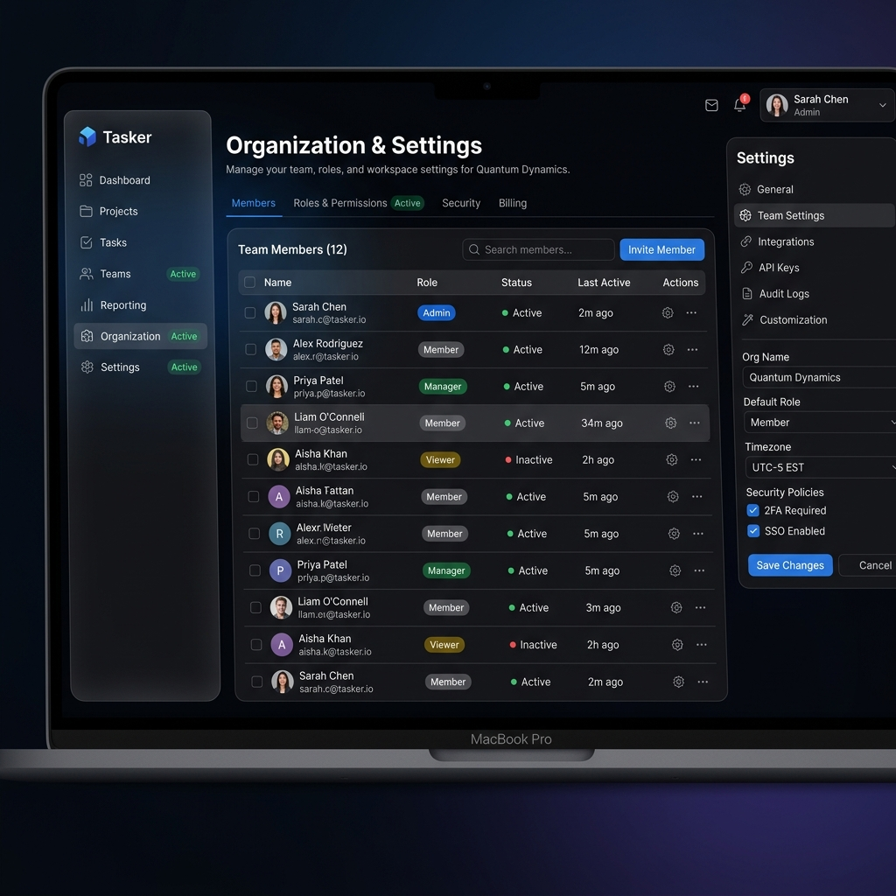
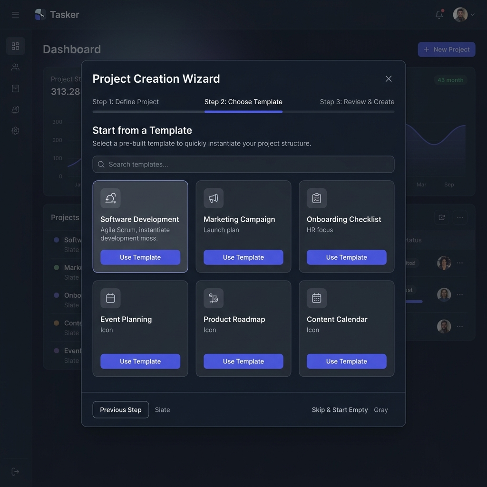
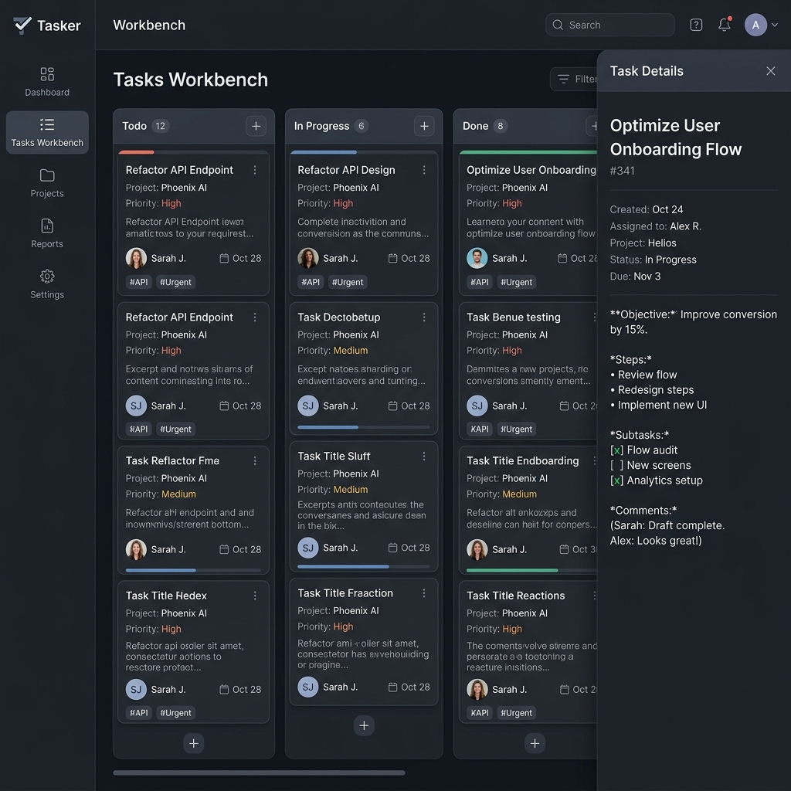
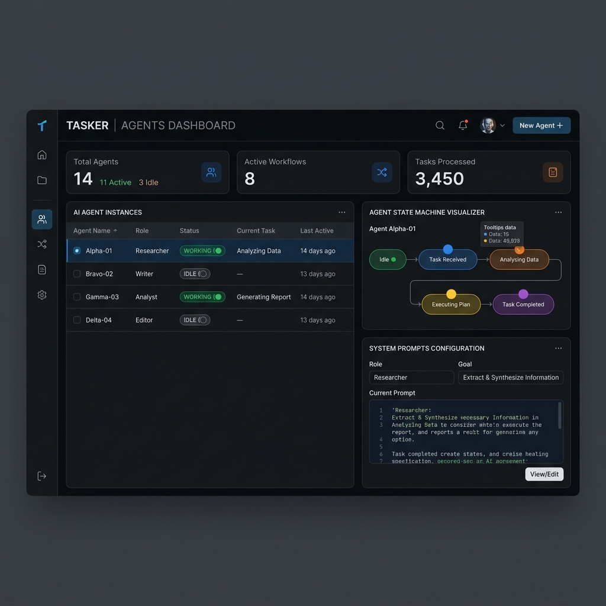
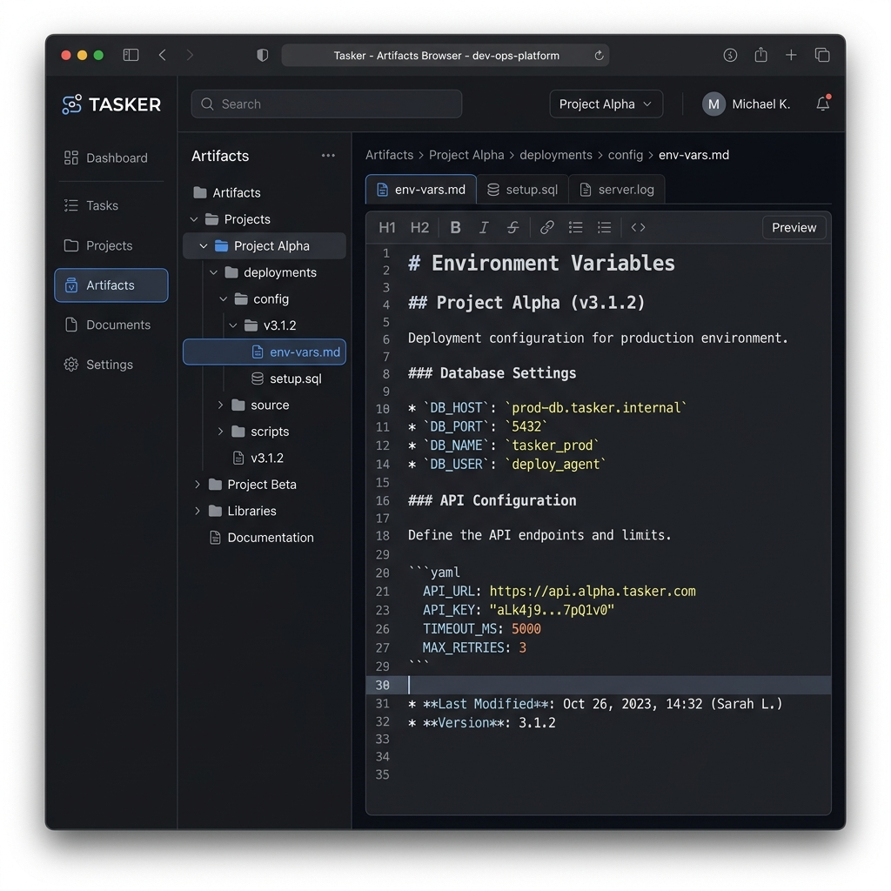
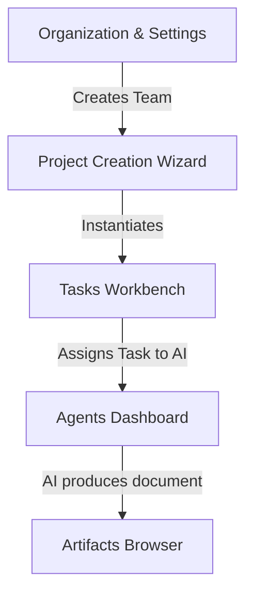
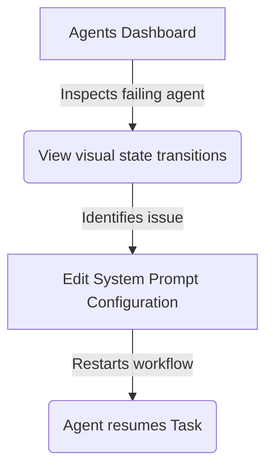

# UX Design — Core Application UI/UX Implementation

## Design Context
Tasker is the foundational task-and-knowledge infrastructure for autonomous AI and human collaboration. This specific design package replaces the existing `GenericPlaceholder` components with specialized layouts for Organizations, Projects, Tasks, Agents, and Artifacts. The visual style follows the Shadcn UI library, strictly adhering to the defined Dark Mode aesthetic to ensure a premium, modern experience.

## Screen Inventory

### 1. Organization & Settings
- **Purpose**: Manage organization details, team member access, roles, and global preferences.
- **Key Elements**: Left navigation sidebar, table list of team members, roles/permissions tab, top-level profile dropdown.
- **States & Storybook**: Default, Loading, Empty.
- **Accessibility Notes**: Ensure table supports keyboard navigation. Use aria-labels for actions like "Invite Member".
- **Component Mapping**: `Sidebar`, `Table`, `Badge`, `DropdownMenu`, `Button`.
- **Mockup**:
  

### 2. Project Creation Wizard
- **Purpose**: Allow humans to instantiate new projects effectively using pre-defined foundational templates.
- **Key Elements**: Multi-step modal indicator, grid of template cards (Software Development, Marketing Campaign, etc.), action buttons.
- **States & Storybook**: Step 1 (Define), Step 2 (Choose Template), Step 3 (Review).
- **Accessibility Notes**: Focus trapping within the modal. Clear announcements of step progression.
- **Component Mapping**: `Dialog`, `Card`, `Progress/Stepper`.
- **Mockup**:
  

### 3. Tasks Workbench
- **Purpose**: High-density workspace to manage, view, and organize tasks across various states.
- **Key Elements**: Kanban columns (Todo, In Progress, Done), dense task cards with avatars and tags, slide-out side panel for rich markdown details.
- **States & Storybook**: Dragging state, Empty column, Expanded detail panel.
- **Accessibility Notes**: Drag and drop should have keyboard accessible handles.
- **Component Mapping**: `ScrollArea`, `Sheet` (for details), custom `DraggableCard`.
- **Mockup**:
  

### 4. Agents Dashboard
- **Purpose**: Monitor AI agent instances, their current activities, and configure system prompts.
- **Key Elements**: Key metrics overview, data table of instances with status indicators (Working, Idle), visual state machine graph (React Flow), prompt editor.
- **States & Storybook**: Active workflow running, Agent idle, State machine transition animation.
- **Accessibility Notes**: State machine visualizer requires alternative text descriptions for nodes.
- **Component Mapping**: `Table`, `Badge`, `ReactFlowCanvas`, `Textarea` (for prompt).
- **Mockup**:
  

### 5. Artifacts Browser
- **Purpose**: Browse and edit raw project assets and markdown files in a classic IDE-like layout.
- **Key Elements**: Nested folder tree explorer (left panel), multi-tab editor view (right panel) with rich text markdown markdown viewing.
- **States & Storybook**: Tree expanded/collapsed, File selected (Preview mode), File unsaved.
- **Accessibility Notes**: Tree view keyboard navigation (arrows to expand/collapse).
- **Component Mapping**: `ResizablePanelGroup`, `Tree`, `Tabs`, `MarkdownEditor`.
- **Mockup**:
  

## UX Flows

### Primary Flow: Core Setup & Task Engagement

### Secondary Flow: Agent Monitoring & Tuning

## Interaction Specifications
| Element | Trigger | Action | Feedback |
|---------|---------|--------|----------|
| Task Card | Click | Opens detail slide-out sheet | Slide-in animation from right |
| Template Card | Click | Selects template and advances step | Highlight border, subtle scale |
| State Node | Hover | Shows tooltip of data passing | Quick fade-in tooltip |
| Tree Folder | Click | Expands/collapses children | Smooth slide down/up |

## Agentic Behavior & Feedback
- **Transparency**: The Agents Dashboard visibly displays the current executing task and real-time state machine paths.
- **Trust & Overrides**: In the Tasks Workbench, humans can intercept agent assignments, manually pause them, or overwrite markdown artifacts in real-time.
- **Feedback Loops**: Explicit comments on task threads provide steering commands to agents.

## Responsive Considerations
- **Desktop (Primary)**: Full-width interfaces utilizing multi-panel layouts (e.g., list on left, details on right).
- **Mobile/Tablet**: Sidebars collapse into Hamburger menus. Task details switch from side-sheets to full-screen modals. Trees condense.

## Open Design Questions
- Does React Flow require custom nodes or can we utilize standard Shadcn components injected into the nodes?
