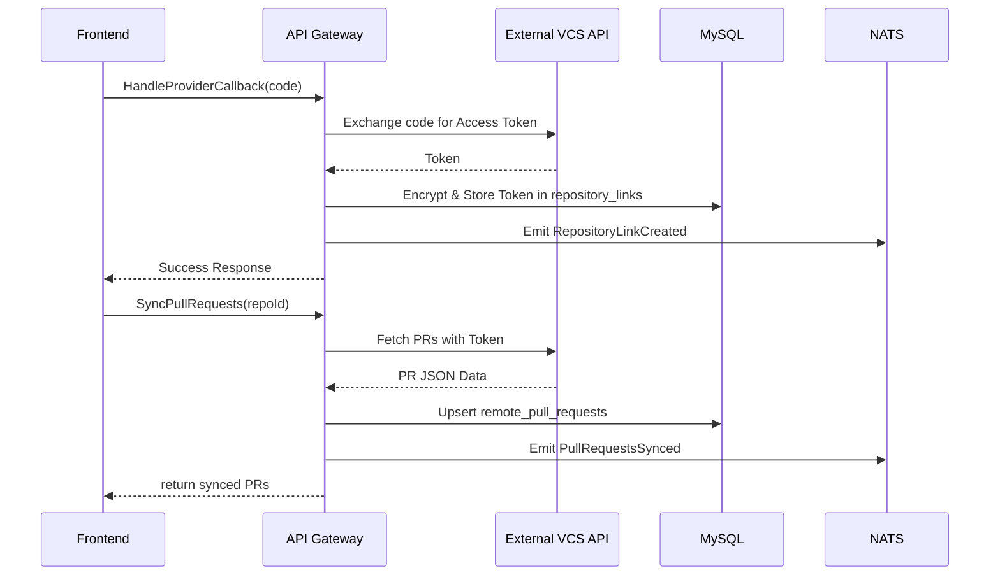

# Architecture Design — Repository Integration and Auth

## System Context & Approach
This epic introduces the `Repositories` Bounded Context, focused on linking Tasker Projects securely with external version control platforms (GitHub, Bitbucket Cloud). It integrates with the established `Projects` and `Tasks` contexts by importing remote state (specifically Pull Requests) into Tasker for read-only consumption. The integration strictly adheres to the CQRS paradigm: user sync requests or background polling invoke commands that update the MySQL database with PR metadata, subsequently emitting Domain Events to keep OpenSearch synced, shielding core transactional flows from external API latency.

## Key Component Changes
- **API (TypeSpec/Connect-RPC):**
  - `RepositoriesService`
    - `AddRepositoryLink(projectId, provider, remoteRepoName)`
    - `ListRepositoryLinks(projectId)`
    - `SyncPullRequests(repositoryId)`
  - `OAuth2SecondaryService` (or added flow)
    - `InitProviderAuth(provider, returnUrl)`
    - `HandleProviderCallback(provider, code)`
- **Database (MySQL/Drizzle):**
  - **New tables:** `repository_links` (id, project_id, provider, remote_name, access_token), `remote_pull_requests` (id, repo_link_id, remote_pr_id, title, status, url).
  - AES encryption must be handled seamlessly for `access_token` fields at the application boundary prior to DB insertion.
- **Messaging (NATS):**
  - Emits `RepositoryLinkCreated`
  - Emits `PullRequestsSynced` (used to update OpenSearch indices for Tasks displaying PR badges)
- **Search (OpenSearch):**
  - Index `remote_pull_requests` to provide PR-Task relationship queries efficiently.

## Data Flow Diagram

## Architecture Decision Records (ADRs)
- [ADR-0001: OAuth Token Storage and Encryption](ADR-0001-oauth-token-encryption.md)
- [ADR-0002: Remote API Sync Strategy](ADR-0002-remote-api-sync-strategy.md)

## Migration & Deployment Impact
- Database schema migration required to introduce `repository_links` and `remote_pull_requests`.
- Node/Bun environment configuration must be updated with `GITHUB_CLIENT_ID`, `GITHUB_CLIENT_SECRET`, `BITBUCKET_CLIENT_ID`, and `BITBUCKET_CLIENT_SECRET` before deployment.
