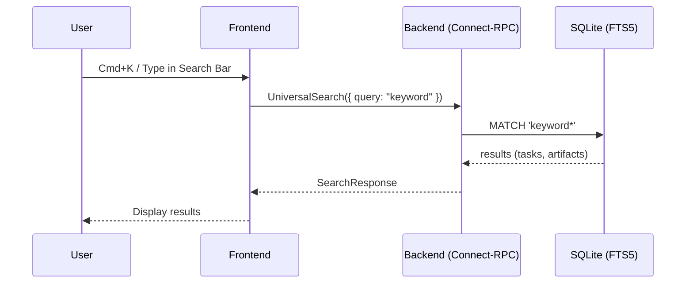

# Architecture: Universal Search

## High-Level Approach
We will expose a new `UniversalSearch` Connect-RPC method.
The backend will use `bun:sqlite` with the `fts5` extension for fast full-text search without requiring OpenSearch locally. We will query the full text search indices for both `artifacts` and `tasks`.

## Sequence Diagram

