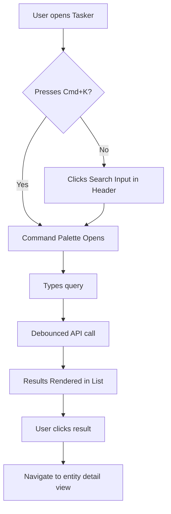

# UX Design: Universal Search

## Key Screens
1. **Global Navigation Bar / Command Palette**:
   - A search input globally accessible (e.g., via Cmd+K).
   - Dropdown or modal listing results grouped by Tasks and Artifacts.
   - Highlighting matched keywords.
   - Distinct icons for Tasks vs Artifacts.

## User Flow

