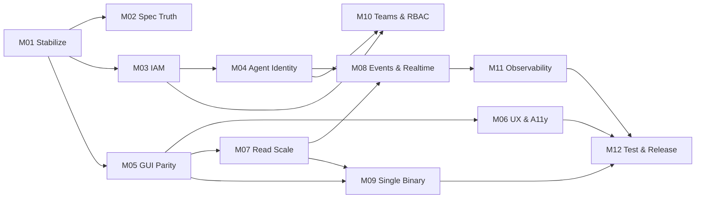

# Delivery State

> **Read this file first.** It is the single entry point for any agent or human
> resuming delivery. It is committed to git, so the state of the work travels
> with the repository and survives the end of any session.

## Now

- **Milestone**: M01 — Stabilize the Build
- **Task**: M01-T04 — Make the health probe read-only
- **Branch**: `feature/m01-stabilize-the-build`
- **Command to continue**: `/milestone-deliver M01`

## How to resume

1. Read this file.
2. Read `.milestones/MILESTONE-<active>/MILESTONE.md` for the plan.
3. Read that milestone's `PROGRESS.md` — the last entry names the task in
   flight and why it was left there.
4. Run `/milestone-deliver` (interactive) or `/milestone-deliver-auto`
   (autonomous). Both pick up from the first unchecked task.

If `blocked: true`, read `blocker` above and resolve it before continuing.

## Milestone ledger

| ID  | Milestone                      | Status | Depends on | Tasks | Done |
|-----|--------------------------------|--------|------------|-------|------|
| M01 | Stabilize the Build            | in-progress | —     | 13    | 3    |
| M02 | Specification Truth            | todo   | M01        | 7     | 0    |
| M03 | IAM Correctness & Scale        | todo   | M01        | 14    | 0    |
| M04 | Agent Identity & M2M Tokens    | todo   | M03        | 12    | 0    |
| M05 | GUI / API Parity               | todo   | M01        | 12    | 0    |
| M06 | UX, Design System & A11y       | todo   | M05        | 13    | 0    |
| M07 | Read-Path Scale                | todo   | M05        | 11    | 0    |
| M08 | Events, Audit & Real-Time      | todo   | M04, M07   | 11    | 0    |
| M09 | Portable Single Binary         | todo   | M05, M07   | 9     | 0    |
| M10 | Teams & Policy-Based RBAC      | todo   | M03, M04   | 13    | 0    |
| M11 | Observability & Deployability  | todo   | M08        | 12    | 0    |
| M12 | Test Depth & Release           | todo   | M06,M09,M11| 11    | 0    |

**Total: 138 tasks across 12 milestones.**

## Dependency graph

Milestones with no dependency edge between them may run in parallel on separate
branches. M02 is intentionally cheap and unblocking — it can run alongside
anything.

## Handoff notes

_Nothing yet. The first `/milestone-deliver` run writes here._
