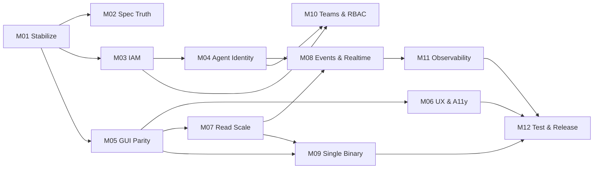

# Delivery State

> **Read this file first.** It is the single entry point for any agent or human
> resuming delivery. It is committed to git, so the state of the work travels
> with the repository and survives the end of any session.

## Now

- **Milestone**: M04 — Agent Identity & M2M Tokens
- **Task**: M04-T04 — token resolution in the interceptor
- **Branch**: `feature/m03-iam-correctness-and-scale` — M03 is complete on it but
  **not yet merged to `main`**. Merge it before branching M04, which builds on
  M03's authorization work.
- **Command to continue**: `/milestone-deliver M04`

M03 closed 16/16 tasks and 8/8 exit criteria. M04 (unblocked by M03), M05 and
M10 (needs M04) are the frontier; M04 and M05 can run in parallel on separate
branches.

## How to resume

1. Read this file.
2. Read `.milestones/MILESTONE-<active>/MILESTONE.md` for the plan.
3. Read that milestone's `PROGRESS.md` — the last entry names the task in
   flight and why it was left there.
4. Run `/milestone-deliver` (interactive) or `/milestone-deliver-auto`
   (autonomous). Both pick up from the first unchecked task.

If `blocked: true`, read `blocker` above and resolve it before continuing.

## Milestone ledger

| ID  | Milestone                      | Status | Depends on | Tasks | Done |
|-----|--------------------------------|--------|------------|-------|------|
| M01 | Stabilize the Build            | done   | —          | 14    | 14   |
| M02 | Specification Truth            | done   | M01        | 7     | 7    |
| M03 | IAM Correctness & Scale        | done   | M01        | 16    | 16   |
| M04 | Agent Identity & M2M Tokens    | in-progress | M03   | 12    | 4    |
| M05 | GUI / API Parity               | todo   | M01        | 12    | 0    |
| M06 | UX, Design System & A11y       | todo   | M05        | 13    | 0    |
| M07 | Read-Path Scale                | todo   | M05        | 11    | 0    |
| M08 | Events, Audit & Real-Time      | todo   | M04, M07   | 11    | 0    |
| M09 | Portable Single Binary         | todo   | M05, M07   | 9     | 0    |
| M10 | Teams & Policy-Based RBAC      | todo   | M03, M04   | 13    | 0    |
| M11 | Observability & Deployability  | todo   | M08        | 12    | 0    |
| M12 | Test Depth & Release           | todo   | M06,M09,M11| 11    | 0    |

**Total: 141 tasks across 12 milestones — 37 done (M01 14, M02 7, M03 16).**

## Dependency graph

Milestones with no dependency edge between them may run in parallel on separate
branches. M02 is intentionally cheap and unblocking — it can run alongside
anything.

## Handoff notes

**2026-08-15 — M03 IAM Correctness & Scale closed (16/16 tasks, 8/8 exit criteria).**

An administrator can now operate an organization of 100,001 members: page it,
search it by name or email, filter by role, change roles, remove people safely,
and manage invitations — all inside 200 ms server-side and at 60 fps in the
browser. A viewer genuinely cannot write. Five things a next session would
otherwise rediscover the hard way:

1. **`db.transaction(async …)` is a no-op on bun:sqlite.** Drizzle hands the
   callback to `client.transaction(fn)`, which commits as soon as `fn`
   *returns* — and an async callback returns a promise immediately, so COMMIT
   lands before the first statement runs. This was not theory: `purgeOrg` left
   half-deleted organizations, and eight concurrent `createTask` calls all
   returned `ENG-1`. Both sites are now dialect-split — the SQLite branch is
   **fully synchronous** (`.run()`/`.all()`, no `await` anywhere inside, not even
   `await 0`, which defers past the commit); MySQL keeps the awaited form with
   `SELECT … FOR UPDATE`. Both occurrences were found by accident. A third would
   look identical: correct-reading code, a green suite, wrong behaviour only
   under concurrency. **Flagged for M12**: a lint rule or a wrapper that refuses
   an async callback on the sqlite driver.
2. **bun:sqlite silently discards errors from every statement after the first**
   in one multi-statement `run()`. Drizzle runs one chunk per `run()`, so a
   migration guard sharing a chunk with anything before it is decorative — the
   abort in `0021_scope_agent_roles_to_org.sql` was, until each statement got its
   own chunk. And drizzle splits on the literal `--> statement-breakpoint`
   *wherever it appears, including inside a comment*, which produces a
   comment-only chunk that fails as invalid SQL. Do not write that marker in
   prose.
3. **`viewer-denial.test.ts` is a build gate, not a test file.** It enumerates
   every RPC on every handler and denies by default, with an explicit read
   allowlist; a completeness test fails naming any method it does not recognise.
   Adding an RPC without classifying it breaks the build — which is how
   `listInvitations`/`revokeInvitation` were caught unguarded, unprompted. When
   you add an endpoint in M04, expect this to fail first; that is it working.
4. **A `requestAnimationFrame` delta of ~16.7 ms is 60 fps**, not a budget
   violation. Exit criterion 2's literal "16 ms frame budget" is unsatisfiable by
   any page including a blank one (measured: p50 16.70 ms). Judge dropped frames
   at ~25 ms (two vsyncs), and always run the empty-page control beside the
   measurement — on this GPU-less WSL2 box it is the only thing separating the
   component's cost from the environment's. The members table went 14.6% → 0.0%
   dropped by removing `measureElement` from fixed-height rows and memoising the
   row component. Note that memo is silently reversible: passing an inline arrow
   as a row callback restores the old cost with no test failing.
5. **`moon` caches on declared `inputs`, and a missing one is invisible.**
   `shared-contract:compile` omitted the `.proto` that buf actually reads, so
   contract edits did not invalidate it. Likewise `cli:format` could never fail,
   because `gofmt -l` lists files and exits 0 — unformatted Go went through it
   during this milestone. Both fixed, and both were found by injection rather
   than by reading. Prove a new gate fails before trusting it.

**The contract is two hand-maintained files.** TypeSpec (`main.tsp`) *and*
`packages/shared-contract/tasker/health/v1/health.proto` — buf generates from the
latter and `buf.yaml` excludes `tsp-output`. 195 messages in each, kept in sync
by hand. Every contract change in M04 must edit both.

**Deliberately deferred, with owners**: audit history for invitation revocations
(**M08**); the viewer-visible-but-disabled control question (**M06** — M03 chose
to leave members-table controls active and let the server refuse, but hid the
invitations section entirely, and the two design notes record why they differ);
frame timing as a CI gate and the async-sqlite-transaction lint rule (**M12**).

Still open from M02 and unchanged: `/settings` renders a placeholder nothing
links to (**M05**), and `search_index` is a contentless FTS5 table with no
writer (**M07**).

**The `Real Integration Tests` workflow's documented cause was wrong.** Every
handoff note since M01 has said it fails for want of `GITHUB_TEST_TOKEN` /
`GITHUB_TEST_REPO`. The run on this merge prints `HAS_TOKEN: true` and
`GITHUB_TEST_REPO: huyz0/tasker-test-sandbox` — the secrets are configured and
have been. The actual failure is 3 tests in
`repositories.integration.test.ts`, identical before and after M03 (0 pass /
3 fail in both), throwing `Repository link not found` from
`getRepositoryLinkOrgId`. Cause: nothing on that path sets `STANDALONE`.
`integration.yml` sets only `TASKER_REAL_INTEGRATION` / the two GitHub vars,
`moon run backend:test-integration` runs `bun test <file>` directly, and that
file does not import `src/test/setup.ts` (which is where `STANDALONE=true` is
set for the normal suite). So `isStandalone()` is false, `authz.ts` resolves the
**MySQL** schema objects, and the test's mock db — which compares
`table === schemaSqlite.repositoryLinks` by identity — matches nothing and
returns no rows. Likely a one-line `STANDALONE: "true"` in the workflow env,
unverified because reproducing it needs the sandbox token. Not fixed here: it is
outside M03 and I could not verify the fix. **Do not spend time chasing the
secrets.**

Verified at close: `moon check --all` 23 tasks pass · backend 444 pass / 7 skip ·
GUI suite green at 95.27% branch coverage · `gui:e2e` 13 pass ·
`bun run measure:members` PASS at 1k/10k/100k.

**2026-08-15 — M02 Specification Truth closed (7/7 tasks, 5/5 exit criteria).**

`.specs/` now describes the system that exists. What changed, and the three
things a next session would otherwise rediscover the hard way:

1. **`moon run :spec-drift` is a gate now** (`moon check --all` is 23 tasks;
   CI Workspace job runs it). It compares every manifest identifier against the
   **In Use** tables of `tech-stack.md`, both directions, and has 21 tests.
   Adding a dependency without a table row fails the build — verified by
   injecting `date-fns`. Prose does not count: the check reads table cells, and
   four of the seven drifts it found on its first run were entries the document
   described in prose the tables did not carry.
2. **Do not conclude "unused" from a missing import.** M02-T01 marked
   `better-sqlite3` and `@storybook/addon-onboarding` as removal candidates on
   that reasoning. Both are load-bearing: `drizzle-kit` does
   `import("better-sqlite3")` inside its own bundle for the sqlite dialect and
   declares it as no kind of peer, and the addon is registered at
   `apps/gui/.storybook/main.ts:13`. Removing the first would have broken
   `drizzle-kit push --config drizzle.sqlite.config.ts`.
3. **`api-standard.md` was rewritten and its previous contents are void.** It
   described REST — resource URIs, HTTP verb semantics, `/api/v1/` versioning, a
   `{ data, meta }` envelope — for a system that serves contract-first
   Connect-RPC. It is auto-injected for API work by `AGENTS.md` §3, so any past
   session that added an endpoint was reading the wrong architecture. Three
   other standards told agents to run `npx`/`npm`, which `AGENTS.md` forbids,
   and `testing-standard.md` specified 80% coverage against a 95% enforced gate.

Five ADRs now exist in `.specs/adr/` (0001–0005), numbered from 1 rather than
the 0003–0007 the plan assumed — its predecessors were never written. They
record oxlint-only linting, `LIKE` search, no separate read store, in-process
counters over OTel, and hand-rolled UI primitives. Each names what it forecloses
and the milestone that would reverse it.

**Criterion 5 is observed, not inferred.** `main` was fast-forwarded to this
work and pushed; CI run 31857839549 passed all six jobs, and the **Specification
drift** step ran inside the Workspace job. The earlier hedge in this note — that
the gate was configuration until a run was seen — is retired. The separate
**Real Integration Tests** workflow still fails on every push, as it has since
at least July. Pre-existing and untouched by M02. The reason recorded here
originally — missing secrets — was wrong; see the M03 note above for the real
cause.

**Deliberately deferred**: a permanent gate for `NAVIGATION.md`. Its route map
was verified against `App.tsx` by a throwaway script (14 nodes, 14 routes) and
will drift the moment someone adds a route. The same argument that justifies
`spec-drift` applies, but M02's exit criteria name only the dependency check.
Flagged for **M05**, which is the milestone that adds routes.

**Two open decisions handed to later milestones**: `/settings` is a route that
renders a placeholder and that nothing links to — M05 either gives it an entry
point or deletes it. And the `search_index` FTS5 table is contentless with no
writer, read only by the health probe — M07 must populate it or drop it, because
a table named `search_index` that indexes nothing is a trap.

**2026-08-15 — The gates are tested now.**

A fresh review looking for structural weakness rather than answering a set
question found one that dwarfed the rest: **1,151 lines of harness script with
zero tests**, deciding whether every skill, workflow and adapter in the
repository is sound. Three of their rules had already turned out to be wrong
when checked by hand this session.

1. **`validate.test.mjs` — 24 tests, zero dependencies** (`node:test`). Each
   builds a fixture harness in a temp dir, breaks exactly one thing, and asserts
   the matching rule fires. A rule that cannot be made to fail enforces nothing.
   `HARNESS_ROOT` / `DESIGN_LINT_ROOT` are testing seams; nothing sets them in
   normal use. The suite runs *before* the gate in `moon run :skills-check`.
2. **`skill-forge evolve` read data nobody records.** It asked for "the session's
   friction". Retargeted to the four records that exist: `PROGRESS.md` divergence
   lines and `blocked` entries, `STATE.md` handoff notes, and
   `git log --stat -- .agents/` for churn.
3. **Nothing said file content is data.** Skills read `.specs/`, source, command
   output and fetched pages and act on them. `context-budget.md` now has a Trust
   section, and `AGENTS.md` §5 carries the one-line rule: instructions come from
   the user, the running skill, and its protocols — nowhere else.

Known and unfixed: portability is verified structurally (adapter parity, host
character limits) but has never been *observed* — nothing in this repo has been
run under Codex or Antigravity. Treat the claim as configuration, not evidence.

**2026-08-15 — Epic lifecycle retired; harness cut to 16 skills.**

A per-skill audit asked whether each one earns its place. The command layer had
been skipped in the previous review — the invocable surface is skills *and*
commands, and only 19 of 44 had been examined.

1. **The epic system is gone.** All 8 epics were created 2026-03-30 to
   2026-04-27; milestones arrived 2026-08-15 and no epic ran again. Its only
   live references were five milestone tasks pointing at `.epics/adr/`, a
   directory `git log` proves never existed. `epic-run` and `epic-archive` are
   deleted; their design and four-lens review discipline is
   `milestone-deliver/references/heavy-task.md`, reached from step 12.
2. **ADRs have a real home**: `.specs/adr/`, with a format README. Decisions
   outlive the work item, so they sit beside the specs. Reviews and UX go to
   `.milestones/<MILESTONE>/{reviews,design}/`. `work-ledger.yml` is v3 with no
   `epics` type.
3. **`epic-prioritize` → `milestone-prioritize`.** Same 8-advisor council; it now
   reads the milestone registry and feeds `/milestone-plan`. Reports go to
   `.milestones/council/`.
4. **`tdd` is a protocol, not a skill.** It never produced an artifact and you
   never run it *instead of* a task. `.agents/protocols/tdd.md` now binds every
   implementation path automatically. `/tdd` is gone.
5. **`epic-standard.md` moved to `.archive/EPIC-FORMAT.md`** — it documents a
   format nothing generates. It is out of `index.yml`.
6. **Command descriptions route now.** All 25 read like "Milestone Deliver" —
   their own name in title case. The generator takes the skill's description
   instead, trimmed to the "what" half because Claude Code loads skill *and*
   command entries and copying both pays twice.

Tier 0 is **5,482 chars ≈ 1,370 tokens** — up from 1,043, deliberately. The old
figure was cheap because 400 of its chars said nothing. It also corrects an
earlier entry that reported 943 tokens by counting only skills.

New validator rules: two workflows resolving to the same skill *and* mode
(`/epic-prioritize` and `/epic-prioritize-auto` were byte-identical for a
session), and a command description that only restates its name. Both were
verified by injection.

Verified: `moon check --all` 22 tasks · validator 0/0 · 160 markdown files clean.

**2026-08-15 — Harness reviewed for token cost, consistency and scope.**

1. **Routing moved into the always-on layer.** `AGENTS.md` §3 now carries a
   surface → standards table. Selecting the two binding standards no longer
   costs an `index.yml` read or a skill invocation; `/context-inject` is for the
   ambiguous case only. Tier 0 fell 4,069 → 3,773 chars (≈943 tokens for 19
   skills).
2. **Scope is explicit.** `context-budget.md` now defines what a *task*, a
   *session* and a *sub-agent* each load and drop. Sub-agents get paths and
   their own brief — never the orchestrator's accumulated context.
3. **Consistency is enforced, not asked for.** The validator now fails on
   `# Execution Mode` (the section is `# Modes`), an `-auto` workflow against a
   skill with no `# Modes` table, `AskUserQuestion` without the autonomy
   protocol, and a second lockfile inside a skill.
4. **`markdown-lint` was quietly broken twice.** Its default `**/*.md` skipped
   every dot-directory, so "lint everything" checked 7 files and ignored
   `.agents/`, `.specs/` and `.milestones/`; and it claimed in a comment to
   honour a project config it never read. Both fixed. It also shipped its own
   `bun.lock` and 22MB of `node_modules` — a second lockfile
   `dependency-standard.md` forbids. Its three dependencies now come from the
   workspace root and are declared in `knip.json`'s `ignoreDependencies`,
   because knip cannot see `.agents/**`.
5. **`moon run :docs-lint` is now a gate**, in `moon check --all` and CI. The
   whole tree is clean (160 files). Conventions that differ from markdownlint's
   defaults are recorded with reasons in `.markdownlint-cli2.jsonc` — notably
   MD025 (skills use sibling `#` sections by design) and MD029 (skill steps are
   numbered across the file, so `--fix` must not restart them per section).

Verified: `moon check --all` 22 tasks pass · validator 0 errors 0 warnings.

**2026-08-15 — UI/UX design harness added (outside the milestone plan).**

Researched the 2026 design-skill landscape (Vercel Web Interface Guidelines,
Anthropic `frontend-design`, `plugin87/ux-ui-agent-skills`) and adopted the
patterns rather than the packages — Snyk's ToxicSkills audit found 36.8% of
scanned third-party skills flawed.

1. **`/design-review`** — judges rendered screenshots, not source.
   `apps/gui/scripts/screenshot.mjs <route>` captures light and dark at
   375/768/1280 with reduced motion, and reports console errors. Needs the dev
   server and `PLAYWRIGHT_HOST_PLATFORM_OVERRIDE=ubuntu22.04-x64` on this box.
2. **`moon run gui:design-lint`** is now part of `moon check --all` and CI. It
   fails on raw hex, raw Tailwind palette utilities, token pairs below WCAG AA,
   and the statically checkable Web Interface Guidelines. Escape hatch:
   `design-lint-disable-next-line <rule> — <reason>`.
3. **axe is real.** `jest-axe` is installed and every page asserts
   `expectNoA11yViolations`. `ui-testing-standard.md` §1 had required this since
   it was written while axe was never installed. Do **not** add `axe-core` as a
   direct dependency — `jest-axe` brings it and `knip` fails the build on it.
4. **Design-system tokens gained status semantics** — `success`/`warning`/`info`
   with solid and subtle pairs, plus `destructive-subtle`. Four pre-existing
   WCAG AA failures were fixed by adjusting `--primary`, `--muted-foreground`,
   `--destructive` (light) and dark `--primary-foreground`, so the app's purple
   and red are marginally darker than before.
5. **`Card` and `Button` were unstyled `
`/`<button>` passthroughs.** The
   screenshot loop caught it in the first capture. Both now carry their Shadcn
   styling, and `Button` has the `variant`/`size` API that
   `frontend-standard.md` §1 already described.

Verified: `moon check --all` 21 tasks pass; `CI=true moon run gui:e2e` 13 pass;
the a11y gate was confirmed to fail on an injected `button-name` violation.

**2026-08-15 — Agent harness consolidated (outside the milestone plan).**

The harness in `.agents/` was rebuilt against four reference systems (agent-os,
oh-my-claudecode, metaswarm, get-shit-done) and the verified skill conventions of
Codex, Antigravity and Claude Code. No milestone task was touched.

What a next session needs to know:

1. **Slash commands changed.** `/epic-define`, `/epic-design`,
   `/epic-design-review`, `/epic-implement`, `/epic-implement-review` and
   `/epic-end-to-end` are now one skill, `/epic-run` (`/epic-run-auto` runs every
   phase). `/standards-create`, `/standards-discover` and `/standards-index` are
   `/standards-manage`. `/standards-inject` and `/product-inject` are
   `/context-inject`. `/skill-manage` is `/skill-forge`. `/caveman` is gone — its
   rules are always-on in `.agents/protocols/response-style.md`.
2. **`.claude/` is generated.** Never hand-edit it. Run
   `node .agents/skills/skill-forge/scripts/sync-adapters.mjs` after any change
   under `.agents/`. All 18 skills and 23 workflows now have adapters; before
   this, only three did.
3. **`moon check --all` now includes `tasker:skills-check`**, which fails on dead
   path references, host-limit overruns, adapter drift and standards-index drift.
   It is also a CI step in the Workspace job.
4. **`.epics/` and `.test-plans/` are empty and no longer exist.** All three
   remaining epics were `done` with every review approved, so they and the nine
   test plans were archived to `.archive/`. The directories reappear when
   `/epic-run` starts the next epic.

Pre-existing and untouched: `markdown-lint` reports 487 errors repo-wide (was 615
across the same files), almost all `MD060` table style in the epic-prioritize
advisor references. It is not part of `moon check`.

**2026-08-15 — M01 Stabilize the Build closed (14/14 tasks, 7/7 exit criteria).**

What changed, in one pass: the GUI's task and artifact detail views are driven
by the URL, unknown routes render a Not Found view, and every global-search
result resolves to a route that renders its entity. The health probe no longer
writes to the database it reports on (1,000 pings leave the file
byte-identical), and a migration clears the rows earlier builds left. CI now
runs the GUI suite behind its 95% coverage gate plus a real Playwright job
against a seeded backend; the Go toolchain is pinned to what `go.mod`
requires; `knip` gates unused files, dependencies and exports; backend fixtures
fail loudly instead of swallowing errors; and the pre-commit hook is one
documented command away from active.

Three things a next session should know:

1. **A clean clone now bootstraps itself** — every JS-consuming task depends on
   `shared-contract:install-deps`. That task is deliberately anchored to
   `packages/shared-contract`, not the workspace root: moon derives the ROOT
   project's id from the checkout directory name, so a `root:`/`tasker:` target
   breaks in a clone named anything else. Do not "tidy" it back to the root.
2. **Use the `:task` form for root tasks** — `moon run :dev`,
   `moon run :setup-hooks`. Plain `moon run dev` fails with "No default project
   has been configured"; that is why the README changed.
3. **`gui:e2e` is `type: run` on purpose**, keeping it out of `moon check` (and
   so out of the pre-commit hook), because it needs a booted backend, a seeded
   database and installed browsers. CI runs it explicitly after seeding one.

A follow-up pass then cleared the residuals this close had left open: the seed
is re-runnable against one database, `bun run test` no longer wipes the local
dev data (it opened with `rm -rf .data`), artifact list invalidations no longer
read a stale folder id from a mutation closure, knip runs as its own CI job
rather than only inside `moon check`, and the inert `.moon/toolchain.yml` is
gone so `.prototools` is the sole home of the version pins. Note that
`moon setup` is still a no-op — moon 2 ignores that file's deprecated platform
keys — and toolchains come from proto's `auto-install`.

Exit criterion 3 is now **observed**, not inferred: `main` was fast-forwarded to
this work and pushed, and CI ran all six jobs green — Shared Contract, Workspace
(knip), GUI, GUI E2E (Playwright), Backend, CLI. The first run was red and worth
recording: `gui:e2e` exited "No tasks found", because `type: run` (which keeps
e2e out of `moon check`, and so out of the pre-commit hook) also implies
`runInCI: false`. Every local run had passed because `CI` was unset. `runInCI`
is now explicit. A workflow that declares the right jobs is not the same as one
observed to run them — which is why that criterion was hedged.

The separate **Real Integration Tests** workflow (`integration.yml`) still fails
on every push, as it has since at least July. Pre-existing and untouched by M01.
The reason recorded here originally — missing secrets — was wrong; see the M03
note for the real cause.

M02, M03 and M05 all have their dependencies satisfied now and can run in
parallel on separate branches. M02 is the cheap unblocking one.
