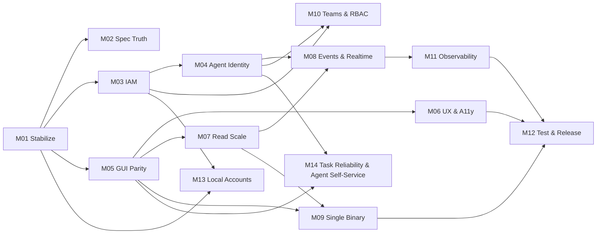

# Delivery State

> **Read this file first.** It is the single entry point for any agent or human
> resuming delivery. It is committed to git, so the state of the work travels
> with the repository and survives the end of any session.

## Now

**2026-08-22 — M24 (Project Reports & Agent Insights) planned; delivery
starts at M24-T01.** Requested via `/goal` ("add chart/diagram for a specific
project … similar to Jira's project-level reports … especially provide views
on agents aspect"). The chart set was drafted from the codebase's real data
model, then reviewed by three independent subagent lenses — product value,
agents dimension, technical feasibility — before planning, and the reviews
changed the design materially: exception lists lead trend charts (agents fail
discretely, not gradually — stalled claims, status regressions, handoff
churn), the "leaderboard" became a trust scorecard (reopen rate, autonomy
rate, agent⇄role toggle), tabs were dropped for one urgency-ordered page,
and the data substrate is a new synchronous `task_activity` table (the audit
log was rejected: no project scoping, projector-clock timestamps, absent in
standalone mode). Ten tasks, two ADRs (0020 activity substrate, 0021
hand-rolled SVG charts); the three review reports land in the spec folder at
M24-T01. See `MILESTONE-24-project-reports-and-agent-insights/MILESTONE.md`.

**2026-08-22 — the GUI CI job went from 24m to 9m54s** (commit `2e48247`),
by parallelising the two Storybook browser gates. Worth recording for the
method as much as the result: the first hypothesis was wrong, and measuring
is what caught it.

Step timings showed the 24 minutes was **22m05s in a single step** — the
`Storybook a11y + mobile overflow` gate. Lint, typecheck, the whole vitest
suite with coverage, and the vite build together were under two minutes, so
there was exactly one thing to fix.

`waitUntil: 'networkidle'` looked like the obvious culprit (Playwright's own
docs discourage it). An A/B over 15 stories put it at **1.1x** — 7.6s vs
7.0s per story. Changing it would have been a no-op dressed up as a fix. The
real cost is ~7s of CPU per story: loading Storybook's runtime plus the
story's own chunk, then running axe. 94 stories × 2 gates × 7s is 22 minutes
almost exactly. So `networkidle` was deliberately left alone — it is nearly
free, and it is the safest wait for the one code-split story
(`LazyRichMarkdownEditor`), whose Suspense fallback would otherwise satisfy
the render check while the real chunk was still downloading.

The fix is the one the measurement supports: both gates drive several pages
off a single browser, pulling from a shared cursor rather than fixed slices
(story cost varies by an order of magnitude between a Badge and a Dashboard).
Findings are sorted before reporting, since pages now finish out of order.

**Verified in the order that matters**: 5m52s locally at CI's concurrency
with identical findings; then that the gates still *fail* rather than merely
still finish — a story deliberately violating both got a11y exit 1 on
`color-contrast` (the rule the gate exists for, and the one needing a real
browser) and overflow exit 1 naming the 916px element; then all 14 config
tests guarding these gates, unchanged.

Each gate now prints the page count it chose, which turned an assumption into
a fact: CI reported **3 pages**, so `availableParallelism()` sees 4 vCPU and
the `- 1` headroom margin leaves one core spare. 3 workers gave 2.88x — 96%
scaling efficiency — so dropping the `- 1` would likely recover ~2 more
minutes. Left at 3 deliberately: the remaining gain is small and
oversubscribing a shared runner trades wall-clock for timeout flakiness,
which costs more than it saves.

**2026-08-22 — CI investigation: three real bugs found and fixed behind two
red GitHub Actions workflows** (commits `970f0a4`, `eb0639b`, `5ceb4fb`).
Prompted by "check ci" after M12-T01 landed; both `CI Pipeline` and `Real
Integration Tests` turned out to have been red since the M08/M09/M11/M12
merges the day before — none of it caused by M12-T01, all three confirmed
independently and fixed one at a time, each reproduced and verified locally
before pushing rather than iterated on via push-and-wait:

1. **`ArtifactUpload.test.tsx` coverage flake** (mine, a side effect of the
   M12-T01 conversion): the regression test built to force
   `ArtifactUpload.tsx`'s one flaky branch called `pending.resolve(...)`
   and returned without awaiting anything after it, so the test — and
   Vitest's teardown — could finish before the resolved fetch's microtask
   chain (decode → mutation `onSuccess` → the line under test) actually
   ran. Locally this consistently finished in time; CI's scheduling
   apparently doesn't always. Fixed by awaiting `invalidateQueries`, the
   one `onSuccess` side effect still observable after the component has
   unmounted, pinning the test to `onSuccess` having actually completed.
2. **Two E2E specs broken by the M23 follow-up** (`comments.spec.ts`,
   `task-description-rich-editor.spec.ts`), failing on every run since
   `ba5c2e7`. `getByPlaceholder(...)` can never match a
   `RichMarkdownEditor` — a Lexical contenteditable has no native
   `placeholder` attribute regardless of what text MDXEditor's own
   placeholder plugin renders. And once comments got their own
   always-mounted rich editor alongside the task description's, unscoped
   `getByRole('radio', {name: /bold/i})` /
   `getByRole('textbox', {name: 'editable markdown'})` locators started
   matching two elements — a strict-mode violation, not a timeout, once
   reproduced locally instead of read from CI's log. A third, independent
   bug was hiding inside the identical timeout symptom: `listOrgs` defaults
   newest-first when given no explicit sort, and the org switcher
   auto-selects `orgs[0]` on load — so `journeys/core-journey.spec.ts`
   creating its own org mid-suite silently switches every *later*
   `page.goto('/tasks')` in the run onto that new, empty org. Fixed the
   placeholder/scoping bugs directly and added
   `tests/e2e/selectSeededOrg.ts`, which both specs now use to explicitly
   pick `bun run seed`'s org via the switcher instead of trusting whatever
   the app defaults to.
3. **`Real Integration Tests`' `Realtime Event Feed (NATS)` job, `NatsError:
   503` on every run since the M08 merge**: `.github/workflows/
   integration.yml` started NATS via a `services:` block, which has no
   `command:` key — there is no way to pass `-js` through it, so every run
   silently started plain core NATS with JetStream disabled, and the
   durable consumer's first JetStream API call failed with "no responders"
   100% of the time, not intermittently. `docker-compose.yml`'s own `nats`
   service already had this right (`command: ["-js", "-m", "8222"]`) — this
   job just never matched it, because copying that into a `services:` block
   silently drops the command instead of erroring loudly. Confirmed by hand
   against the exact image (`nats:2.10-alpine`): `varz.jetstream` comes
   back `{}` without `-js`, populated with it. Replaced the `services:`
   block with an explicit `docker run ... -js -m 8222` step, mirroring
   `ci.yml`'s own backend-startup health-check-poll pattern.

**Also corrected here**: this session's own memory had gone stale by a full
day — M08 (Events, Audit & Real-Time), M09 (Portable Single Binary), M11
(Observability & Deployability) and M12 (Test Depth & Release) were all
designed, implemented and merged on 2026-08-21 by a session with no record
carried forward, along with a Bin empty-state fix and an M23 follow-up
(rich editor reaching comments + artifact markdown, plus a deep-link-reload
fix). This file's own merge-commit history is what caught the discrepancy —
another argument, on top of the file's own opening instruction, for reading
it fresh every time rather than trusting a summary written in a previous
session.

**2026-08-22 — M12-T01 done: all 30 GUI feature test files converted from
`vi.mock('@connectrpc/connect' …)` to MSW network-level interception.**
Recorded below (and in MILESTONE-12's PROGRESS.md) as deliberately not
attempted when M12 closed — argued at the time to be adequately covered by
T02's wire-level suite, T03's codec round-trips, and `gui:typecheck` catching
a renamed field. Revisited on a direct question about that reasoning: none of
those three catch a field that still exists, still compiles, and is still
handled wrong — the exact class of bug this conversion is for.

It found two, on its own, as a byproduct of making the existing tests honest
rather than from writing new ones: a `PingResponse` optional-presence gap, and
`Bin/index.tsx` sending `item[labelKey] ?? item.id`, which never actually
fell back to the id for a nameless row because a plain proto3 scalar decodes
its missing value to `''`, not `undefined` — fixed to `||`. Both were real,
both shipped invisible to every prior gate including this milestone's own
wire-level and round-trip suites, which is the argument for having done this
in the first place. `apps/gui/src/test/mockRpc.ts` is the shared harness
(`mockRpc`/`mockRpcError`/`mockRpcPending`/`mockRpcStream`); MILESTONE-12's
MILESTONE.md and PROGRESS.md are updated to reflect this as closed rather than
open. `moon check --all` clean.

**2026-08-22 — invitation email delivered, closing M12's last open roadmap
line.** "Invite users by email — record created, never sent" had been true for
the life of this repository.

Gmail by default (an app password, port 587, STARTTLS), plain SMTP underneath
so any provider works by pointing `SMTP_HOST` elsewhere. **Off unless
configured** — the same rule the OTLP exporter follows, and a test asserts no
transport is even constructed without a host, because the standalone binary
must not reach for a service that is not there.

Developable without mailing anyone: `docker compose --profile mail up -d
mailpit` catches everything at localhost:8025, and the `full` profile starts it
with the backend already pointed at it. Verified that way rather than described
— a real invite arrived with the right recipient, subject, organization, role
and expiry.

**Three decisions worth carrying forward.** There is deliberately **no accept
link**: acceptance redeems on the identity a person *proves* at sign-in, so a
forwarded invitation grants nobody anything, and a link that did would be a real
escalation path. A mail failure **never** costs the invitation — the row is what
grants membership and the email only says it exists. And TLS is derived from the
port rather than configured, because getting that backwards produces a hang
rather than an error.

Two things remain open, both named in MILESTONE-12's PROGRESS.md: **M12-T01**
(network-level interception in GUI tests) and **code signing**. [M12-T01 was
done later the same day — see the entry at the top of this file.]

**2026-08-22 — M12 Test Depth & Release complete. Every milestone in the
ledger is now closed.**

**The headline finding.** Until this milestone, *nothing in the repository ever
serialized a contract message.* The GUI's tests mock the generated module; the
backend's tests call handler functions directly. A field-number collision or a
wire-breaking type change would have passed every gate green. Two suites now
close that from opposite ends: 825 round-trip tests enumerated from the
descriptor (so a new service is covered the moment it is generated), and a
wire-level suite that spawns the real server on its own port and drives it with
the real generated client — which is the only thing that proves the interceptor
chain, the CORS allowlist, the body cap and the credential lookup are wired at
all.

**The core journey** runs through the real UI: sign in → organization →
template → project → task → comment → search → archive. Determinism comes from
unique per-run names rather than a restored snapshot — order-independent and
repeatable, and it does not destroy whatever the developer was working on.
Getting it green took five corrections and every one was the test learning
something true; the sharpest was that the archive confirmation says **"Move to
bin"**, so matching `/delete/i` hit the button *behind* the dialog and left the
task exactly where it was. A green step that proved nothing.

**Two things are deliberately not done, and are recorded as open rather than
quietly closed** (see MILESTONE-12's PROGRESS.md):

- ~~**M12-T01**, replacing the `health_pb` module mock with network-level
  interception across 66 GUI test files.~~ **Done later the same day** — see
  the entry at the top of this file. The reasoning below is preserved as the
  record of what was argued at the time; it undersold the gap, which turned
  out to include real bugs no other gate in this milestone caught.
  What it was buying was argued to be covered by T02 and T03 from two other
  directions; the residual gap was argued to be narrow, and the change a
  mechanical rewrite of a passing suite where each file is an opportunity to
  weaken an assertion while making it compile.
- **Signed** binaries. They are versioned and cross-platform; signing needs
  certificates this project does not have, as M09 already concluded.

**Also still open, from the roadmap**: invite email is never sent. The invite
surface exists end to end — create, list, revoke, expiry — and no SMTP
integration does.

**2026-08-22 — M11 Observability & Deployability complete, merged to `main`.**
Tracing, a Prometheus endpoint, three health signals, a real drain, a container
image, the full compose stack, a deployment manifest, dependency scanning and a
security review.

ADR-0004 chose in-process counters over OpenTelemetry "until M11" on two
grounds: the single binary must run with no external dependency, and there was
nothing deployed to trace. **Both are answered rather than reversed.** The SDK
is always installed but an exporter is created *only* when
`OTEL_EXPORTER_OTLP_ENDPOINT` is set — without one, spans still exist,
`traceparent` still propagates and every log line still carries a trace id, all
in process, with nothing ever connecting to a collector that is not there. The
counters are kept, not replaced; `/metrics` is a *view* of them.

**The find of the round, again in the deployment.** The compose stack's first
boot died reading `./drizzle-mysql`. M09-T01 embedded only the SQLite
migrations — the standalone binary was the case in front of us — and a
container has no repository to read from. Both dialects are embedded now,
through one dialect-agnostic apply loop whose runner methods may return a
promise or not, so `bun:sqlite` and mysql2 share a code path.

**Two things worth carrying forward.** `bun audit --ignore` accepts a
comma-separated list silently and matches nothing: the gate reported green
while ignoring nothing at all, which is the worst possible failure mode for a
security check. And a gate that fails on every pre-existing advisory is a gate
that gets switched off — `scripts/audit-dependencies.sh` is a ratchet with each
accepted advisory carrying a reason and the route it arrives by.

`govulncheck` found five *reachable* Go standard-library vulnerabilities;
pinning go1.26.6 clears them. The security review records no open critical or
high findings, four issues fixed during it, and three things named as out of
scope rather than left implied.

M12 (Test Depth & Release) is the last milestone in the ledger.

**2026-08-22 — M09 Portable Single Binary complete, merged to `main`.**
One executable that carries the GUI, every migration and FTS5, verified the way
the milestone asks: built, copied to a temporary directory, run under `env -i`
so nothing it needs can leak in from the checkout it was built in.

The GUI travels as a path → base64 manifest at a committed path. A static
import has to resolve at typecheck time, but Vite fingerprints every asset name
— so the committed manifest is *empty*, the build fills it in immediately
before `--compile` and empties it again after, and a test asserts the committed
one is still empty so a two-megabyte accident cannot be committed quietly.

**The find of the round.** Migrations run bare, rather than inside a
transaction, broke twelve unrelated tests with foreign-key errors. Two
migrations bracket a table rebuild with `PRAGMA foreign_keys=OFF` / `=ON`, and
SQLite ignores that pragma inside a transaction — which drizzle's migrator
opens, so the `ON` half had never taken effect in the life of this repository.
The embedded migrator now opens the same transaction, for atomicity and for
this.

Also worth carrying forward: `{ type: 'text' }` imports are inlined only by the
*bundler*. Run from source they yield the path, which turned every migration
into a one-line syntax error — `{ type: 'file' }` plus `Bun.file` works in
both.

ADR-0019 decides the long-standing in-process transport question as **declined,
not deferred**, and deletes the stub. The GUI is a browser application, so its
RPCs cross a real socket whatever the server does internally; a second entry
point into the handlers would duplicate the interceptor ordering that
authenticates and throttles every caller.

The sign-in screen now asks the backend which providers exist and renders only
those — a "Continue with Google" button on a credential-less binary redirects
with an empty `client_id` and strands the person on a Google error page.

M11 (Observability & Deployability) is next; M12 behind it.

**2026-08-21 — M08 Events, Audit & Real-Time complete, merged to `main`.**
T07–T11 in two commits, closing the milestone: a server-streaming
`EventService.SubscribeEvents`, a GUI hook that turns events into targeted
React Query invalidations, reconnect with backoff and a polling fallback, a
connection indicator in the shell, and a real-broker integration test over the
whole chain.

**The find of the round was not in the new code.** Verified against NATS, a
task creation produced no event on the feed at all. A task row carries a
`projectId` and no `orgId`, so `domain.task.*` — the highest-traffic subject
in the system — has always been published with no tenant on it. The live feed
refuses to deliver an event it cannot attribute to an org, which is correct
and is what made the gap visible; the audit trail built in T03/T05 had been
silently swallowing the same events, filing them under a null org where
`listAuditEvents(orgId)` could never find them again.

Fixed where T04 put the actor — one injection point rather than fifty publish
sites. `setRequestOrg` records the org on the request context from the
authorization check, which is the one place that already knows: `can()`
resolves a project's owning org anyway, and `authorizePrincipal` takes the org
as a parameter. `withRequestCorrelation` stamps it onto any payload that does
not already name one.

Two design notes worth carrying forward. The stream re-authorizes by *watching
itself*: a `domain.org.member_*` event re-resolves the connection's org set
before the delivery decision, so a revocation is the very message that cannot
slip through under the stale answer — no policy check per message on a feed
whose point is volume. And the feed emits `stream.ready`/`stream.heartbeat`
control frames, because an opened stream that has yielded nothing is
indistinguishable from a wedged one, and the connection indicator would
otherwise have shown "live" for a dead feed.

M08's own remaining item is nothing; M09, M11 and M12 are next in the ledger.

**2026-08-20 — CLI test hygiene and coverage measurement, merged to `main`.**
Requested as `/goal suggest and fix whatever things remain`. Worked the
long-deferred list at the bottom of this file, verifying each item still
existed before touching it — two were real, two had already been fixed and
the notes were stale.

**Fixed: `go test -shuffle=on` failed 8–9 CLI tests per run.** Every command
in `apps/cli/cmd` is a package-level `var xCmd = &cobra.Command{}` singleton,
so flag values outlive the test that set them, and cobra never clears
`Changed` once set. Three narrower helpers each reset a hand-listed subset,
which is inherently incomplete. The clearest symptom was not a stale boolean:
a test named `...DefaultsContentTypeToTextMarkdown` failed trying to open a
file inside `...UploadsFileAsBase64Image`'s temp dir, because the earlier
test's `--file <t.TempDir()>/logo.png` was still set on `artifactsCreateCmd`
and that directory had been cleaned up. Added `resetAllFlags(t)`
(`cmd/flags_reset_test.go`) which walks the whole command tree before and
after each test, and called it from all 243 tests. The cleanup pass is the
load-bearing one — tests attach their subtree via `rootCmd.AddCommand` *after*
setup, so a command may be unreachable when the reset first runs but always
reachable by the time the test ends. Slice flags needed `Replace`, not `Set`:
pflag slice values append after the first Set and render their default as
`"[]"`, which their own parser will not read back, so a naive reset appended a
literal `"[]"` per call and sent a request carrying three hundred empty
scopes. Verified 6 consecutive shuffled runs clean; disabling the reset brings
9 failures straight back.

**Fixed: `cli:coverage` reported a meaningless number.** The profile counted
`gen/tasker/**` — generated protobuf and connect stubs — so 2,665 of the 2,710
measured functions were generated getters nobody tests, and the gate printed
**6.9%** while the same run measures **94.4%** over `cmd/` and `internal/`.
A figure that low reads as "untested" and gets ignored, which is how it
drifted from a cached 97.9% to 6.9% unnoticed. Scoped with `-coverpkg`, with
`./...` kept as the package list so every package still compiles and runs —
what the note above that task says the gate exists for. Confirmed
pre-existing, not introduced: a clean checkout of HEAD measures the same 6.9%.

**Checked and found already fixed — notes below were stale, now corrected:**
the CLI's doubled `Error: Error:` prefix (a single prefix prints for both a
missing arg and an unknown flag), and `query-builder.ts`'s `softDeleteById`
double-archive guard (no such symbol in that file; the helper lives there and
is called by artifacts/memory handlers, but the note described something that
is not present).

**Also fixed in the same round: the Bin's ambiguous empty state.** A list
gated on `enabled: Boolean(orgId)` never runs when the scope is missing — no
loading, no error, no data — so `ListState` fell through to its empty branch
and said "No archived agents in the active organization" whether the org had
none or none was selected. All six ambiguous messages were in the Bin, so
this is a call-site fix rather than a new prop on the shared component; each
tab now names the state it is in. One test was renamed, not just re-worded:
"shows the Projects tab's empty message when no org is active" never cleared
`activeOrgId`, so it asserted the opposite of what its name claimed — which
is how the two states stayed indistinguishable this long.

**Still open, and genuinely larger than a fix round** — these are feature
work, not deferred nits: M23's named follow-up (comments and artifact content
still use bare `<textarea>`s; the `RichMarkdownEditor` wrapper was built to be
reused there), the deep-link `/tasks/:taskId` hard-reload bug found during
M23, and the `M08`/`M09`/`M11`/`M12` backlog milestones.

**2026-08-20 — UX audit of the GUI, then fixed all four findings, merged to
`main`.** The user asked for research into how teams use AI for UI/UX review
(Aug 2026), then had the distilled result built as a portable `ux-review`
skill at user level (`~/.agents/skills/ux-review/` with a thin
`~/.claude/skills/` adapter — the same source-plus-adapter split this repo
uses for its own skills), then ran it against this GUI, then `/goal fix all`.

The skill's governing rule is that a verdict without evidence is not a
verdict: findings name a `file:line` and the artefact that produced them, and
a review that never interacted returns `Incomplete` rather than `Pass`. That
discipline earned its keep twice in one session — see the two false starts
below.

Findings, all four fixed and each re-verified against the evidence that
produced it:

1. **Major, site-wide: every route scrolled sideways at 375px.** The mobile
   header's right group needed 259px of the 214px left beside the brand;
   document `scrollWidth` measured 420 vs a 375 `clientWidth` on all six
   routes checked. Fixed with `min-w-0` on the group (the half that actually
   stops it — established by reverting each half separately) plus a new
   `compact` icon-only variant of `GlobalSearchTrigger`, since a squeezed
   "Search tasks, artifacts..." label with a ⌘K hint is the wrong treatment
   on a device with no ⌘ key. Re-measured 375/375 on all six.
2. **Major: axe `nested-interactive` (serious) on all 60 task cards.** The
   card was a `role="button"` div containing `AssigneePicker`'s own button.
   The card is a plain draggable container now and the title is a real
   `<button>`, so keyboard activation is native rather than a hand-written
   `onKeyDown`. Re-ran axe: 0 violations; click-to-open and drag both intact.
3. **Minor, and the reason #1 shipped: `scripts/mobile-overflow.mjs` only
   scans `storybook-static`.** It measures components in isolation and never
   the shell they mount in, and no story contains `AppShell`. Added the
   route-level companion as an e2e spec (`tests/e2e/mobile-overflow.spec.ts`),
   where a booted backend and the router already exist. Proven to fail before
   trusting it: reverting the fix yields "/tasks overflows by 13px",
   "/agents overflows by 45px", with the overrun named in the message.
4. **Minor: "Unassigned" plus "Assign…" on every card** — the state and its
   remedy saying the same thing twice. Merged into one control (the status is
   the button). Deleting "Unassigned" outright would have been wrong: it
   exists from an earlier deliberate decision whose test asserts the card
   says "unassigned rather than showing an empty box".

**Two false starts worth recording, because the process caught both.** The
audit's first pass read a screenshot and concluded the Kanban board was
clipped at 375px — measurement showed the container is `overflow-x-auto`, a
deliberate side-scroller, and the finding was dropped. Its second pass
reported "create task silently fails" — checking the source showed
`InlineCreateForm` is a real `<form>`, and re-running scoped to that form
showed creation works and survives a reload; the original run had typed into
the page-level filter, which is the first visible input on the page. Both
would have shipped as confident findings under a read-the-JSX-and-describe-it
habit.

Also fixed one pre-existing fragility found while verifying: the rich-editor
e2e located the editable surface by a class MDXEditor also applies to its
placeholder, so the selector matched two nodes whenever a description was
empty — it passed only because the seeded first card happened to have body
text. Located by role now.

Verified: `moon check --all` 27/27 · 918 unit · 27/27 e2e (8 of them new) ·
Storybook 86 stories, 0 a11y violations, nothing wider than 375px.

**2026-08-20 — Bin feature review: Teams tab + richer row detail, merged to
`main`.** Raised in plain conversation ("review bins feature, do you think
it is better to distributed bin into relevant screen or in centralized
screen?"), answered with a recommendation (keep it centralized — matches the
near-universal trash/recycle-bin mental model, avoids duplicating restore/
purge/confirm machinery across six already-large feature screens), then the
user confirmed fixing the two real gaps the review surfaced. Not a numbered
milestone — single-screen review-and-fix round, same weight as the
chunk-optimization/Storybook-coverage rounds.

1. **Teams were entirely missing from the Bin.** `teams.handler.ts` already
   had `archiveTeam`/`restoreTeam` + `listTeams(onlyDeleted)`, and the CLI
   already had `teams --only-deleted`, but `apps/gui/src/features/Bin/
   index.tsx`'s `TABS` array never included `'teams'` — an archived team was
   unrecoverable from the GUI at all. Added a `TeamsBin` tab mirroring the
   other org-scoped tabs. `TeamService` has no `purgeTeam` RPC (archive/
   restore only, no hard delete), so `BinList`'s "Delete Forever" button is
   now optional (`onPurge?`) and simply omitted for this tab rather than
   wired to a call that doesn't exist.
2. **Every row rendered only a name and a raw `deletedAt`.** A deleted task
   showed its title and nothing else (no status, no assignee); a deleted
   artifact showed its name with no content type or size — despite that data
   already being on the wire (`Task.status`/`assignees`,
   `Artifact.contentType`/`sizeBytes`, `Project.key`) and simply never
   rendered. Added an optional `renderDetail` prop to `BinList` (a second,
   muted line under the label), wired into Tasks (status + assignee names),
   Artifacts (content type + size via `ArtifactUpload.tsx`'s existing
   `formatBytes`, not duplicated), and Projects (key). Organizations/Agents/
   Folders were deliberately left as-is — no comparable extra context is
   available for them without a backend/contract change, named here rather
   than silently skipped.

No backend, contract, or CLI changes — purely a GUI fix using data the
existing RPCs already return. 30/30 Bin tests pass (14 new, covering the new
tab, its restore-only affordance, and each tab's new detail line). `moon
check --all` clean 27/27. Verified via `gh run watch` on the merge push:
`CI Pipeline` and `Real Integration Tests` both green.

**2026-08-19/20 — CI fully green: fixed `CI Pipeline` and `Real Integration
Tests`, both previously broken on every push since at least M21.** Requested
directly by the user ("cjeck ci", then "fix itest ci also"), not a `/goal`.
Four fixes across two workflows, each verified against the real GitHub Actions
run (via `gh run watch`), not just locally — this environment can reproduce
none of these failures by running the tests, since the sandbox has no real
network access to a live backend port or a real `GITHUB_TEST_TOKEN`/
`INTEGRATION_TEST_TOKEN`.

`CI Pipeline` (three fixes, one commit each, merged in sequence):

1. `axe-core` was only reachable as a transitive dependency of
   `@storybook/addon-a11y`; `scripts/storybook-a11y.mjs`'s
   `require.resolve('axe-core/package.json')` couldn't reliably find it in a
   clean CI install (worked locally only because of this session's
   long-lived, heavily-installed `node_modules`). Fixed by adding `axe-core`
   as a direct `devDependency` of `apps/gui/package.json` + a `knip.json`
   ignore entry + a `tech-stack.md` row.
2. `apps/gui/tests/e2e/universal-search.spec.ts` asserted a placeholder
   string (`'Type a command or search...'`) that no longer exists in
   `GlobalSearch.tsx`; updated to the real one.
3. `apps/gui/tests/e2e/navigation.spec.ts` asserted an "Agent State Machine"
   heading that doesn't exist anywhere in the current Agents screen; dropped,
   per the file's own established convention for stale assertions.

Verified via `gh run watch`: `CI Pipeline` went from red to fully green (6/6
jobs).

`Real Integration Tests` (three fixes, one commit each — each only
discoverable by reading the *next* real failure the previous fix uncovered,
since no local run can exercise the real GitHub sandbox path):

1. `.github/workflows/integration.yml`'s "Run Integration Tests" step never
   set `STANDALONE`, so `authz.ts`'s `isStandalone()` resolved the *mysql*
   schema objects while `repositories.integration.test.ts`'s `mockDb` only
   ever recognized *sqlite* schema objects by identity — every authz lookup
   silently matched nothing, throwing spurious `not_found` regardless of the
   mock's row data. Fixed by adding `STANDALONE: "true"`, matching every
   other place this repo runs standalone mode.
2. That unblocked the org-membership lookup, surfacing the next real gap:
   `can()` (`policy.ts`) also needs a `role_permissions` lookup to resolve a
   role into actual granted permission keys, which the mock never
   special-cased either — every `assertCan()` call then failed
   `PermissionDenied` regardless of the mocked "admin" membership row. Fixed
   by mocking `role_permissions` to match the real seeded catalog
   (`role-admin` → `repository:read`/`repository:write`, confirmed against
   `drizzle-sqlite/0034_seed_system_roles_and_migrate_grants.sql`).
3. That unblocked `listBuilds`/`syncPullRequests`, surfacing the last real
   gap: `listDeployments` cross-validates that `buildId`'s real head commit
   sha matches the given `commitSha` (a deliberate anti-spoofing check,
   `repositories.handler.ts:443`) — the test called it with a made-up
   `buildId` and the literal string `"main"` as a commit sha, a pair that
   could never correspond. Fixed by resolving a real (run id, head sha) pair
   from the sandbox repo's own most recent workflow run in `beforeAll`
   (mirroring the file's own raw-fetch pattern already used in its teardown);
   the test skips itself if the sandbox repo has no workflow runs at all,
   rather than asserting an impossible pairing.

Verified via `gh run watch` on the final push: `Real Integration Tests`
completed fully green (`GitHub Integration Tests` job, all steps including
the real "Run Integration Tests" step against `huyz0/tasker-test-sandbox`).

**2026-08-19 — Storybook coverage for every custom component and screen,
merged to `main`.** Requested directly via `/goal` ("ensure storybook
work for every custom components and screens"), immediately after the
chunk-optimization round. Not a numbered milestone (single technical
task, like M15–M20 and the chunk-optimization round). Developed on
`feature/storybook-coverage` as one commit, merged with `--no-ff`.

`frontend-standard.md`'s Storybook rule ("all newly created or modified
UI components, primitives, and screens MUST have a corresponding
`.stories.tsx` file") had drifted: diffing every non-test/non-story
`.tsx` file in `apps/gui/src` against every existing `.stories.tsx`
file found 27 components/screens that had never had one — UI primitives
(`button`, `card`, `ConfirmDialog`, `Dialog`, `InlineCreateForm`,
`ListState`, `RowActionsMenu`, `VirtualList`, `ErrorBoundary`), the
`labels/` compound component (via a new `Label.stories.tsx` mirroring
the sibling `comments/` subsystem's own `Comment.stories.tsx` pattern),
layout components (`Breadcrumbs`, `PaginationControls`, `ThemeToggle`,
`CurrentUser`, `OrgProjectSwitcher`), feature sub-components
(`AgentTokens`, `ArtifactUpload`, `AssigneePicker`, `ReviewerPicker`,
`TaskArtifactLinks`), and whole screens (`BinDashboard`,
`TaskTypesEditor`, `Dashboard`, `SystemHealthPage`, `OAuthCallback`,
the `Login`/`Register` page wrappers around their already-storied
forms).

Two real accessibility bugs were found and fixed via Storybook's own
a11y gate running against surfaces it had never been able to check
before: `VirtualList.tsx`'s scroll container had no `tabIndex`, so a
keyboard user could not scroll it without first tabbing through every
row (every real caller happens to have a focusable element inside the
visible rows already, which masked this for the region itself until
`VirtualList` got a story of its own); `Login.tsx`/`Register.tsx`'s
in-text links were distinguished from surrounding text by colour alone
at rest (`hover:underline` only, no baseline `underline`).

A latent gap in the shared `storybook-a11y.mjs`/`mobile-overflow.mjs`
test harness itself was also found and fixed: any component with a
real, unconditional `useQuery` on mount and no MSW to answer it
(`CurrentUser`, `OrgProjectSwitcher`, `Dashboard`, `TaskTypesEditor`,
`BinDashboard`, `SystemHealthPage`, and others) fires a real
`createClient(...)` call against the backend, and in this environment a
fetch to a closed local port hangs rather than failing fast — never
letting Playwright's `networkidle` wait resolve, timing out the whole
run on the first such story. Never triggered before because no existing
story fired an unconditional query the same way (the existing
manager-screen stories, e.g. `Memory`/`Handoffs`, deliberately never
reach a state that queries at all). Fixed generally, in the shared
harness, with `page.route('http://localhost:8080/**', route =>
route.abort())` before iterating stories — benefits every current and
future story that needs it, not just the ones added here.

Verified: `moon check --all` (27/27); `moon run gui:storybook-test` — 86
stories (up from 32), 0 axe violations, nothing wider than 375px.

**2026-08-19 — Front-end route-level code-splitting (chunk optimization),
merged to `main`.** Requested directly by the user via `/goal` ("optimise
front end chunks on all screen"). Not a formal milestone (no
`MILESTONE-NN` folder or ledger slot) — a single, well-scoped technical
task, developed on `feature/gui-chunk-optimization` as one commit,
merged with `--no-ff`.

`apps/gui/src/App.tsx` previously imported all 17 routed screens/pages
eagerly, so every session downloaded one bundle containing every
feature at once regardless of which screens it actually visited — the
same problem `RichMarkdownEditor`'s own `React.lazy`/`Suspense` split
(M23) had just solved for one component, here applied at route scale.
Every route element (`Dashboard`, `SystemHealth`, `OAuthCallback`,
`NotFound`, `Login`, `Register`, and all 14 feature screens) is now
`React.lazy()`, each producing its own chunk behind one of two Suspense
boundaries (top-level for the unauthenticated Login/Register routes,
inside `AppShell` for everything else). Rollup/Vite factors out
whatever two or more lazy chunks share automatically — no
`manualChunks` config needed.

Result (`vite build`): the main chunk dropped from 960.53kB to
488.80kB (269.03kB → 146.72kB gzip), a 49% reduction, and any screen a
session never visits no longer ships to it at all.
`RichMarkdownEditor`'s own 561.76kB chunk (Lexical) is unaffected,
already isolated since M23.

`App.test.tsx` needed every synchronous `getByRole`/`getByText`
assertion immediately after `render()` converted to
`await findByRole`/`findByText`, since content is no longer in the DOM
on the same tick a route renders — the same pattern M23-T03 already
established for one field, applied here to the whole router. Also
added coverage for every route the test file didn't already exercise
(Projects/Agents/Labels/Roles/Teams/Memory/Handoffs/Bin/TaskTypes/
Login/Register/OAuthCallback), taking `App.tsx` itself from
59%/39% statement/function coverage to 100%/100% (only the routes
already under test had their `lazy()` call site actually invoked
before).

Verified: `moon check --all` (27/27, coverage aggregate
98.34/95.03/97.16/98.64% stmt/branch/func/line); `moon run gui:e2e`'s
`navigation.spec.ts`/`dashboard.spec.ts` (16/17 — the one failure is
the same pre-existing, sandbox-specific `/agents` state-machine-panel
issue already documented as unrelated in M23; confirmed still
unaffected here since every other route in that same spec, run in the
same pass, passed).

**2026-08-19 — M23 (Rich Markdown Editor) closed: 5/5 tasks, 6/6 exit
criteria, merged to `main`.** Requested directly by the user, who asked
whether the GUI had a rich markdown editor for task descriptions,
comments, and artifact content, and — none existing (three bare
`<textarea>`s, no library installed) — asked for web research into
open-source options before deciding. That research, plus a `/goal`
command to deliver the recommendation, made this a formal milestone:
`.specs/specs/2026-08-19-2026-rich-markdown-editor/` + `ADR-0018` +
`.milestones/MILESTONE-23-rich-markdown-editor/`. Developed on
`feature/m23-rich-markdown-editor` as five task commits, merged with
`--no-ff`.

`@mdxeditor/editor` (MIT, Lexical + remark) was chosen over Milkdown
(same markdown-native category, more manual assembly), Tiptap+markdown
(HTML-native content model — real round-trip-drift risk, since this
repo's raw markdown strings are read verbatim by the CLI too, not just
rendered through the GUI's own renderer), and BlockNote (bigger
block-editor UX shift, more complex license) — `ADR-0018`, mirroring
`ADR-0011`'s own bar for adopting a third-party UI dependency. React 19
compatibility was verified live against the npm registry rather than
trusted from a stale mid-2024 GitHub issue.

Delivery (T02–T05), piloted on the task description field only
(comments and artifact content are a named follow-up, not silently
dropped — `ADR-0018`'s own "Foreclosed, for now" section): a new
`RichMarkdownEditor` wrapper component with a hand-picked plugin/toolbar
set, re-themed to this repo's own `hsl(var(--token))` design tokens
rather than MDXEditor's defaults — its theming tokens turned out to be
declared directly on MDXEditor's own root element (a private class
alongside a stable public `.mdxeditor` class), so the usual `:root`
override this repo uses everywhere else would have silently done
nothing; fixed by targeting `.rich-markdown-editor .mdxeditor` directly
(T02). Wired into `Tasks/index.tsx`'s description edit form behind
`React.lazy`/`Suspense` — the first use of that pattern anywhere in this
GUI, confirmed via `vite build` to actually produce its own ~561KB
chunk, separate from the main bundle (T03). One Playwright e2e test
against the real (unmocked) editor, bolding text via the real toolbar
and confirming the round-trip with a direct `GetTask` RPC call rather
than trusting the rendered DOM or client cache (T04). Full verification
suite: `moon check --all` 27/27, `moon run gui:storybook-test` (32
stories, 0 axe violations — checked in dark mode too, confirming the
theming exit criterion), `moon run gui:e2e` clean under CI-representative
settings (T05).

Three test-only bugs were found and fixed while building the e2e test
(all in the test, not the product): MDXEditor's Bold/Italic/Underline
toggles expose ARIA role `radio` (a Radix single-select toggle group),
not `button`; the toggle's accessible name flips `"Bold"`/`"Remove
bold"` depending on whether the cursor already carries bold formatting
forward from a previous run against the same seeded task (Lexical keeps
the last format live through a select-all-delete); and
`getByRole('button', {name:'Edit'})` is ambiguous once the task has
comments, since each comment has its own identically-labelled Edit
button. One genuine, pre-existing, unrelated bug was found and
deliberately **not** fixed (named as an explicit follow-up instead): a
hard reload of a deep-linked `/tasks/:taskId` loses the route once
`activeProjectId` finishes hydrating (`Tasks/index.tsx`'s "closes the
detail overlay when the active project changes" effect treats the async
hydration itself as a scope change) — confirmed via `git diff` that no
file this milestone touched is anywhere near that effect.

**2026-08-19 — M22 (Task Handoff & Continuity) closed: 8/8 tasks, 7/7
exit criteria, merged to `main`.** Requested directly by the user in
conversational follow-up immediately after M21 closed - a different
problem from shared memory: a cloud agent has no local disk to fall back
on the way a person coding locally does, so if its claim on a task ends
before the task is done, whoever picks it up next has nothing but the
raw diff unless the agent wrote down what it tried. Design pass
(`.specs/specs/2026-08-19-1659-task-handoff-continuity/` + `ADR-0017`)
and an interactive scoping review (three `AskUserQuestion` rounds -
agent-only authorship, a compact task-detail summary rather than the
full notes panel, a top-level cross-task screen rather than a per-task
sub-view) preceded implementation, same discipline as every milestone
since M21. Developed on `feature/m22-task-handoff-continuity` as eight
task commits, merged with `--no-ff`.

Delivery (T02–T08): `TaskNote.noteType` (`'comment' | 'handoff'`,
default `'comment'`) plus a new `listHandoffNotes` RPC and
`latestHandoffNote` on `claimTask`/`getTask` responses (T02) - no new
entity, no new permission family, no new agent-token scope (ADR-0017);
`note_type` column + migration, both dialects, a plain `ALTER TABLE ADD
COLUMN` needing no full-table rebuild (T03); the backend handler, with
`listHandoffNotes` deliberately avoiding a dialect-branched raw-SQL
window-function query in favor of a single ordered+capped typed join
and in-JS dedupe-to-latest-per-task (T04); a task-detail Handoffs
summary block sharing `TaskNotesPanel`'s own query/cache entry (no new
network call) plus a new top-level `features/Handoffs/` screen
mirroring Memory's own M21 nav entry (T05); `tasker tasks handoffs` as
the CLI's primary new command, `note-add --type`, and `claim`/`get`
surfacing via a deliberate, documented breaking change to their
`--json` shape (bare task object → whole response, the only way
`latestHandoffNote` is reachable at all) (T06); the `handoff-task`
agent skill plus `docs/agent-integration.md` §10, written correctly on
the first attempt by directly applying M21-T09's own hard-won
skill-forge lessons rather than rediscovering them (T07); `moon check
--all` clean 27/27, all seven exit criteria re-verified (T08).

Two genuine, previously-latent bugs were found and fixed along the way,
neither scope creep - both were blocking this milestone's own
verification, named and fixed with a dedicated regression test rather
than left as a TODO: `ArtifactUpload.tsx` (M18, unrelated feature) had
one flaky-coverage branch whose v8 report intermittently flipped across
otherwise-identical runs (its `onSuccess` resets a file input ref that's
null once the component has unmounted before the async upload
resolves); and `--json`, a `PersistentFlag` on the CLI's `rootCmd`
shared by every command in `tasks_notes_test.go`, never resets its
`cmd.Flags().Changed()` state once a prior test sets it - the same bug
class M20-T10 already documented, just on a flag every test in that
file happens to touch.

**2026-08-18 — M21 (Shared Memory & Belief System) closed: 10/10 tasks,
7/7 exit criteria, merged to `main`.** Requested directly by the user via
two `/goal` commands (design, then "deliver it end to end"), and — unlike
M15–M20's informal review-and-fix rounds — run as a *formal* milestone:
`.milestones/MILESTONE-21-shared-memory-and-beliefs/MILESTONE.md` +
`PROGRESS.md`, per `milestone-standard.md`, because this is net-new
product surface comparable in size to M10, not a fix-what's-there pass
over an existing feature. Developed on
`feature/m21-shared-memory-and-beliefs` as nine task commits + one
closeout commit, merged with `--no-ff`.

Spec/design (T01): two rounds of research (internal architecture mapping
and external prior art on agent-memory systems) plus an interactive
design review with the user, captured in `.specs/specs/2026-08-18-1622-shared-
memory-and-beliefs/` and three new ADRs — `ADR-0014` (beliefs reuse
ADR-0013's existing organization/team/project scope hierarchy, no new
tier), `ADR-0015` (agent tokens gain `memory:read`/`memory:write`, no
`memory:admin` — promotion, archive, restore, and purge all stay
human-gated), `ADR-0016` (retrieval is pluggable behind a
`BeliefRetriever` interface; v1 ships lexical search only, reusing
`search.handler.ts`'s existing FTS5/FULLTEXT machinery as a sixth
`SearchEntity`; a future vector phase is documented — LanceDB + a local
in-process embedding model via `transformers.js`, researched against
current Aug-2026 tooling rather than assumed — but explicitly not built
now).

Delivery (T02–T10): `MemoryService` contract + `Belief`/`BeliefRelation`/
`BeliefPromotion` models (T02); `memory:{read,write,admin}` permission
family plus the two agent-token scopes (T03); `beliefs`/
`belief_relations`/`belief_promotions` schema with FTS5/FULLTEXT, hand-
written migrations verified against live MySQL after the SQLite
generator produced a corrupted migration against the known-drifted
snapshot lineage (T04); `memory.handler.ts`'s 14 RPCs plus
`LexicalBeliefRetriever` (T05); `belief` as a sixth `SearchEntity` in
`universalSearch`, stress-tested at 20,000 rows with no latency
regression (T06); a search-first `features/Memory/` GUI screen using
Radix `Tabs` (its real activation event, `onMouseDown`, found by reading
library source rather than guessing) for the related/history views (T07);
`tasker memory` CLI with `search` as the primary command, two real
flag-leak bugs found and fixed via `-shuffle=on` (T08); the
`capture-belief` agent skill plus `docs/agent-integration.md` §9,
which surfaced a previously-unencountered `tasker:skills-check`
pre-commit gate and its `sync-adapters.mjs` host-adapter-parity
requirement — fixed by running the real generator rather than hand-
guessing its output (T09); `moon check --all` 27/27 clean, all seven
exit criteria re-verified against existing test coverage (T10).

**2026-08-18 — Sixth out-of-band review/fix round merged: Projects feature
deep review.** Same structure as the Agents (M17)/Artifacts (M18)/Tasks
(M19) rounds before it: three parallel reviews (backend, GUI, CLI) of the
Projects feature - `Project`/`ProjectTemplate` entities, the Projects GUI
screens (including the org/project switcher and the Bin's project tab),
and the CLI `projects`/`project-templates` commands - followed by fixing
everything found. Developed on `feature/projects-feature-review-and-fixes`
(branched from `main` post the Tasks round) as ten commits.

One critical production-breaking bug (M20-T01): a JS `Date` object (not
converted to an ISO string) reaching a wire field declared `string` crashes
connect's protobuf JSON encoder ("expected string, got object") rather than
silently coercing - `Project.deletedAt` hit this unconditionally, so
`listProjects({onlyDeleted:true})` and `getProject` on any archived project
500'd, breaking the Bin's Projects section entirely. Verified with an
actual protobuf `create`/`toJson` round-trip test, not just a
return-value-shape check, since a handler-level unit test alone can't catch
this class of bug.

Backend (M20-T02–T04): `listProjects`/`listTemplates` validated by hand
instead of Zod (same class as M17-T02/M18-T02/M19-T02's fixes elsewhere);
`Project`/`ProjectTemplate` never exposed `createdAt` on the wire despite
the handler computing it. `listProjects`'s `onlyDeleted` facet could leak a
stale cached `totalCount` across a differently-scoped request - closed via
the same `extraCacheKey` opt-in M19-T03 added generically to
`executePaginatedQuery`. `updateTemplate` silently no-op'd an explicit
clear of `description`/`rootTaskTypeId` (the "" -> unset squash M14-T01
already fixed once for tasks); `main.tsp`/`health.proto` had drifted out of
sync on `optional` for four fields, only `health.proto` needed catching up.
A template's `rootTaskTypeId` accepted a project-scoped task type despite a
template being org-wide by definition, leaving `purgeProject` no safe way
to purge that project without dangling the reference - closed at the
source by rejecting a project-scoped `rootTaskTypeId` in both
`createTemplate`/`updateTemplate`, rather than defensively nulling it out
after the fact. `purgeProject` also failed to clean up project-scoped
`grants` rows (M10-T10's authorization primitive), leaving them permanently
unrevokable/unlistable once their project was gone. `project_templates`
gained a real `(orgId, name)` unique index (app pre-check + DB-error
fallback, verified against live MySQL) closing a check-then-insert race;
`purgeProject`'s N+1 per-task-type delete loop was deduped onto the shared
`bulkPurgeTaskTypes` helper (exported from `cascadePurge.ts` for the
purpose, previously module-private).

GUI (M20-T05–T07): five stale-state bugs across two root causes. Wrong/dead
invalidation keys - `['projects', activeOrgId]` matched no query in the
whole app, and neither it nor `['projects', activeOrgId]`-style keys ever
matched the switcher's own `['projects', 'switcher', ...]` key; fixed by
invalidating the bare `['projects']` prefix everywhere, the same pattern
the Organizations screen already used correctly for `['orgs']`. Latched
local state - `activeProjectId` wasn't cleared when the active project was
archived (leaving Tasks/Artifacts/Bin/Dashboard querying a gone project
indefinitely), and the switcher's own label was set once via `useState`
and gated on `!label`, so a rename never re-synced to the sidebar even
after the underlying query refreshed. A newly-identified bug class this
round - "shared mutation object across a list of rows": a single
`useMutation()` shared by every row in a `.map()` meant `.isPending`/
`.isError`/`.variables` reflected whichever row's mutation most recently
ran, not the row a given button belonged to - wrong-row pending/disabled
state, wrong-row error banners, and stale errors resurfacing on reopen
after a *different* row's earlier failure, fixed by comparing
`mutation.variables` against the specific row's own id and calling
`.reset()` at every open/close entry point. Accessibility: unlabeled
project/template name/description inputs and repository remote/email/token
inputs; a build-row disclosure that was a bare `
` (converted
to a real `<button>` with `aria-expanded`, matching the Members/Show-Builds
toggles which gained the same attribute); project members shown by raw
`subjectId` instead of a resolved name (best-effort lookup reusing the
access picker's own org-member query); revoking access was the one
destructive action on the page with no confirmation dialog, unlike
archiving a project or unlinking a repository right next to it.

CLI (M20-T08–T10): `projects update`/`project-templates update` - both
RPCs existed fully on the wire and at the backend with zero CLI commands
reaching them - added with proto3-optional-aware flag handling via
`cmd.Flags().Changed(...)`, matching the M19-T07 `tasks update` pattern, to
preserve the unset-vs-explicitly-cleared distinction M20-T03 just fixed on
the backend for templates. `projects list` gained `--only-deleted` (Projects
has a full delete/restore/purge bin lifecycle, same as Tasks/Artifacts, but
this was never wired up); `projects create` gained `--description` and now
requires `--owner` locally (previously a guaranteed-fail path with an
opaque remote validation error); `projects delete/restore/purge` gained
`--json` parity; `project-templates list` gained `--filter`/`--sort`
(`projects list` already forwarded both). Test coverage backfilled across
both files to 100% statement coverage (get/create-against-a-server/delete/
restore/purge were entirely untested, along with every required-flag and
`--json`-branch path) - along the way, `go test -shuffle=on` surfaced a
real, order-dependent flag-leak bug in two of this round's own new tests
(`cmd.Flags().Changed(name)` never resets itself once a flag has been set,
for the lifetime of the package-level command singleton; fixed by resetting
the underlying `pflag.Flag.Changed` field directly, the one thing
`Flags().Set()` can't touch).

Deferred, explicitly out of scope for this round:

- The doubled `"Error: Error:"` CLI prefix (missing `SilenceErrors` in
  `root.go`) - pre-existing and repo-wide, unchanged since first noted in
  M19's STATE.md entry; confirmed still present, still out of scope for a
  single-feature round.
- The "No projects yet." empty-state message shown identically whether no
  org is selected or the selected org genuinely has no projects - the same
  ambiguity already noted (and deferred) for Tasks/Artifacts in the M18/M19
  rounds; a shared `ListState` component behavior, not Projects-specific.
- `softDeleteById` (the shared soft-delete helper `archiveProject` and five
  other handlers all call) unconditionally stamps `deletedAt: new Date()`
  with no guard against an already-archived row - calling archive twice
  just moves the timestamp forward silently. A repo-wide convention gap in
  a shared helper, noticed only because Projects is where it was checked
  this round; fixing it belongs to whichever round owns `query-builder.ts`
  itself, not a single feature.
- `go test -shuffle=on` also surfaces the same class of flag-leak failure
  (pre-existing, not introduced this round) in `auth_token_test.go`/
  `artifacts_test.go`/`orgs_test.go`/`auth_test.go` - all outside
  `projects.go`/`projecttemplates.go` and out of scope for a
  Projects-focused round.

`moon check --all` (27/27) clean at every commit. Backend: 1331 pass, 0
fail (13 skip - MySQL-only integration tests, expected without
`TASKER_MYSQL_INTEGRATION=1`), coverage held at its established near-100%
gate on every touched file; the new unique-index migration verified against
a live MySQL instance via `docker compose`. GUI: `tsc -b && vite build`
clean, 834 vitest tests pass, coverage held at 98%+ statements. CLI:
`go build`/`vet`/`test` clean, 100% statement coverage on both
`projects.go` and `projecttemplates.go`, full suite re-run five times with
`-shuffle=on -count=1` to confirm zero Projects-related order-dependent
flakiness.

**2026-08-18 — Fifth out-of-band review/fix round merged: Tasks feature deep
review.** Same structure as the Agents (M17) and Artifacts (M18) rounds
before it: three parallel reviews (backend, GUI, CLI) of the Tasks feature -
`Task`/`TaskType`/`TaskStatus`/`TaskReviewer`/`TaskNote` entities, the Tasks
GUI screens, and the CLI `tasks`/`tasks_comments`/`tasks_notes` commands -
explicitly scoped to exclude what M14 ("Task Reliability & Agent
Self-Service") and an earlier informal GUI round already fixed, followed by
fixing everything found. Developed on
`feature/tasks-feature-review-and-fixes` (branched from `main` post the
Artifacts round) as nine commits.

One security bug (M19-T01): `updateTaskNote`/`deleteTaskNote` checked only
an ordinary `tasknote:write` permission, not authorship - any org member,
or any other agent's token, could rewrite or delete an agent's own record
of its work. Mirrors `comments.handler.ts`'s `assertCommentAuthor` (M04,
ADR-0008) - the identical bug, already fixed once for comments.

Backend (M19-T02–T03): `getTask`/`listTasks`/`listTaskNotes` validated by
hand instead of Zod (same class as M17-T02/M18-T02's fixes elsewhere);
`Task`/`TaskNote` never exposed `createdAt` on the wire despite the handler
computing it, and `createTask`/`createTaskNote`'s payloads never had it at
all - both the "computed then dropped" and the more severe "never set"
variants of the same recurring bug class, fixed the same way (added field
11/5 to the contract, explicit `createdAt: new Date()` + `insertRecord`'s
auto-stamp disabled). `createTask`/`updateTask` never checked a
project-scoped `taskTypeId` actually belonged to the task's own project -
mirrors `createTaskType`'s own rule, closed on the task side too.
`updateTaskType` checked cross-org parents but neither cross-project nor
cycles when reparenting an *existing* type (impossible on create, since a
brand-new type can't already be its own ancestor). `taskStatuses`/
`taskReviewers` gained unique constraints closing check-then-insert races,
verified against a live MySQL instance. `listTasks`'s
status/assigneeFilter/onlyDeleted facets could leak a stale cached
`totalCount` across a differently-scoped request; the shared pagination
helper (`executePaginatedQuery`) gained an opt-in `extraCacheKey` to close
this generically rather than one-off for Tasks. `AssignTaskRequest`'s
`agentId`/`userId` are now real proto3 `optional` fields, matching
`UnassignTaskRequest` and the Zod schema's existing "exactly one" contract.

GUI (M19-T04–T05): the table view crashed entirely on a task whose status
matched no resolved column (a non-null assertion on a lookup that can miss
during a task-type-loading race, or after a status is deleted/renamed) -
now falls back to showing the raw status string instead of taking the
whole table down. `AssigneePicker` only invalidated the board/table's list
query, leaving the task-detail panel's separate `['task', id]` query
showing a stale assignee list after assigning/unassigning from that panel.
The open task-detail overlay (URL-driven, so it survives navigation by
design) and `TaskTypesEditor`'s selected type both also survived a
project/org *switch*, continuing to query across the old scope - both now
reset on switch, mirroring M18-T05's identical fix for the Artifacts
explorer's selection.

CLI (M19-T06–T09): `tasks claim` - the M14-T06 headline agent-self-service
feature (atomically claim an unassigned task) - had no CLI command at all,
nor did `tasks get`/`update`/`unassign`, nor `comment update`/`delete` and
`tasks note-update`/`note-delete` (the latter pair deliberately sequenced
after M19-T01, since the author-only check had to exist before adding a
CLI path to reach the RPC). `--idempotency-key` (M14-T07) was unreachable
from the CLI on both `create` and the new `claim`. `tasks list` gained
`--only-deleted`/`--status`/`--assignee-filter`. Test coverage backfilled
across `tasks_notes.go` (previously zero), `tasksAssignCmd`/
`tasksUpdateStatusCmd`/delete/restore/purge (including their `--json`
branches, never actually exercised despite looking correct on inspection),
`tasksCommentsCmd`, and every command's required-flag validation path -
along the way, found and worked around a recurring package-level-singleton
flag-persistence gotcha already present in the test suite (a flag value
set by one test surviving into the next via cobra's shared `Command`
singletons across `Execute()` calls within one test binary).

Deferred, explicitly out of scope for this round:

- `claimTask` has no GUI surface - deliberate; an agent-facing feature
  correctly reached via CLI/API, not the human-facing board.
- `idempotencyKey` is unused by any GUI mutation - a project-wide gap
  (agents don't operate through the GUI), not Tasks-specific.
- `TaskNotesPanel` has no add-note UI - likely intentional; a note is an
  agent's own record of its work, read/moderated by a human, not authored
  by one.
- The doubled `"Error: Error:"` CLI prefix (missing `SilenceErrors` in
  `root.go`, pre-existing and repo-wide across every command with a
  required-flag check that embeds its own `"Error: "` prefix) - confirmed
  no new `tasks.go`/`tasks_notes.go`/`comments.go` code copies the
  offending convention; the actual fix is out of scope for a
  single-feature round.
- `UnassignTaskRequest`'s `health.proto` still lacks the `optional`
  keyword its own `main.tsp` `?` declarations call for (unlike
  `AssignTaskRequest`, fixed this round) - noticed while fixing Assign's
  sibling issue, but a separate pre-existing gap this round's findings
  didn't select.

`moon check --all` (27/27) clean at every commit. Backend: 1322 pass, 0
fail, coverage held at its established near-100% gate on every touched
file. GUI: `tsc -b && vite build` clean, vitest coverage held at 98%+
statements. CLI: `go build`/`vet`/`test` clean, full suite re-run twice
with `-count=1` to rule out order-dependent flakiness from the
singleton-command gotcha found along the way.

**2026-08-17 — Fourth out-of-band review/fix round merged: Artifacts feature
deep review.** Same structure as the Agents round just before it: three
parallel reviews (backend, GUI, CLI) of the Artifacts feature - `Folder`/
`Artifact` entities and their content storage, the GUI browser/upload/
editor, the CLI commands - followed by fixing everything found. Developed
on `feature/artifacts-feature-review-and-fixes` (branched from `main` post
the Agents round) as nine commits.

Two genuinely severe bugs surfaced, found independently by the GUI and CLI
reviews and fixed together since they share the same content/encoding
contract:

- **GUI (M18-T04)**: every upload was base64-encoded regardless of content
  type, but the viewer only ever decoded `image/*` to a data URI - opening
  a `.md`/`.txt`/`.json`/`.csv` artifact showed raw base64 text, and saving
  an edit from that state permanently overwrote the artifact with the
  undecoded base64, destroying the original content. `content`'s own
  docstring in the contract named the exact hazard ("the content type does
  not reliably say which" encoding a given artifact uses) without a fix
  ever landing for it. Fixed at the source: only content that cannot
  survive being read as text (`image/*`, `application/pdf`,
  `application/octet-stream`) is ever base64-encoded now: everything else
  is read and sent as plain text, matching what the viewer and editor
  already assumed. Artifacts already corrupted by the old bug before this
  fix are not repaired - there is no reliable way to tell a still-encoded
  body from an artifact that genuinely contains base64-looking text.
- **CLI (M18-T07)**: `artifacts read` printed `Artifact.content` from
  `ListArtifacts`, which the backend deliberately leaves empty on a listing
  (the body can reach ~15MB of base64; a listing needs the name, not the
  bytes) - always an empty body, for every artifact, against the real
  server. The bug was fully masked by the command's own test: the fake
  handler backing it populated `Content` on `ListArtifacts` directly, a
  divergence from the real contract that nothing caught. Rewritten to call
  `GetArtifact` + `GetArtifactContent`, the pair the backend built for
  exactly this case (a deep link with an artifact id and nothing else) -
  `--folder` and the O(folders × pages) pagination walk it existed to avoid
  are both gone. `create --file`/the new `update-content --file` had the
  mirror-image bug (base64-encoding every upload regardless of type) and
  got the same fix, so the CLI and GUI clients agree on the same encoding
  contract.

Backend (M18-T01–T03): `getArtifact` 404'd an archived artifact while
`getArtifactContent` did not, even though both exist to serve the same
deep-linked viewer - made consistent (dropped the filter, matching
`getTask`/`getProject`'s convention of not gating a "get one" RPC on
`deletedAt`). `listFolders`/`listArtifacts` validated by hand instead of
Zod (same class as M17-T02's Agents fix); `Folder`/`Artifact` never exposed
`createdAt` on the wire despite the handler already computing it (same
"computed, then silently dropped" bug M17-T02 fixed for `AgentRole`/
`Agent`). No unique constraint existed on folder name (per project+parent)
or artifact name (per folder) - added, both dialects, verified against live
MySQL, with the same pre-check/DB-conflict-fallback pattern used since
`labels.handler.ts`. MySQL's `content` column was widened from `mediumtext`
to `longtext`: the Zod char cap (15,000,000) is safe for base64 (ASCII,
1 byte/char) but could exceed `mediumtext`'s 16,777,215-*byte* cap for
large multi-byte UTF-8 text.

CLI (M18-T08–T09) also gained three previously-RPC-only-reachable commands
(`update-content`, `update-folder`, `list-task-links`) and `--only-deleted`
on `list`; `delete`/`restore`/`purge` for both artifacts and folders (plus
`unlink-task`) now honor `--json`, the same gap just closed for Agents'
equivalent commands in M17-T03.

GUI (M18-T05–T06) also fixed: six of the view's seven mutations never
rendered their error (only `updateContentMutation` did); the subfolder
create form read the wrong mutation's pending state, allowing a
double-submit; nothing reset the folder/artifact selection on an active
project/org switch, leaving the main pane showing stale cross-scope data;
`description` (a real `Artifact` field) had no GUI control to set it on
either creation path and was never displayed; the folder-rename input and
content-edit textarea had no accessible name; the upload preview's object
URL was never revoked.

Like the three rounds before it, not run through the formal milestone
process (no `MILESTONE.md`, non-`mNN` branch) - the same deliberate
lighter-weight treatment for a conversational "review and fix" request.
`moon check --all` (27/27) clean at every commit; backend and GUI coverage
held at their established near-100%/95%+ gates throughout, including on
every newly-added code path specifically, not just the aggregate.

**2026-08-17 — Third out-of-band review/fix round merged: Agents feature deep
review.** A deep review of the Agents feature — `Agent`/`AgentRole` entities,
agent tokens' surrounding CRUD (not the token auth/authz system itself,
already covered by M14), the Agents GUI screen and `AgentTokens` panel, and
the CLI's `agents`/`auth token` commands — via three parallel read-only
reviews (backend, GUI, CLI), followed by fixing everything scoped in.
Developed on `feature/agents-feature-review-and-fixes` (branched from `main`
post the Project-model round) as five commits:

- **Security**: `updateAgent` never checked that a new `agentRoleId` belonged
  to the same org as the agent being updated — `createAgent` already made
  this check (ADR-0007), `updateAgent` was a second, unguarded path to the
  same cross-tenant scenario. Fixed with the same NotFound-not-
  PermissionDenied reasoning as `createAgent`; regression test reverted and
  confirmed-failing before the fix, confirmed-passing after.
- **Backend consistency**: `listAgents` validated its request by hand instead
  of a Zod schema (now `ListAgentsSchema`, matching every other RPC in the
  file); `agent_roles` had no unique constraint on `(orgId, name)` (added,
  both dialects, verified against live MySQL — no pre-existing duplicates to
  break the migration); `AgentRole`/`Agent` never exposed `createdAt` on the
  wire despite the handler already computing it and then silently dropping it
  before the response left the function (added `createdAt` field 6 to both
  models in `main.tsp` and its hand-maintained proto twin, regenerated via
  `moon run shared-contract:compile`, fixed the handler to compute the
  timestamp once and use it for both the DB write and the response).
- **CLI**: added `agents update` / `agents update-role` (the RPCs existed,
  no command did); `agents delete/restore/purge` now honor `--json` (the
  same gap exists in `projects.go`/`teams.go`'s archive/restore/purge — a
  repo-wide pattern, left as-is, out of scope for an agents-only review);
  `auth token revoke` gained `--json` (had none); removed a redundant local
  `--json` flag on two token commands that shadowed the persistent one for no
  reason; `agents list` gained `--only-deleted`, matching `teams list`'s
  existing flag of the same name and purpose.
- **GUI**: "Total Agents" now reads the server-computed total instead of the
  loaded-page count; removed the "Agent State Machine / Visualizer" panel — a
  permanently-static `h-[400px]` stub reading "React Flow Component ...(To be
  implemented fully with reactflow)", never gated behind `ListState`, never
  true — this session's established pattern of removing a fake placeholder
  rather than dressing it up further; added client-side JSON validation to
  the capabilities field on both the create-role and edit-role forms (an
  unenforced opaque JSON string on the wire, previously validated nowhere);
  `AgentTokens` now shows each token's `lastUsedAt` (on the contract since
  ADR-0008, never rendered) and enforces the 365-day expiry maximum
  client-side (was stated in helper text, only enforced server-side).
- **New surface, not a new endpoint**: added an "Agent Activity" panel to the
  Agents screen (filling the layout slot the removed visualizer used to
  occupy) that reuses the Dashboard's `getDashboard` RPC and its
  already-computed per-agent `lastUsedAt`/`openTaskCount` rather than adding
  a second endpoint duplicating the same `api_tokens`/`task_assignments`
  join — same 8-quietest-first cap as the Dashboard's own fleet panel, with a
  note pointing at the Dashboard when an org has more agents than the panel
  shows.

**Deliberately deferred, not silently dropped** (found during the review,
scoped out of this round as lower-value or larger than an in-place fix):
`agentRole` soft-delete/lifecycle (roles can be edited and used but never
archived); `updatedAt` tracking on either table; optimistic concurrency on
`updateAgentRole` (last-write-wins, same as most of the product pre-M14);
the `agent:write` vs `agent:admin` permission-tier split (create needs
`write`, update needs `admin` — asymmetric, possibly intentional, not
verified either way); an org-active check on `createAgent`/`createAgentRole`
(an archived org can apparently still gain new agents/roles); agent
kind/provider/model structured metadata; `getAgent`/`getAgentRole`
single-fetch RPCs (list-only today); a pause/deactivate lifecycle state
between active and archived; avatar/icon fields; and restructuring CLI token
command discoverability (e.g. aliasing `agents token` to `auth token`).

Like the prior two out-of-band rounds, not run through the formal milestone
process (no `MILESTONE.md`, non-`mNN` branch) — a deliberate lighter-weight
treatment for a conversational "review and fix" request. `moon check --all`
(27/27) clean at every commit; backend and GUI coverage held at their
established near-100%/95%+ gates throughout, including on the newly-added
code paths specifically (not just the aggregate). Merged to `main`
(`git merge --no-ff`) and pushed.

**2026-08-17 — Second out-of-band GUI/backend follow-up merged: Project
model usability.** A review of the `Project` entity itself (not just its
list screen) against Linear/Jira/Asana/Monday/ClickUp/Basecamp found the
model was closer to a bare Jira project record than any competitor's - no
description, no signal of what's inside it, and a real, tested M10
capability (project-scoped role grants) with zero GUI screen ever calling
it. All four findings fixed on `feature/project-model-usability-improvements`
(stacked on the task-screen-ux branch, itself stacked on M14) and merged in
the same push: a `description` field on `Project` (schema, contract,
handler, GUI - real proto3 presence like M14-T01's fix, not the "" -> unset
squash); a per-project task count on the list card (plain count, not "N of
M done" - deliberately not attempted, since a task type's statuses are
configurable per type and there is no universal "done" to total against);
and a collapsed-by-default "Members" section wiring `grantRole`/
`listGrants`/`revokeGrant(scopeType: 'project')` into the GUI for the first
time since M10 built and tested that primitive. Like the prior GUI
follow-up, not run through the formal milestone process (no `MILESTONE.md`,
non-`mNN` branch) - same deliberate lighter-weight treatment for a
conversational "fix all findings" request. The project-home-page question
this review raised was decided explicitly rather than deferred: enrich the
existing list screen rather than build a new `/projects/:id` route, to stay
consistent with the global-active-project model Tasks and Artifacts already
use, and because it closes every finding without the much larger scope a
new page/IA would need.

**2026-08-17 — M14 (Task Reliability & Agent Self-Service) closed: 9/9
tasks, 8/8 exit criteria met, verified against actual passing tests
including a real MySQL integration run — not inferred from task
completion.**

Scoped from a deep review of task type/state/editing (UI, UX, API,
implementation, test depth), a competitive usability read against
Linear/Jira/Trello/Monday, and a dedicated pass on the agent-facing surface,
which together found three live defects in the task edit/status/archive
paths and, more fundamentally, that the product's own stated goal — usable
by autonomous AI agents, not just humans — was not yet met. All three
defects are fixed (task edit no longer silently drops description; two
concurrent status changes can't both "win"; archiving a project with live
tasks no longer strands them). Agents can now discover unclaimed work
(`listTasks` with `assigneeFilter`), atomically claim exactly one task
(`claimTask`, a single `INSERT ... SELECT ... WHERE NOT EXISTS`, race-proven
under real concurrent MySQL connections as well as SQLite), and retry
`createTask`/`claimTask` safely with an idempotency key (sequential-retry
case fully closed; genuinely concurrent duplicate calls remain a documented,
deliberately deferred gap). The CLI can link/unlink artifacts to tasks. Task
type CRUD lives in one GUI surface instead of two disagreeing ones. Full
closing note: `.milestones/MILESTONE-14-task-reliability-and-agent-self-service/PROGRESS.md`.

Developed on `feature/m14-task-reliability-and-agent-self-service`, merged to
`main` 2026-08-17 by explicit user request (`git merge --no-ff`, no
conflicts; `moon check --all` re-verified clean on `main` post-merge before
pushing).

**Deliberately deferred, with owners**: a task dependency/subtask model and
bulk task creation (**M15**, not yet planned); a push/webhook/SSE surface
for agents beyond polling, and whether agent tokens (not just browser
sessions) can hold that connection (**M08**, already scheduled, note added
to its scope); explicit task→repository/branch assignment, still
regex-inferred (no owning milestone yet); a TTL/cleanup sweep for the new
`idempotency_keys` table (whichever session next touches
`retentionSweep.ts`); and closing the concurrent (not just sequential)
idempotency-retry case, which needs a reservation-before-mutation redesign
(no owning milestone yet — flagged in `lib/idempotency.ts`'s own docstring).

**2026-08-17 — Out-of-band GUI follow-up merged alongside M14**: a
screen-estate/navigation review (Task Types, Projects, Tasks board and
table, against Linear/Jira/Monday) found four concrete fixes, delivered on
`feature/task-screen-ux-improvements` (stacked on the M14 branch) and
merged to `main` in the same push. Not run through the formal milestone
process (no `MILESTONE.md`, non-`mNN` branch name) — a deliberate,
lighter-weight treatment for a conversational "suggest and fix" request
rather than a planned milestone. What shipped: Task Types is a two-pane
list-rail + detail layout instead of one stacked column; Projects no
longer carries a redundant read-only Task Types section; the Tasks board
supports drag-and-drop status changes (native HTML5 DnD, no new
dependency — ADR-0009); the Tasks table supports bulk status change via
row checkboxes. **Not done**: bulk *assignee* change (needs the
`AssigneePicker`'s search flow, scoped out and named rather than silently
dropped) and a `gui:e2e` run against these changes (needs a booted
backend; verified at the component-test level only, including simulated
drag events, not through a real browser).

**2026-08-17 — M10 (Teams & Policy-Based RBAC) closed: 13/13 tasks, every
exit criterion in the milestone's own §6 verification checklist met.**
Already merged to `main` (`fa4c13b`) before this session's work began —
correcting a stale note this file previously carried claiming it was
still unmerged. T13's own PROGRESS entry has the full closing note.

**This closes out the three-part goal this delivery effort was scoped
against from the start**: local username/password accounts with Google as
an optional, disable-able linked identity rather than the account itself
(M13, closed 2026-08-16); teams as a first-class grouping below the
organization (M10-T07/T08/T12); and a real, policy-based role and
permission-management system replacing the old hardcoded four-tier enum
(ADR-0013, M10). Both milestones are done.

- **Milestone**: none. Every milestone in the ledger is closed.
- **Command to continue**: there is no next milestone. The three things that
  remain open are named in the entry above and in MILESTONE-12's `PROGRESS.md`
  — M12-T01's GUI mock replacement, code signing, and invite email delivery.
  Each is a round of its own, and none blocks the others.

  New work starts with `/milestone-plan`, not `/milestone-deliver`.

## How to resume

1. Read this file.
2. Read `.milestones/MILESTONE-<active>/MILESTONE.md` for the plan.
3. Read that milestone's `PROGRESS.md` — the last entry names the task in
   flight and why it was left there.
4. Run `/milestone-deliver` (interactive) or `/milestone-deliver-auto`
   (autonomous). Both pick up from the first unchecked task.

If `blocked: true`, read `blocker` above and resolve it before continuing.

## Milestone ledger

| ID  | Milestone                      | Status | Depends on | Tasks | Done |
|-----|--------------------------------|--------|------------|-------|------|
| M01 | Stabilize the Build            | done   | —          | 14    | 14   |
| M02 | Specification Truth            | done   | M01        | 7     | 7    |
| M03 | IAM Correctness & Scale        | done   | M01        | 16    | 16   |
| M04 | Agent Identity & M2M Tokens    | done   | M03        | 12    | 12   |
| M05 | GUI / API Parity               | done   | M01        | 12    | 12   |
| M06 | UX, Design System & A11y       | done   | M05        | 14    | 14   |
| M07 | Read-Path Scale                | done   | M05        | 14    | 14   |
| M08 | Events, Audit & Real-Time      | done   | M04, M07   | 11    | 11   |
| M09 | Portable Single Binary         | done   | M05, M07   | 9     | 9    |
| M10 | Teams & Policy-Based RBAC      | done   | M03, M04   | 13    | 13   |
| M11 | Observability & Deployability  | done   | M08        | 12    | 12   |
| M12 | Test Depth & Release           | done   | M06,M09,M11| 11    | 10   |
| M13 | Local Accounts & Linked Identity| done   | M01, M03   | 15    | 15   |
| M14 | Task Reliability & Agent Self-Service | done | M04, M05 | 9   | 9    |
| M21 | Shared Memory & Belief System   | done   | —          | 10    | 10   |
| M22 | Task Handoff & Continuity       | done   | —          | 8     | 8    |
| M23 | Rich Markdown Editor            | done   | —          | 5     | 5    |
| M24 | Project Reports & Agent Insights | in-progress | — | 10    | 6    |

**Total: 202 tasks across 18 milestones — 149 done (M01 14, M02 7, M03 16, M04 12, M05 12, M06 14, M07 14, M10 13, M13 15, M14 9, M21 10, M22 8, M23 5).**

M15–M20 were informal review-and-fix rounds over existing features (no
`MILESTONE-NN` folder, no numeric ledger slot) and are not counted here;
see `PROGRESS.md`/git history for each. M21, M22, M23 and M24 are sequenced
by explicit user priority (like M13 before M10), with no `depends_on`
edge to anything still `todo`.

## Dependency graph

Milestones with no dependency edge between them may run in parallel on separate
branches. M02 is intentionally cheap and unblocking — it can run alongside
anything. M13 has no dependency edge to M10 — they are independent — but are
delivered in that order (M13 then M10) by product priority, recorded in both
milestones' "Why Now" sections rather than as a `depends_on` entry, since
neither actually blocks the other.

## Handoff notes

**2026-08-16 — M13 (Local Accounts & Linked Identity) closed: 15/15 tasks,
7/7 exit criteria, all verified against actual passing tests, not inferred
from task completion.**

A user can now exist, be invited, and log in entirely on a local username
and password — no email, no Google account, matching the milestone's own
exit criterion. Google is one optional linked identity per account rather
than the account itself, mirroring a Windows local-account/Microsoft-account
relationship; either credential can be added or removed independently, and
the system refuses to remove the last one standing at every point that
matters (`unlinkIdentity`, and by construction `setPassword` never removes
the only method).

Eleven things a next session would otherwise pay to rediscover:

1. **`users.id` never changed.** ADR-0012's central bet: every pre-existing
   Google user's id stays exactly what it was (their Google `sub`), and a
   new `linked_identities` table generalizes "how you prove who you are" so
   nothing else had to move. This is what kept the migration additive
   instead of a second M10-sized rewrite. Backfilled by
   `0031_backfill_google_linked_identities.sql` (SQLite) /
   `0018_...` (MySQL), idempotent, verified against a hand-built pre-M13
   fixture in `auth.test.ts`'s "a pre-migration user, backfilled, logs in
   via Google afterward with the exact same id".
2. **A defect was caught and fixed mid-milestone, not shipped**: before
   T08's fix, linking Google to a local account and then signing in with
   Google again would have silently created a *second*, duplicate account,
   because `completeLogin` resolved purely by `users.id === profile.id`.
   It now resolves through `linked_identities` first. If a future session
   touches `completeLogin`, read T08's PROGRESS.md entry before changing
   the resolution order.
3. **A security review (T14) found and fixed two real issues before
   close**, not just documented decisions: (a) `registerLocalUser` used to
   let an unauthenticated caller claim someone else's pending
   email-targeted invitation by typing their email with no proof of
   ownership — fixed by making local registration consume only
   username-targeted invitations, never email ones (email invitations
   still redeem correctly through Google, where the email is
   provider-verified). (b) The two password HTTP routes accepted any
   content-type Elysia recognized, including form-urlencoded — a
   CORS-preflight-free login CSRF vector — fixed by rejecting anything but
   `application/json` with a 415. Full writeup:
   `.milestones/MILESTONE-13-local-accounts-and-linked-identity/reviews/SECURITY-REVIEW-v1.md`.
4. **Two independent, complementary rate-limiting mechanisms**, not one:
   a per-source-IP bucket (`lib/loginRateLimiter.ts`, reusing ADR-0008's
   bounded rate limiter) ahead of the Connect adapter, and a per-account
   exponential lockout stored in `password_credentials` (5 failures locks,
   doubling up to 1 hour). A locked account gets a distinct `429` rather
   than folding into the generic `401` — a deliberate, recorded tradeoff
   (registration already leaks username existence, so hiding lockout state
   too would cost more in usability than it buys in secrecy).
5. **`Bun.password` (argon2id) needed no new backend dependency** — it
   ships with the Bun runtime already pinned in `.prototools`. The CLI
   *did* add one: `golang.org/x/term`, for a masked password prompt,
   recorded in `tech-stack.md` with a reason.
6. **The drizzle-sqlite snapshot drift discovered in M13-T02 is still
   unresolved** and will recur for any future schema change: migrations
   0024-0027 were hand-written without updating
   `drizzle-sqlite/meta/*_snapshot.json`, so `drizzle-kit generate` against
   the current schema re-proposes already-applied changes. Every M13
   schema migration (0028-0032) was hand-written to work around this
   rather than trusting the tool. **Flagged for M12** (already noted
   there); a next session touching sqlite schema should expect this.
7. **`OrgMember` (the contract model `listOrgMembers` returns) still has
   no `username` field** — only `User` and `Invitation` gained one. A
   member with no email and no name renders however `member.name ||
   member.email` happens to evaluate today (likely blank). Not fixed in
   M13 because it needs `orgs.handler.ts`'s `listOrgMembers` query changed
   too, and was judged GUI-screen territory for **T11/T12**'s successor
   work rather than in-scope here — but it was never picked up, since
   T11/T12 turned out to be about login/settings, not the member list.
   Worth a fresh look before M10 builds a team member list on the same
   pattern.
8. **`AuthService.adminResetPassword` (T10) has no GUI or CLI caller
   anywhere** — `gui:rpc-coverage`'s exception for it says so explicitly,
   naming "the Organizations member list" as where it belongs. Nothing in
   M13's 15 tasks scheduled that UI. A real, usable gap: an admin cannot
   currently reset a locked-out member's password from either app surface,
   only via a raw RPC call.
9. **Self-service password reset over email does not exist** — deliberate,
   per ADR-0012: this repo has no outbound email delivery yet. The only
   recovery path for a password-only account with no admin around is
   T10's `adminResetPassword`, which (per note 8) has no UI yet either.
10. **`mustChangePassword` enforcement lives in `ProtectedRoute`**, reading
    a field added to `GET /api/auth/session` (not `GetIdentityResponse` —
    a deliberate choice, see T12's note) and redirecting to `/settings`
    with a self-referential guard against a redirect loop. If a future
    session adds another top-level route outside `AppShell`'s guard (like
    `/login`/`/register`), it will not get this enforcement and does not
    need it.
11. **CLI gained `tasker auth set-password`**, beyond T13's literal scope
    — without it a CLI-only user handed a temporary password by an admin,
    or who registered locally with no GUI in reach, would have no way to
    ever change it.

**MySQL migrations for this milestone were verified against a live
container** (`docker compose up -d mysql`, `TASKER_MYSQL_INTEGRATION=1`)
at every schema-changing task, not just SQLite — a gap M04's handoff note
flagged as historically untested. `moon check --all` — 27 tasks, clean, at
close. `gui:e2e` (Playwright) was not run this session — it is `type: run`,
excluded from `moon check` by design (needs a booted backend + seeded DB +
browsers); its coverage of the new login/register/settings screens is
configuration (the routes and components exist and are unit-tested), not
an observed Playwright run, and that gap is named here rather than implied
closed.

**Deliberately deferred, with owners**: notes 7-9 above (member-list
username fallback and admin-reset UI — no clear owning milestone yet;
email-based self-service reset — needs an email-sending capability this
repo has never had, no milestone owns it either). The drizzle-sqlite
snapshot drift (note 6) is M12's.

**2026-08-16 — M13 (Local Accounts & Linked Identity) added and prioritized
ahead of M08, by explicit product direction.**

Three things were asked for together: users that don't require an email or a
Google account and can log in with a local password (disable-able per account
once an external identity is linked — a Windows local-account /
Microsoft-account relationship); a Team concept; and a real, data-driven
role/permission system. The second and third were already fully planned as
**M10 (Teams & Policy-Based RBAC)** — 13 tasks, unstarted, unblocked. The
first had no milestone, so **M13** was created for it (15 tasks) and set to
lead, with M10 following.

1. **Why a new milestone rather than a task inside M10.** M13 changes what a
   `users` row *is* — `users.id` today is literally the caller's Google
   profile id, and `email` is required. M10's grants/teams model keys on
   `userId` and does not care how that user authenticates, so the two are
   independent — M13 is sequenced first by priority, not by a real
   `depends_on` edge. Encoding it as a hard dependency would have overstated
   a requirement that does not exist; see M10's "Why Now" for the note left
   there instead.
2. **The load-bearing design decision, made without asking**: `users.id`
   does not change during migration. Every existing Google user gets a new
   `linked_identities` row (`provider='google'`, `providerUserId` = their
   current id); the `users.id` they already have stays their id. This is what
   keeps the migration from touching every other table's `userId` foreign key
   — the alternative (mint a new internal id, re-point every FK) would have
   made this a second M10-sized rewrite for no behavioural gain.
3. **M08 was not started** (`active_task: null`, no commits recorded against
   it) when this re-plan landed, so re-sequencing ahead of it abandoned no
   in-flight work. It resumes in its prior position once M13 and M10 close.
4. Full plan, exit criteria and task breakdown:
   `.milestones/MILESTONE-13-local-accounts-and-linked-identity/MILESTONE.md`.

**2026-08-16 — M07 Read-Path Scale closed (14/14 tasks; 5 of 6 exit criteria
met outright, the sixth met with a stated deviation).**

The read path is index-backed and measured. Search reads FTS5 (SQLite) or
InnoDB FULLTEXT (MySQL) and ranks by relevance; every list pages; the hot query
set is gated against full table scans; and p95 figures at the scale target are
committed in `PROGRESS.md`.

Seven things a next session would otherwise pay to rediscover:

1. **An index is a global change to every query plan, not a local
   improvement.** T09 added `projects_org_created_idx` to make an ordered
   project list seek instead of sort. It did — and it also made `projects` an
   attractive *driving* table for search, so SQLite inverted the join and
   probed the FTS index once per task. `universalSearch` went to **368
   seconds** at the scale target while every unit test still passed in
   milliseconds. **Re-measure after touching the schema**: `bun run
   measure:latency` from `apps/backend`.
2. **`CROSS JOIN` in `search.handler.ts` is load-bearing**, not style. It pins
   the join order so the FTS match set drives. Plain `JOIN` is a 4,500x
   regression waiting for the next index anyone adds.
3. **`snippet()` returns NULL on a contentless FTS5 table** rather than
   erroring, so anything built on it ships silently empty snippets. Snippets
   are built in the application; highlighting travels as **offsets, not
   markup**, so the client never renders server-supplied HTML.
4. **The exit criteria found what eleven task-level checks did not** — again,
   as in M06. Three criteria were unmet after T11: `fetchAllPages` still walked
   every page of a folder holding 100,000 artifacts, a deep link listed every
   folder x every page to find one row, and snippets were never highlighted.
   All three had explanatory comments; **a comment saying what the code does is
   not a justification**. Run the criteria as written.
5. **The measurement script lied before it told the truth.** Its first version
   measured every endpoint against the org owning the biggest task project, so
   `listProjects` and `listOrgMembers` reported sub-millisecond figures against
   an org with 1 project and 2 members. Each endpoint now resolves its own
   largest fixture and the header prints the sizes — check them before trusting
   a run.
6. **Two views are deliberately not virtualized**: Labels and TaskTypes are
   `flex-wrap` chip clouds with no rows, bounded by hand-created entries. This
   is the one exit criterion met with a deviation, and it is written into the
   criterion itself rather than hidden.
7. **MySQL differs from SQLite in two measured ways.** `innodb_ft_min_token_size`
   is 3, so two-character terms match nothing there while SQLite finds them
   (asserted by a test). And MySQL kept `Using filesort` for the ordered task
   list with every composite tried, even under `FORCE INDEX`, so the
   sort-backing indexes are SQLite-only on evidence — see
   `drizzle-mysql/0014_hot_query_indexes.sql`.

**MySQL tests are gated** behind `TASKER_MYSQL_INTEGRATION=1` and skipped by
default; run `docker compose up -d mysql` first. `moon check --all` is 26 tasks.

**Out-of-band work also landed on `main` this session**: the dashboard was
reworked around what needs a supervisor (see the entry at the end of M07's
`PROGRESS.md`), and `comments.spec.ts` — failing on a clean tree since before
this milestone — was repaired.

**2026-08-15 — M06 UX, Design System & Accessibility closed (14/14 tasks, 7/7
exit criteria).**

The interface is one system: colour comes from tokens, one `Dialog` primitive
owns every overlay, both themes pass axe on every view, and no view is a dead
end. The milestone was planned as 13 tasks and closed as 14 — the fourteenth is
the interesting part, below.

Six things a next session would otherwise pay to rediscover:

1. **The exit-criteria check found what thirteen task-level checks could not,
   and it was the largest defect in the milestone.** Criterion 2 says both
   themes render every view legibly. Running axe over whole pages in both themes
   — which no task had done — surfaced 25 contrast violations in light and 10 in
   dark, including `bg-primary/10 text-primary` at 4.2:1 on the **active
   navigation item of every page**. Every one of them was composed in a
   `className`, and the contrast gate reads token **pairs** in CSS, so there was
   nothing for it to check. **Run the exit criteria as written; do not infer
   them from the tasks.** M06-T14 is the fix, and `primary-subtle` is now a
   named pair the gate discovers on its own.
2. **Opacity modifiers discard the contrast a token guarantees.**
   `text-muted-foreground/70` (2.84:1), `opacity-50` on muted text (2:1),
   `bg-primary/20 text-primary` (3.38:1). If a colour needs to be quieter, that
   is a token, not a modifier. Related but distinct: `border-t/50` is not a
   utility *at all* — the modifier applies to colours and `border-t` is a width,
   so the class was never generated and the sidebar footer had no border
   (M06-T12, now a lint rule, along with runtime-assembled class names).
3. **Do not make user data load-bearing for legibility.** Label chips rendered
   the user's chosen colour as the *text* colour, so whether the name could be
   read depended on a value any user can pick — a plain grey measured 3.54:1.
   The colour is a swatch now and the name is `text-foreground`. No token and no
   lint rule can catch this shape; only rendering it can.
4. **Query errors were surfaced nowhere.** Every `isError` in `features/*`
   belonged to a *mutation*, so a failed list fell through to its empty branch
   and said "No projects found" — a confident claim that the data is gone.
   `ListState` renders the three states as one component and
   `gui:query-error-coverage` keeps the next view from omitting it. That gate
   found four readers the manual sweep had missed, two with the same lie
   (M06-T11).
5. **Three gates are new and will fail on ordinary future work**:
   `gui:query-error-coverage` (a new `useQuery` in `features/*` must render its
   error, or be excepted **with a reason**; an exception excuses one query, not
   a whole file), `gui:storybook-test` (axe over every story in a real browser —
   `type: run`, so it is out of `moon check` and explicit in CI), and
   `gui:storybook-a11y-config` (cheap, cached, pins the settings whose quiet
   reversal would make the a11y gate a no-op again). `gui:design-lint` gained
   two rules. `moon check --all` is 26 tasks.
6. **`test: 'todo'` is indistinguishable from `off`.** The Storybook a11y addon
   had been reporting to a panel nobody opened, and a critical violation had
   been sitting in a story the whole time — the gate found it on its first run.
   The runner is deliberately built from what was already installed
   (`storybook build`, `playwright`, `axe-core`, node's http server) rather than
   adding `@vitest/browser`. It must stay a **real browser**: `color-contrast`
   is the rule it exists to catch, and axe reports it `incomplete` under jsdom,
   which would make it a gate that cannot fail.

**Verified as configuration, not as an observed run.** Exit criterion 7 says the
a11y addon runs in CI at `error` and passes. It passes locally (21 stories, 0
violations) and the workflow step plus the browser install are committed and
pinned by a test — but no CI run has executed them. The first push will be the
first real proof.

**Deliberately deferred, with owners.** ADR-0009 keeps the primitives
hand-rolled and names the three conditions that would reverse it — if a later
milestone needs a combobox, a date picker or a menu with roving tabindex, read
it before building a fourth overlay by hand. The Kanban card is still a
`
` (M12 owns E2E depth). `.pb-1`-style violations were fixed
at the source, but nothing yet runs axe over the *app* in CI the way
`storybook-test` does for stories — the whole-page sweep that found M06-T14 was
run by hand, and making it a gate is the obvious follow-up for **M12**.

**2026-08-15 — M05 GUI / API Parity closed (12/12 tasks, 6/6 exit criteria).**

A manager can now do the whole job in the browser: assign a person or an agent,
add reviewers, link artifacts to tasks in both directions, comment on and upload
artifacts, navigate a nested folder tree, and configure a task type's state
machine — with nothing on screen that the system does not actually know.

Seven things a next session would otherwise pay to rediscover:

1. **The recurring shape of this milestone was a missing read path, not a
   missing feature.** Four times — assignees, reviewers, task↔artifact links,
   artifact upload — the write path had existed since M01 and nothing could read
   it back, so the capability was invisible and therefore never exercised. If a
   later milestone finds a table nothing renders, check for this before assuming
   the feature is unbuilt.
2. **Names are resolved server-side, deliberately.** `Assignee.name`,
   `TaskReviewer.name`, `TaskArtifactLink.artifactName`/`taskTitle`. The reason
   is measured, not stylistic: the first assignee picker resolved names by
   paging the member catalogue, which against the 100,001-member fixture issued
   ~2,000 requests and never finished — the unbounded-list defect M03 spent a
   milestone removing, reintroduced on the client. **Do not add a list field
   that a client can only render by fetching a catalogue.** For artifacts the
   argument is stronger still: artifact rows carry up to ~15 MB of base64 in
   `content`, so a client resolving names itself downloads every body to render
   a list of file names.
3. **Pickers search, they do not enumerate.** Every one added here sends the
   typed text to the server's `filter` and shows one bounded page. This is not
   interchangeable with client-side filtering, and the unit tests cannot tell
   the difference — they mock the transport, so a page costing two thousand
   calls looks identical to one costing two. Run it against the seeded fixture.
4. **`gui:rpc-coverage` is a new gate** and it will fail when you add an RPC.
   That is the point: 92 of 95 RPCs are reached from the GUI, and an RPC added
   later and reachable only from the CLI is the exact defect this milestone
   existed to remove. Wire it up, or add it to `EXCEPTIONS` **with a reason** —
   the gate's own tests assert the reasons are real, and also catch a *stale*
   exception (one listed as unreachable that the GUI now calls), which is worse
   than no list.
5. **The deny-by-default sweeps caught a live hole again**, and this one was
   subtle: `deleteTaskStatusTransition` originally looked the edge up, returned
   success when it was missing, and authorized afterwards — so any id at all
   returned success with no authorization check, and because it never threw the
   sweeps would have counted it as classified. It now names the task type too
   and authorizes against that. **Authorize on something that exists
   independently of the row you are deleting.**
6. **`task_statuses` gained a `position` column** with migrations in both
   dialects (`0024` sqlite, `0011` mysql), backfilled by rowid and by id
   respectively. `reorderTaskStatuses` demands the complete list — a partial one
   leaves the unnamed statuses at stale positions, which is how two end up
   sharing one. Also: proto3 omits zero-valued scalars, so the first status
   arrives with `position` absent rather than `0`; the GUI never reads the
   number because the server returns the array ordered, but a client sorting
   client-side must treat missing as 0.
7. **The 95% GUI branch gate named real behaviour five milestones running**, and
   did so four separate times in this one. When it fires, read what it names —
   in this milestone it found the two distinct empty states in every picker, the
   name-or-email fallback for an invited member who has never signed in, an
   unreadable file, and moving a status *down* as distinct from moving it up.

**Deliberately deferred, with owners.** Deleting a task *status* is not built:
tasks store their status by name, so a delete would leave tasks in a status
their own type no longer contains, and the migration story (reassign? block?
soft-delete?) belongs to **M08**, which owns the data model — renaming a status
is the same problem. The Kanban card is a `
`, so its
accessible name is its entire text including the labels of the controls nested
inside it (**M06**). Nothing fails the build for an inert control: "Filter
Tasks" was a button with no handler for three milestones, and `design-lint`'s
fabrication check does not match it because it looks for invented *state*, not
dead controls (**M06**). `rpc-coverage` matches method names textually, so a
local helper sharing an RPC's name would count as a call — the failure mode is a
false pass on one RPC, and resolving the client object per call is a
type-checker's job (**M12**).

**Verification method worth keeping.** Every exit criterion here was checked by
driving the real browser against a real backend and then reading the result back
through a *second* HTTP client — not through the page's own cache. Twice that
distinction mattered: the reviewer round-trip and the artifact-link round-trip
both look identical from inside the page whether or not the server stored
anything.

**2026-08-15 — M04 Agent Identity & M2M Tokens closed (12/12 tasks, 7/7 exit criteria).**

An agent is now a principal. It holds a token issued for it, scoped to one
organization and a fixed vocabulary of eight permissions, revocable on its own,
rate-limited on its own, and everything it writes is attributed to it because of
that credential rather than because the request said so. A scripted worker runs
with no browser login anywhere — verified end to end against a backend started
without `ENABLE_TEST_LOGIN`.

Six things a next session would otherwise pay to rediscover:

1. **`ADR-0008` is the contract for all of this.** Opaque 256-bit secret behind
   a `tskr_` prefix, stored only as a SHA-256 hash, always expiring (90 days
   default, 365 max, `NOT NULL`). SHA-256 rather than bcrypt is deliberate and
   argued: a 256-bit random has no terminating offline attack, and a slow hash
   would make the token unlookupable — every agent request becomes a table scan
   plus ~100 ms of deliberate work, i.e. a DoS surface on the auth path bought
   for nothing. Do not "harden" it to bcrypt without reading that section.
2. **Two deny-by-default sweeps now guard authorization**, and adding an RPC
   trips them on purpose. `viewer-denial.test.ts` (M03) and
   `agent-scope-sweep.test.ts` (M04) each enumerate every method on every
   handler and fail naming anything neither classified nor refusing. When your
   new endpoint breaks the build, classify it — do not add it to the allowlist
   to make the red go away. The agent sweep caught a real defect in its own map
   on its first run (five methods filed under `tasks` that live in
   `taskManagement`), which is the argument for writing the gate before the
   migration.
3. **`requireUser` refuses agents; `requirePrincipal` accepts them.** The rename
   of `requireUserId` → `requireUser` *is* the security control: every endpoint
   not deliberately migrated is closed to tokens by construction. If you want an
   endpoint to accept an agent, move it to `authorizePrincipal(db, principal,
   orgId, { scope, write })` and add it to `AGENT_RPC_SCOPES`. Scopes apply only
   to agents — a human's authority is still their org role, and giving people a
   parallel permission system is M10's decision.
4. **Three gates were reporting success on things they never checked**, all
   found this milestone and all fixed: the GUI tasks did not declare the
   generated contract as an input (so a contract change left their caches valid
   and `moon check --all` passed while `gui:build --force` failed with three
   type errors); `cli:test` ran only `./cmd/...`, so `internal/backend`'s tests
   had never executed; and `moon` caching generally keys on declared `inputs`,
   which is now the third distinct instance of this class. **When you add a
   gate, prove it fails.** And when you inject a fault to prove it, verify the
   injection actually applied — one of mine silently did not (it matched
   `assertOrgWriter` where the target used `assertOrgAdmin`) and the green run
   nearly got written up as "the gate cannot catch this".
5. **The security review found two live defects, not one.** A purged agent's
   tokens kept authenticating — `purgeAgent` deleted the agent row but not its
   tokens, and `resolveAgentToken` LEFT JOINs agents to check `deletedAt`, so a
   missing agent row yields NULL and the check never fires. And the rate
   limiter's bucket map was unbounded and reachable with no credential at all,
   since it keys on the presented token's hash *before* authentication. On that
   second one, note the eviction order: LRU is exactly wrong, because during a
   flood the genuine credential is by definition the least recently used.
6. **The contract is still two hand-maintained files** — `main.tsp` and
   `packages/shared-contract/tasker/health/v1/health.proto`, which is the one
   buf generates from. Every change edits both. `agentId` was removed from the
   comment and task-note request models with field numbers `reserved`, so an old
   client's field 4 cannot land in a future field.

**Deliberately deferred, with owners.** `ZodError` propagates as `internal`
rather than `invalid_argument` across *every* handler in the repo, so a
malformed agent request is told the server broke — repository-wide, so fixing it
means changing error semantics for every RPC (**M12**). Agent traffic is
unattributed in logs: `requestLogging` binds `userId`, which is null for a token
(**M11**). `createTask` stamps `createdBy: null` for an agent because the column
references `users.id`, so which agent created a task is not recoverable from the
row (**M08**). The rate limiter is per-instance; with N backends the effective
limit is N times one (**M11**). `assignTask` stays closed to agents — a token
that can reassign work to itself can help itself to any task (**M10**).

**Still open from earlier milestones**: `/settings` renders a placeholder nothing
links to (**M05** — now the active milestone, so this is its business);
`search_index` is a contentless FTS5 table with no writer (**M07**); MySQL
migrations have never been observed applying, here or in CI (**M12**); and the
`Real Integration Tests` workflow fails for the reason recorded in the M03 note
below — **not** missing secrets.

Verified at close: `moon check --all` 23 tasks pass · backend 556 pass / 7 skip ·
GUI 423 pass at 95.03% branch coverage · `cli:test` both packages · the
milestone's own Verification block, including
`TASKER_TOKEN=… ./apps/cli/cli tasks list --project … --json`, run against a
backend with `ENABLE_TEST_LOGIN` unset.

**2026-08-15 — M03 IAM Correctness & Scale closed (16/16 tasks, 8/8 exit criteria).**

An administrator can now operate an organization of 100,001 members: page it,
search it by name or email, filter by role, change roles, remove people safely,
and manage invitations — all inside 200 ms server-side and at 60 fps in the
browser. A viewer genuinely cannot write. Five things a next session would
otherwise rediscover the hard way:

1. **`db.transaction(async …)` is a no-op on bun:sqlite.** Drizzle hands the
   callback to `client.transaction(fn)`, which commits as soon as `fn`
   *returns* — and an async callback returns a promise immediately, so COMMIT
   lands before the first statement runs. This was not theory: `purgeOrg` left
   half-deleted organizations, and eight concurrent `createTask` calls all
   returned `ENG-1`. Both sites are now dialect-split — the SQLite branch is
   **fully synchronous** (`.run()`/`.all()`, no `await` anywhere inside, not even
   `await 0`, which defers past the commit); MySQL keeps the awaited form with
   `SELECT … FOR UPDATE`. Both occurrences were found by accident. A third would
   look identical: correct-reading code, a green suite, wrong behaviour only
   under concurrency. **Flagged for M12**: a lint rule or a wrapper that refuses
   an async callback on the sqlite driver.
2. **bun:sqlite silently discards errors from every statement after the first**
   in one multi-statement `run()`. Drizzle runs one chunk per `run()`, so a
   migration guard sharing a chunk with anything before it is decorative — the
   abort in `0021_scope_agent_roles_to_org.sql` was, until each statement got its
   own chunk. And drizzle splits on the literal `--> statement-breakpoint`
   *wherever it appears, including inside a comment*, which produces a
   comment-only chunk that fails as invalid SQL. Do not write that marker in
   prose.
3. **`viewer-denial.test.ts` is a build gate, not a test file.** It enumerates
   every RPC on every handler and denies by default, with an explicit read
   allowlist; a completeness test fails naming any method it does not recognise.
   Adding an RPC without classifying it breaks the build — which is how
   `listInvitations`/`revokeInvitation` were caught unguarded, unprompted. When
   you add an endpoint in M04, expect this to fail first; that is it working.
4. **A `requestAnimationFrame` delta of ~16.7 ms is 60 fps**, not a budget
   violation. Exit criterion 2's literal "16 ms frame budget" is unsatisfiable by
   any page including a blank one (measured: p50 16.70 ms). Judge dropped frames
   at ~25 ms (two vsyncs), and always run the empty-page control beside the
   measurement — on this GPU-less WSL2 box it is the only thing separating the
   component's cost from the environment's. The members table went 14.6% → 0.0%
   dropped by removing `measureElement` from fixed-height rows and memoising the
   row component. Note that memo is silently reversible: passing an inline arrow
   as a row callback restores the old cost with no test failing.
5. **`moon` caches on declared `inputs`, and a missing one is invisible.**
   `shared-contract:compile` omitted the `.proto` that buf actually reads, so
   contract edits did not invalidate it. Likewise `cli:format` could never fail,
   because `gofmt -l` lists files and exits 0 — unformatted Go went through it
   during this milestone. Both fixed, and both were found by injection rather
   than by reading. Prove a new gate fails before trusting it.

**The contract is two hand-maintained files.** TypeSpec (`main.tsp`) *and*
`packages/shared-contract/tasker/health/v1/health.proto` — buf generates from the
latter and `buf.yaml` excludes `tsp-output`. 195 messages in each, kept in sync
by hand. Every contract change in M04 must edit both.

**Deliberately deferred, with owners**: audit history for invitation revocations
(**M08**); the viewer-visible-but-disabled control question (**M06** — M03 chose
to leave members-table controls active and let the server refuse, but hid the
invitations section entirely, and the two design notes record why they differ);
frame timing as a CI gate and the async-sqlite-transaction lint rule (**M12**).

Still open from M02 and unchanged: `/settings` renders a placeholder nothing
links to (**M05**), and `search_index` is a contentless FTS5 table with no
writer (**M07**).

**The `Real Integration Tests` workflow's documented cause was wrong.** Every
handoff note since M01 has said it fails for want of `GITHUB_TEST_TOKEN` /
`GITHUB_TEST_REPO`. The run on this merge prints `HAS_TOKEN: true` and
`GITHUB_TEST_REPO: huyz0/tasker-test-sandbox` — the secrets are configured and
have been. The actual failure is 3 tests in
`repositories.integration.test.ts`, identical before and after M03 (0 pass /
3 fail in both), throwing `Repository link not found` from
`getRepositoryLinkOrgId`. Cause: nothing on that path sets `STANDALONE`.
`integration.yml` sets only `TASKER_REAL_INTEGRATION` / the two GitHub vars,
`moon run backend:test-integration` runs `bun test <file>` directly, and that
file does not import `src/test/setup.ts` (which is where `STANDALONE=true` is
set for the normal suite). So `isStandalone()` is false, `authz.ts` resolves the
**MySQL** schema objects, and the test's mock db — which compares
`table === schemaSqlite.repositoryLinks` by identity — matches nothing and
returns no rows. Likely a one-line `STANDALONE: "true"` in the workflow env,
unverified because reproducing it needs the sandbox token. Not fixed here: it is
outside M03 and I could not verify the fix. **Do not spend time chasing the
secrets.**

Verified at close: `moon check --all` 23 tasks pass · backend 444 pass / 7 skip ·
GUI suite green at 95.27% branch coverage · `gui:e2e` 13 pass ·
`bun run measure:members` PASS at 1k/10k/100k.

**2026-08-15 — M02 Specification Truth closed (7/7 tasks, 5/5 exit criteria).**

`.specs/` now describes the system that exists. What changed, and the three
things a next session would otherwise rediscover the hard way:

1. **`moon run :spec-drift` is a gate now** (`moon check --all` is 23 tasks;
   CI Workspace job runs it). It compares every manifest identifier against the
   **In Use** tables of `tech-stack.md`, both directions, and has 21 tests.
   Adding a dependency without a table row fails the build — verified by
   injecting `date-fns`. Prose does not count: the check reads table cells, and
   four of the seven drifts it found on its first run were entries the document
   described in prose the tables did not carry.
2. **Do not conclude "unused" from a missing import.** M02-T01 marked
   `better-sqlite3` and `@storybook/addon-onboarding` as removal candidates on
   that reasoning. Both are load-bearing: `drizzle-kit` does
   `import("better-sqlite3")` inside its own bundle for the sqlite dialect and
   declares it as no kind of peer, and the addon is registered at
   `apps/gui/.storybook/main.ts:13`. Removing the first would have broken
   `drizzle-kit push --config drizzle.sqlite.config.ts`.
3. **`api-standard.md` was rewritten and its previous contents are void.** It
   described REST — resource URIs, HTTP verb semantics, `/api/v1/` versioning, a
   `{ data, meta }` envelope — for a system that serves contract-first
   Connect-RPC. It is auto-injected for API work by `AGENTS.md` §3, so any past
   session that added an endpoint was reading the wrong architecture. Three
   other standards told agents to run `npx`/`npm`, which `AGENTS.md` forbids,
   and `testing-standard.md` specified 80% coverage against a 95% enforced gate.

Five ADRs now exist in `.specs/adr/` (0001–0005), numbered from 1 rather than
the 0003–0007 the plan assumed — its predecessors were never written. They
record oxlint-only linting, `LIKE` search, no separate read store, in-process
counters over OTel, and hand-rolled UI primitives. Each names what it forecloses
and the milestone that would reverse it.

**Criterion 5 is observed, not inferred.** `main` was fast-forwarded to this
work and pushed; CI run 31857839549 passed all six jobs, and the **Specification
drift** step ran inside the Workspace job. The earlier hedge in this note — that
the gate was configuration until a run was seen — is retired. The separate
**Real Integration Tests** workflow still fails on every push, as it has since
at least July. Pre-existing and untouched by M02. The reason recorded here
originally — missing secrets — was wrong; see the M03 note above for the real
cause.

**Deliberately deferred**: a permanent gate for `NAVIGATION.md`. Its route map
was verified against `App.tsx` by a throwaway script (14 nodes, 14 routes) and
will drift the moment someone adds a route. The same argument that justifies
`spec-drift` applies, but M02's exit criteria name only the dependency check.
Flagged for **M05**, which is the milestone that adds routes.

**Two open decisions handed to later milestones**: `/settings` is a route that
renders a placeholder and that nothing links to — M05 either gives it an entry
point or deletes it. And the `search_index` FTS5 table is contentless with no
writer, read only by the health probe — M07 must populate it or drop it, because
a table named `search_index` that indexes nothing is a trap.

**2026-08-15 — The gates are tested now.**

A fresh review looking for structural weakness rather than answering a set
question found one that dwarfed the rest: **1,151 lines of harness script with
zero tests**, deciding whether every skill, workflow and adapter in the
repository is sound. Three of their rules had already turned out to be wrong
when checked by hand this session.

1. **`validate.test.mjs` — 24 tests, zero dependencies** (`node:test`). Each
   builds a fixture harness in a temp dir, breaks exactly one thing, and asserts
   the matching rule fires. A rule that cannot be made to fail enforces nothing.
   `HARNESS_ROOT` / `DESIGN_LINT_ROOT` are testing seams; nothing sets them in
   normal use. The suite runs *before* the gate in `moon run :skills-check`.
2. **`skill-forge evolve` read data nobody records.** It asked for "the session's
   friction". Retargeted to the four records that exist: `PROGRESS.md` divergence
   lines and `blocked` entries, `STATE.md` handoff notes, and
   `git log --stat -- .agents/` for churn.
3. **Nothing said file content is data.** Skills read `.specs/`, source, command
   output and fetched pages and act on them. `context-budget.md` now has a Trust
   section, and `AGENTS.md` §5 carries the one-line rule: instructions come from
   the user, the running skill, and its protocols — nowhere else.

Known and unfixed: portability is verified structurally (adapter parity, host
character limits) but has never been *observed* — nothing in this repo has been
run under Codex or Antigravity. Treat the claim as configuration, not evidence.

**2026-08-15 — Epic lifecycle retired; harness cut to 16 skills.**

A per-skill audit asked whether each one earns its place. The command layer had
been skipped in the previous review — the invocable surface is skills *and*
commands, and only 19 of 44 had been examined.

1. **The epic system is gone.** All 8 epics were created 2026-03-30 to
   2026-04-27; milestones arrived 2026-08-15 and no epic ran again. Its only
   live references were five milestone tasks pointing at `.epics/adr/`, a
   directory `git log` proves never existed. `epic-run` and `epic-archive` are
   deleted; their design and four-lens review discipline is
   `milestone-deliver/references/heavy-task.md`, reached from step 12.
2. **ADRs have a real home**: `.specs/adr/`, with a format README. Decisions
   outlive the work item, so they sit beside the specs. Reviews and UX go to
   `.milestones/<MILESTONE>/{reviews,design}/`. `work-ledger.yml` is v3 with no
   `epics` type.
3. **`epic-prioritize` → `milestone-prioritize`.** Same 8-advisor council; it now
   reads the milestone registry and feeds `/milestone-plan`. Reports go to
   `.milestones/council/`.
4. **`tdd` is a protocol, not a skill.** It never produced an artifact and you
   never run it *instead of* a task. `.agents/protocols/tdd.md` now binds every
   implementation path automatically. `/tdd` is gone.
5. **`epic-standard.md` moved to `.archive/EPIC-FORMAT.md`** — it documents a
   format nothing generates. It is out of `index.yml`.
6. **Command descriptions route now.** All 25 read like "Milestone Deliver" —
   their own name in title case. The generator takes the skill's description
   instead, trimmed to the "what" half because Claude Code loads skill *and*
   command entries and copying both pays twice.

Tier 0 is **5,482 chars ≈ 1,370 tokens** — up from 1,043, deliberately. The old
figure was cheap because 400 of its chars said nothing. It also corrects an
earlier entry that reported 943 tokens by counting only skills.

New validator rules: two workflows resolving to the same skill *and* mode
(`/epic-prioritize` and `/epic-prioritize-auto` were byte-identical for a
session), and a command description that only restates its name. Both were
verified by injection.

Verified: `moon check --all` 22 tasks · validator 0/0 · 160 markdown files clean.

**2026-08-15 — Harness reviewed for token cost, consistency and scope.**

1. **Routing moved into the always-on layer.** `AGENTS.md` §3 now carries a
   surface → standards table. Selecting the two binding standards no longer
   costs an `index.yml` read or a skill invocation; `/context-inject` is for the
   ambiguous case only. Tier 0 fell 4,069 → 3,773 chars (≈943 tokens for 19
   skills).
2. **Scope is explicit.** `context-budget.md` now defines what a *task*, a
   *session* and a *sub-agent* each load and drop. Sub-agents get paths and
   their own brief — never the orchestrator's accumulated context.
3. **Consistency is enforced, not asked for.** The validator now fails on
   `# Execution Mode` (the section is `# Modes`), an `-auto` workflow against a
   skill with no `# Modes` table, `AskUserQuestion` without the autonomy
   protocol, and a second lockfile inside a skill.
4. **`markdown-lint` was quietly broken twice.** Its default `**/*.md` skipped
   every dot-directory, so "lint everything" checked 7 files and ignored
   `.agents/`, `.specs/` and `.milestones/`; and it claimed in a comment to
   honour a project config it never read. Both fixed. It also shipped its own
   `bun.lock` and 22MB of `node_modules` — a second lockfile
   `dependency-standard.md` forbids. Its three dependencies now come from the
   workspace root and are declared in `knip.json`'s `ignoreDependencies`,
   because knip cannot see `.agents/**`.
5. **`moon run :docs-lint` is now a gate**, in `moon check --all` and CI. The
   whole tree is clean (160 files). Conventions that differ from markdownlint's
   defaults are recorded with reasons in `.markdownlint-cli2.jsonc` — notably
   MD025 (skills use sibling `#` sections by design) and MD029 (skill steps are
   numbered across the file, so `--fix` must not restart them per section).

Verified: `moon check --all` 22 tasks pass · validator 0 errors 0 warnings.

**2026-08-15 — UI/UX design harness added (outside the milestone plan).**

Researched the 2026 design-skill landscape (Vercel Web Interface Guidelines,
Anthropic `frontend-design`, `plugin87/ux-ui-agent-skills`) and adopted the
patterns rather than the packages — Snyk's ToxicSkills audit found 36.8% of
scanned third-party skills flawed.

1. **`/design-review`** — judges rendered screenshots, not source.
   `apps/gui/scripts/screenshot.mjs <route>` captures light and dark at
   375/768/1280 with reduced motion, and reports console errors. Needs the dev
   server and `PLAYWRIGHT_HOST_PLATFORM_OVERRIDE=ubuntu22.04-x64` on this box.
2. **`moon run gui:design-lint`** is now part of `moon check --all` and CI. It
   fails on raw hex, raw Tailwind palette utilities, token pairs below WCAG AA,
   and the statically checkable Web Interface Guidelines. Escape hatch:
   `design-lint-disable-next-line <rule> — <reason>`.
3. **axe is real.** `jest-axe` is installed and every page asserts
   `expectNoA11yViolations`. `ui-testing-standard.md` §1 had required this since
   it was written while axe was never installed. Do **not** add `axe-core` as a
   direct dependency — `jest-axe` brings it and `knip` fails the build on it.
4. **Design-system tokens gained status semantics** — `success`/`warning`/`info`
   with solid and subtle pairs, plus `destructive-subtle`. Four pre-existing
   WCAG AA failures were fixed by adjusting `--primary`, `--muted-foreground`,
   `--destructive` (light) and dark `--primary-foreground`, so the app's purple
   and red are marginally darker than before.
5. **`Card` and `Button` were unstyled `
`/`<button>` passthroughs.** The
   screenshot loop caught it in the first capture. Both now carry their Shadcn
   styling, and `Button` has the `variant`/`size` API that
   `frontend-standard.md` §1 already described.

Verified: `moon check --all` 21 tasks pass; `CI=true moon run gui:e2e` 13 pass;
the a11y gate was confirmed to fail on an injected `button-name` violation.

**2026-08-15 — Agent harness consolidated (outside the milestone plan).**

The harness in `.agents/` was rebuilt against four reference systems (agent-os,
oh-my-claudecode, metaswarm, get-shit-done) and the verified skill conventions of
Codex, Antigravity and Claude Code. No milestone task was touched.

What a next session needs to know:

1. **Slash commands changed.** `/epic-define`, `/epic-design`,
   `/epic-design-review`, `/epic-implement`, `/epic-implement-review` and
   `/epic-end-to-end` are now one skill, `/epic-run` (`/epic-run-auto` runs every
   phase). `/standards-create`, `/standards-discover` and `/standards-index` are
   `/standards-manage`. `/standards-inject` and `/product-inject` are
   `/context-inject`. `/skill-manage` is `/skill-forge`. `/caveman` is gone — its
   rules are always-on in `.agents/protocols/response-style.md`.
2. **`.claude/` is generated.** Never hand-edit it. Run
   `node .agents/skills/skill-forge/scripts/sync-adapters.mjs` after any change
   under `.agents/`. All 18 skills and 23 workflows now have adapters; before
   this, only three did.
3. **`moon check --all` now includes `tasker:skills-check`**, which fails on dead
   path references, host-limit overruns, adapter drift and standards-index drift.
   It is also a CI step in the Workspace job.
4. **`.epics/` and `.test-plans/` are empty and no longer exist.** All three
   remaining epics were `done` with every review approved, so they and the nine
   test plans were archived to `.archive/`. The directories reappear when
   `/epic-run` starts the next epic.

Pre-existing and untouched: `markdown-lint` reports 487 errors repo-wide (was 615
across the same files), almost all `MD060` table style in the epic-prioritize
advisor references. It is not part of `moon check`.

**2026-08-15 — M01 Stabilize the Build closed (14/14 tasks, 7/7 exit criteria).**

What changed, in one pass: the GUI's task and artifact detail views are driven
by the URL, unknown routes render a Not Found view, and every global-search
result resolves to a route that renders its entity. The health probe no longer
writes to the database it reports on (1,000 pings leave the file
byte-identical), and a migration clears the rows earlier builds left. CI now
runs the GUI suite behind its 95% coverage gate plus a real Playwright job
against a seeded backend; the Go toolchain is pinned to what `go.mod`
requires; `knip` gates unused files, dependencies and exports; backend fixtures
fail loudly instead of swallowing errors; and the pre-commit hook is one
documented command away from active.

Three things a next session should know:

1. **A clean clone now bootstraps itself** — every JS-consuming task depends on
   `shared-contract:install-deps`. That task is deliberately anchored to
   `packages/shared-contract`, not the workspace root: moon derives the ROOT
   project's id from the checkout directory name, so a `root:`/`tasker:` target
   breaks in a clone named anything else. Do not "tidy" it back to the root.
2. **Use the `:task` form for root tasks** — `moon run :dev`,
   `moon run :setup-hooks`. Plain `moon run dev` fails with "No default project
   has been configured"; that is why the README changed.
3. **`gui:e2e` is `type: run` on purpose**, keeping it out of `moon check` (and
   so out of the pre-commit hook), because it needs a booted backend, a seeded
   database and installed browsers. CI runs it explicitly after seeding one.

A follow-up pass then cleared the residuals this close had left open: the seed
is re-runnable against one database, `bun run test` no longer wipes the local
dev data (it opened with `rm -rf .data`), artifact list invalidations no longer
read a stale folder id from a mutation closure, knip runs as its own CI job
rather than only inside `moon check`, and the inert `.moon/toolchain.yml` is
gone so `.prototools` is the sole home of the version pins. Note that
`moon setup` is still a no-op — moon 2 ignores that file's deprecated platform
keys — and toolchains come from proto's `auto-install`.

Exit criterion 3 is now **observed**, not inferred: `main` was fast-forwarded to
this work and pushed, and CI ran all six jobs green — Shared Contract, Workspace
(knip), GUI, GUI E2E (Playwright), Backend, CLI. The first run was red and worth
recording: `gui:e2e` exited "No tasks found", because `type: run` (which keeps
e2e out of `moon check`, and so out of the pre-commit hook) also implies
`runInCI: false`. Every local run had passed because `CI` was unset. `runInCI`
is now explicit. A workflow that declares the right jobs is not the same as one
observed to run them — which is why that criterion was hedged.

The separate **Real Integration Tests** workflow (`integration.yml`) still fails
on every push, as it has since at least July. Pre-existing and untouched by M01.
The reason recorded here originally — missing secrets — was wrong; see the M03
note for the real cause.

M02, M03 and M05 all have their dependencies satisfied now and can run in
parallel on separate branches. M02 is the cheap unblocking one.
