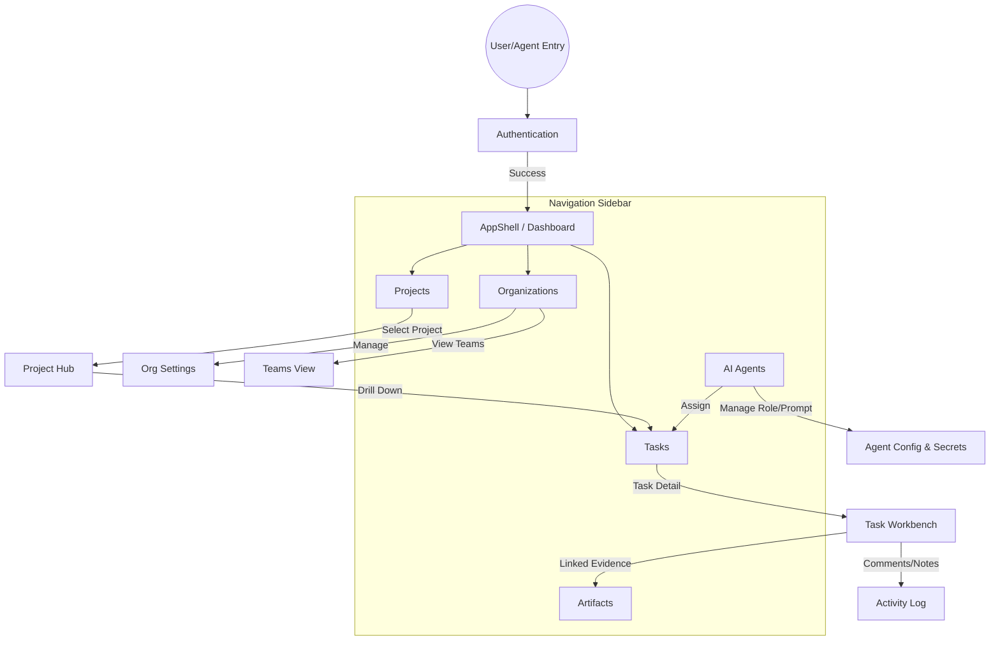

# Global Navigation Flow

This document serves as the programmatic architectural map of the Tasker application. UI/UX Agentic workflows MUST reference this flow before designing new views to understand where the new feature is anchored hierarchically.

## 1. Domain Entities & Route Map

Below is the authoritative map of the `AppShell` side navigation and core application routing paths.

## 2. Navigational Rules

1. **AppShell Confinement**: All core business operations (everything beneath Auth) MUST render inside the main content pane of the AppShell wrapper, preserving the Sidebar state.
2. **Context Retention**: Drilling down into a nested resource (e.g., clicking a specific Task inside a Project) updates the main pane URL (`/projects/xyz/tasks/123`), but the top-level sidebar highlight must accurately reflect the user is still within the `Projects` domain (if arriving that way) or `Tasks` domain. 
3. **No Dead Ends**: Every deep-linked detail view (`Task Workbench`, `Agent Config`) MUST embed breadcrumbs routing the user securely back to the parent container view.
