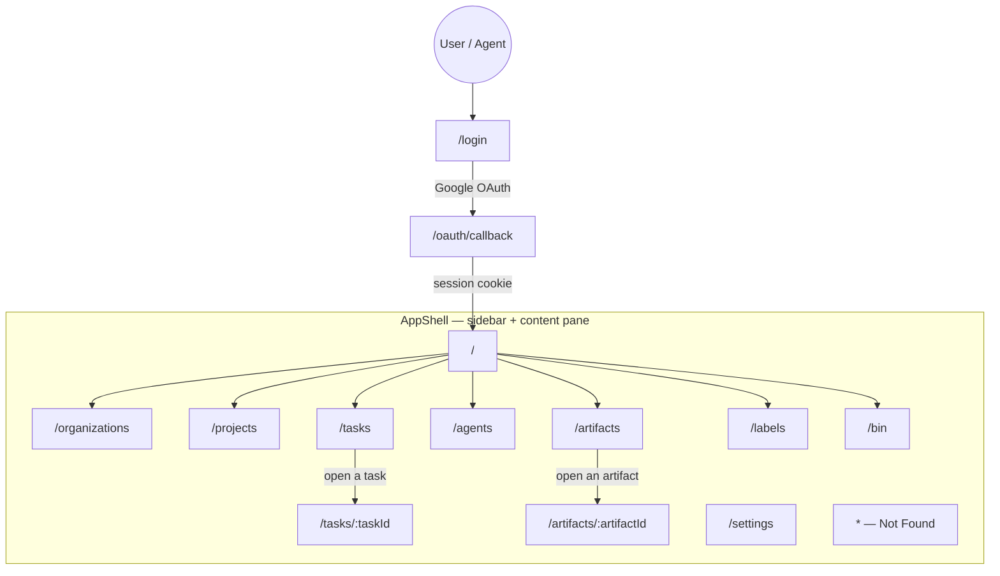

# Global Navigation Flow

The map of routes the application actually serves. A UI/UX workflow reads this
before designing a view, to find where the feature is anchored.

Every node in the diagram below is a **route declared in
`apps/gui/src/App.tsx`**. Concepts that are not routes — a tab, a panel, a
modal — are described in prose under §3 and deliberately kept out of the
diagram, because a map whose nodes are not addresses is not a map.

Rules describing behaviour that does not exist are in §4, labelled with the
milestone that owns building them. They are requirements, not descriptions.

## 1. Route map

```mermaid
graph TD
    Entry((User / Agent)) --> Login["/login"]
    Login -->|Google OAuth| Callback["/oauth/callback"]
    Callback -->|session cookie| Root["/"]

    subgraph Shell["AppShell — sidebar + content pane"]
        Root
        Orgs["/organizations"]
        Projects["/projects"]
        Tasks["/tasks"]
        TaskDetail["/tasks/:taskId"]
        Agents["/agents"]
        Artifacts["/artifacts"]
        ArtifactDetail["/artifacts/:artifactId"]
        Labels["/labels"]
        Bin["/bin"]
        Settings["/settings"]
        NotFound["* — Not Found"]
    end

    Root --> Orgs
    Root --> Projects
    Root --> Tasks
    Root --> Agents
    Root --> Artifacts
    Root --> Labels
    Root --> Bin

    Tasks -->|open a task| TaskDetail
    Artifacts -->|open an artifact| ArtifactDetail
```

## 2. Route table

Authoritative. `App.tsx` is the source; this table mirrors it.

| Route | Component | Reached from |
|---|---|---|
| `/login` | `pages/Login` | unauthenticated entry — the only route outside `ProtectedRoute` |
| `/oauth/callback` | `pages/OAuthCallback` | Google redirect |
| `/` | `pages/Dashboard` | sidebar |
| `/organizations` | `features/Organizations` | sidebar |
| `/projects` | `features/Projects` | sidebar |
| `/tasks` | `features/Tasks` | sidebar |
| `/tasks/:taskId` | `features/Tasks` | clicking a task, or a direct link |
| `/agents` | `features/Agents` | sidebar |
| `/artifacts` | `features/Artifacts` | sidebar |
| `/artifacts/:artifactId` | `features/Artifacts` | clicking an artifact, or a direct link |
| `/labels` | `features/Labels` | sidebar |
| `/bin` | `features/Bin` | sidebar |
| `/settings` | `GenericPlaceholder` | **nothing links to it** — see §3 |
| `*` | `pages/NotFound` | any unknown URL, inside the shell |

The sidebar carries eight items (`components/layout/AppShell.tsx:22-29`):
Dashboard, Organizations, Projects, Tasks, AI Agents, Artifacts, Labels, Bin.
Active state matches on exact path, or prefix for everything but `/`
(`AppShell.tsx:75`).

## 3. What is not a route

These exist as views, but not as addresses. They cannot be linked to, and a
reload returns to the parent's default state.

- **Organizations sections.** `features/Organizations/index.tsx:20` declares
  `type Section = 'organizations' | 'members'`, switched by local `useState`.
  "Org Settings" and a "Teams View" appeared in an earlier version of this
  document as though they were destinations; neither is a route and Teams does
  not exist at all — teams are **M10**.
- **Task detail** is a URL (`/tasks/:taskId`) but renders as an overlay inside
  `features/Tasks`, not a separate page.
- **Project detail.** There is no `/projects/:projectId` route. A "Project Hub"
  was described in an earlier version; it is unbuilt, and GUI/API parity is
  **M05**.
- **Agent configuration.** No `/agents/:agentId` route. Agent role and prompt
  editing happens inside `features/Agents`.
- **`/settings` is orphaned.** The route resolves and renders a
  `GenericPlaceholder`; no link in the application points at it. Either give it
  an entry point or delete the route — **M05** owns the call.

## 4. Navigational rules

### Enforced today

1. **Shell confinement.** Every route except `/login` renders inside
   `ProtectedRoute` → `AppShell`, so the sidebar persists across navigation
   (`App.tsx:21-46`).
2. **No dead ends by URL.** An unknown path inside the shell renders
   `pages/NotFound` with a route back, never an empty pane (`App.tsx:43`).
3. **Deep links resolve.** `/tasks/:taskId` and `/artifacts/:artifactId` open
   their detail view from a cold load; the open entity is in the URL rather than
   in component state.

### Required, not built — **M06** owns these

M06 is the UX, design-system and accessibility milestone. Both rules below were
written in the present tense in an earlier version of this document, describing
behaviour no component implements.

1. **Breadcrumbs on every detail view.** There is **no breadcrumb component in
   the repository** — `grep -i breadcrumb apps/gui/src` returns nothing. A
   deep-linked task today shows no path back to a parent other than the sidebar.
2. **Context retention across a drill-down.** The earlier rule cited
   `/projects/xyz/tasks/123` and required the sidebar to keep highlighting
   `Projects` when arriving that way. **No nested route of that shape exists**,
   so there is no context to retain. This becomes a real requirement only once
   M05 builds project-scoped routes; until then the rule describes a URL the
   router would answer with Not Found.
