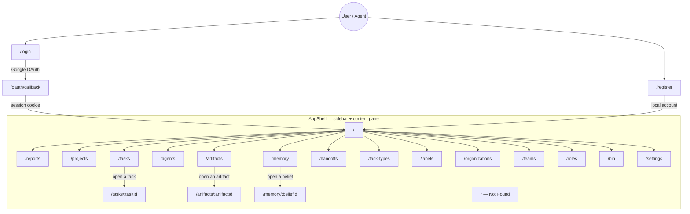

# Global Navigation Flow

The map of routes the application actually serves. A UI/UX workflow reads this
before designing a view, to find where the feature is anchored.

Every node in the diagram below is a **route declared in
`apps/gui/src/App.tsx`**. Concepts that are not routes — a tab, a panel, a
modal — are described in prose under §3 and deliberately kept out of the
diagram, because a map whose nodes are not addresses is not a map.

§4 separates rules the application enforces today from requirements nothing
implements yet. Every numbered milestone is now closed, so an unbuilt
requirement names no owner — it is unscheduled, not queued.

**Every route below is scoped by query parameter.** The active organization
and project travel in the URL as `?org=…&project=…` (M28, ADR-0025), so a
link carries the scope it was taken in and reopens the same thing for whoever
follows it. The layout store still holds the scope for screens to read; the
URL is what fills it, in one direction. Screens that keep their own
navigational state put it alongside — Bin's `?tab=`, Organizations'
`?section=`, Memory's `?scope=`. Transient editing state is deliberately
*not* in the URL: an open inline-edit form is paired with unsaved draft text
the URL does not carry, so restoring the id without the draft is worse than
not restoring it.

## 1. Route map

```mermaid
graph TD
    Entry((User / Agent)) --> Login["/login"]
    Entry --> Register["/register"]
    Login -->|Google OAuth| Callback["/oauth/callback"]
    Callback -->|session cookie| Root["/"]
    Register -->|local account| Root

    subgraph Shell["AppShell — sidebar + content pane"]
        Root
        Reports["/reports"]
        Projects["/projects"]
        Tasks["/tasks"]
        TaskDetail["/tasks/:taskId"]
        Agents["/agents"]
        Artifacts["/artifacts"]
        ArtifactDetail["/artifacts/:artifactId"]
        Memory["/memory"]
        BeliefDetail["/memory/:beliefId"]
        Handoffs["/handoffs"]
        TaskTypes["/task-types"]
        Labels["/labels"]
        Orgs["/organizations"]
        Teams["/teams"]
        Roles["/roles"]
        Bin["/bin"]
        Settings["/settings"]
        NotFound["* — Not Found"]
    end

    Root --> Reports
    Root --> Projects
    Root --> Tasks
    Root --> Agents
    Root --> Artifacts
    Root --> Memory
    Root --> Handoffs
    Root --> TaskTypes
    Root --> Labels
    Root --> Orgs
    Root --> Teams
    Root --> Roles
    Root --> Bin
    Root --> Settings

    Tasks -->|open a task| TaskDetail
    Artifacts -->|open an artifact| ArtifactDetail
    Memory -->|open a belief| BeliefDetail
```

## 2. Route table

Authoritative. `App.tsx` is the source; this table mirrors it, and every route
declared there appears here.

| Route | Component | Reached from |
|---|---|---|
| `/login` | `pages/Login` | unauthenticated entry — outside `ProtectedRoute` |
| `/register` | `pages/Register` | the sign-in screen's "create an account" link — local username/password accounts (M13) |
| `/oauth/callback` | `pages/OAuthCallback` | Google redirect |
| `/` | `pages/Dashboard` | sidebar (Workspace) |
| `/reports` | `features/Reports` | sidebar (Workspace), and the Dashboard's "View project reports" cross-link — project-scoped exception panels, fleet scorecard and trend charts (M24) |
| `/projects` | `features/Projects` | sidebar (Workspace) |
| `/tasks` | `features/Tasks` | sidebar (Workspace) |
| `/tasks/:taskId` | `features/Tasks` | clicking a task, or a direct link |
| `/agents` | `features/Agents` | sidebar (Workspace) |
| `/artifacts` | `features/Artifacts` | sidebar (Workspace) |
| `/artifacts/:artifactId` | `features/Artifacts` | clicking an artifact, or a direct link |
| `/memory` | `features/Memory` | sidebar (Workspace) — the shared belief store (M21) |
| `/memory/:beliefId` | `features/Memory` | clicking a belief, or a direct link |
| `/handoffs` | `features/Handoffs` | sidebar (Workspace) — cross-task handoff notes (M22) |
| `/task-types` | `features/TaskTypes` | sidebar (Configuration) |
| `/task-types/:typeId` | `features/TaskTypes` | clicking a task type, or a direct link |
| `/labels` | `features/Labels` | sidebar (Configuration) |
| `/organizations` | `features/Organizations` | sidebar (Configuration) |
| `/teams` | `features/Teams` | sidebar (Configuration) — teams below the organization (M10) |
| `/roles` | `features/Roles` | sidebar (Configuration) — the role/permission matrix (M10) |
| `/bin` | `features/Bin` | sidebar (Configuration) |
| `/settings` | `pages/SystemHealth` | sidebar (Configuration) |
| `*` | `pages/NotFound` | any unknown URL, inside the shell |

The sidebar's items live in two groups (`components/layout/AppShell.tsx`,
`NAV_GROUPS`): **Workspace** — Dashboard, Reports, Projects, Tasks, AI Agents,
Artifacts, Memory, Handoffs — and **Configuration** — Task Types, Labels,
Organizations, Teams, Roles, Bin, Settings. Active state matches on exact
path, or prefix for everything but `/`.

## 3. What is not a route

These exist as views, but not as addresses. They cannot be linked to, and a
reload returns to the parent's default state.

- **Organizations sections.** `features/Organizations/index.tsx` declares
  `type Section = 'organizations' | 'members'`, switched by local `useState`.
  Teams are a separate route (`/teams`), not a section here.
- **Task detail** is a URL (`/tasks/:taskId`) but renders as an overlay inside
  `features/Tasks`, not a separate page.
- **Project detail.** There is no `/projects/:projectId` route, deliberately:
  the decision was to enrich the list screen rather than add a hub page. A
  "Project Hub" described in an earlier revision of this document was never
  built and is not planned.
- **Agent configuration.** No `/agents/:agentId` route. Agent role and prompt
  editing happens inside `features/Agents`.
- **Notifications.** The bell (`components/layout/NotificationBell.tsx`, M29)
  is a dropdown in the shell, not a screen — there is no `/notifications`
  route and opening it does not change the URL. Each notification *links* to a
  route, carrying its own `?org=`/`?project=` (ADR-0025), so the destination is
  addressable even though the list is not. It is mounted twice, in the
  `md:hidden` header and in the desktop sidebar block, because the two are
  never visible together.

## 4. Navigational rules

### Enforced today

1. **Shell confinement.** Every route except `/login` and `/register` renders
   inside `ProtectedRoute` → `AppShell`, so the sidebar persists across
   navigation (`App.tsx`).
2. **No dead ends by URL.** An unknown path inside the shell renders
   `pages/NotFound` with a route back, never an empty pane.
3. **Deep links resolve.** `/tasks/:taskId`, `/artifacts/:artifactId` and
   `/memory/:beliefId` open their detail view from a cold load; the open
   entity is in the URL rather than in component state.
4. **Breadcrumbs on every deep-linkable detail view.**
   `components/layout/Breadcrumbs.tsx` is mounted by all four screens that
   have one — Tasks, Artifacts, Memory and Task Types — so an entity reached
   by a cold link shows a path back rather than only the sidebar. Every
   ancestor link in a trail carries the scope (M28); a crumb that dropped it
   would land you in whichever project the switcher auto-selects, which is
   the bug M28-T08 found and fixed.
   No trail names an *organization*: there is no `getOrg`-by-id RPC, so an
   org's name is not resolvable from an id anywhere in the GUI. See
   `hooks/useScopeLabels.ts`.
5. **A URL is portable.** Copying one out of the address bar and opening it
   in a different session shows the same scope and the same content, rather
   than resolving against the recipient's last-used project. Proven by
   `tests/e2e/addressable.spec.ts` across two browser contexts.

### Required, not built — unowned

1. **Context retention across a drill-down.** An earlier revision cited
   `/projects/xyz/tasks/123` and required the sidebar to keep highlighting
   Projects when arriving that way. **No nested route of that shape exists**,
   so there is no context to retain, and none is planned — see §3's note on
   project detail. The rule becomes real only if project-scoped routes are
   ever built; until then it describes a URL the router would answer with Not
   Found.
