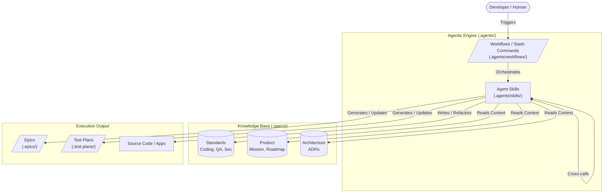

# Agentic & Autonomous Development System

This document outlines the architecture, workflows, skills, and specification systems that power the agentic and autonomous development lifecycle in this repository. 

Our system embraces the paradigm of Large Language Models (LLMs) and specialized autonomous agents driving the software development lifecycle from ideation and architectural design directly through to deployment. By keeping state localized, cleanly separated, and highly declarative, AI output is predictable, easily reviewable, and scalable.

## System Overview

The agentic operation is divided into three primary components:

1. **Specifications (`.specs/`)**: The declarative source of truth for product vision, technical stack, and coding/quality standards.
2. **Workflows (`.agents/workflows/`)**: Step-by-step orchestrations that guide agents (and humans) through specific multi-step development lifecycles.
3. **Skills (`.agents/skills/`)**: Distinct, specialized, and highly-focused capabilities granted to agents to execute tasks.

---

## 1. Specifications (`.specs/`)

The `.specs/` directory holds the project's declarative facts. Agents read this folder to understand project constraints, establish context, and ensure their implementation matches your team's exact specifications. 

- **Product (`.specs/product/`)**: The foundational product documents governing *what* we are building and *how* progress is tracked. It includes:
  - `mission.md`: High-level product vision, core objectives, and user personas.
  - `roadmap.md`: Currently active milestones, planned features, and timeline goals.
  - `tech-stack.md`: The explicit, exhaustive list of approved frameworks, libraries, and tools. This file strictly prevents code-generation agents from hallucinating unauthorized or random dependencies into the project.
  - `workflow.yml`: Global configuration for agent workflows (e.g., dictating where automated review artifacts are stored or pipeline behaviors).
  - `work-ledger.yml`: The strategic router for project management. This file maintains the authoritative tracking configuration for artifacts. It explicitly dictates whether Epics, Architectural Decisions (ADRs), or Test Plans are managed locally within the Git repository or handled via an external tracker (like Jira, Linear, or Trello). Agents use the `/work-ledger-define` skill to configure this, ensuring they dynamically resolve the system-of-record before reading or writing project management files.
- **Standards (`.specs/standards/`)**: Formalized rules applied to AI agents during generation. Includes `coding-standard.md`, `testing-standard.md`, `security-standard.md`, etc.
- **Architecture**: Contains system design boundaries, C4/DDD boundaries, and Architecture Decision Records (ADRs).

---

## 2. Workflows (`.agents/workflows/`)

Workflows are human-readable (and agent-executable) orchestrations of large processes. Every workflow exists as a structurally distinct `.md` file mapping to a `/slash-command` (e.g., `/epic-implement`).

**System Adaptability**: Currently, these lightweight slash-command workflows are optimized specifically to be executed by the **Antigravity** agentic ecosystem. However, because they are written as pure Markdown playbooks rather than explicit Python or Node scripts, they can be trivially extended or adapted to plug into *any* AI coding agent or IDE that supports custom slash commands.

Rather than chaining complex steps, a Workflow in this architecture acts primarily as an explicit **1:1 forwarder** to a specific Skill. It serves as an optimization for Antigravity, providing a dedicated slash command that intentionally triggers an isolated capability (e.g., typing `/epic-implement` directly forwards the execution context to the `epic-implement` Skill).

**Key Workflows:**
- **Product Planning**: `/product-plan`
- **Epic Lifecycle**: 
  - *Interactive Mode* (requires human-in-the-loop QA via terminal): `/epic-define`, `/epic-design`, `/epic-implement`, `/epic-implement-review`
  - *Autonomous Mode* (zero-shot full execution): `/epic-define-auto`, `/epic-design-auto`, `/epic-implement-auto`, `/epic-implement-review-auto`
- **Quality & Assurance**: `/code-review`, `/architecture-review`
- **System Evolution**: `/standards-discover`, `/standards-inject`

---

## 3. Skills (`.agents/skills/`)

Skills are the foundational execution blocks of our agentic system. Located in `.agents/skills/`, each skill is a self-contained directory with a highly token-efficient `SKILL.md` file.

**Universal Portability**: Unlike proprietary agent ecosystems locked behind hardcoded framework boundaries (like Python Langchain scripts), this skills architecture is universally portable. Because a skill is simply a structured Markdown file (Role, Goal, Constraints, Instructions, Output Format), it can be injected into *any* modern LLM system or AI coding agent (e.g., Antigravity, Claude Code, Cursor, Codex, Copilot Workspaces, Aider) and function with identical predictability.

These files use strict markdown structure to provide bulletproof framing for LLM personas, regardless of the underlying execution engine.

### Core Skill Categories

- **Planning & Shaping**: Building structural foundations. `/product-plan` establishes base product docs, `/spec-shape` shapes technical approaches for complex features, and `/qa-plan-define` structures strict Given/When/Then test plans.
- **Epic Management**: Creating, parsing, and progressing features inside `.epics/`.
- **Design & Architecture**: Shaping technical specs and boundaries via `/architecture-create`.
- **Implementation**: Translating specs into functional code while strictly adhering to your `coding-standard.md`.
- **Review & QA**: Autonomous verification of code against standards, security vulnerabilities, and generated test plans.
- **Standards Management**: Maintaining project rules. `/standards-discover` extracts tribal knowledge into codified rules, `/standards-index` catalogs them, and `/standards-inject` strictly enforces them inside an agent's context.
- **Meta-Skills**: Self-improving skills like `/skill-create` (to bootstrap a new agent tool) or `/skill-optimize` (to compress and optimize an existing prompt).

---

## 4. The Standards & Planning System

The system guarantees high code quality and architectural uniformity through a strict Standards & Planning pipeline. Rather than dumping a massive set of rules into every prompt (which wastes tokens and degrades LLM performance), the project embraces *Just-In-Time* context.

### The Planning & Shaping Flow
Jumping straight into implementation code on a fresh Epic always leads to sprawling, non-cohesive output. Instead, tasks are first shaped and bound by contracts:
1. **Analyze Requirements**: Agents scope out technical boundaries and structural requirements during `/spec-shape` or architectural design phases.
2. **Define Test Agreements**: Triggering `/qa-plan-define` (or its auto variant) forces the agent to read the Epic and generate a rigid `TEST-PLAN.md` utilizing pure Given/When/Then scenarios.
3. **Contractual Binding**: This establishes a verified test contract. When the `/epic-implement` agent begins writing business logic, it operates entirely within the boundaries of those exact, pre-approved test cases.

### Discovering, Defining, and Indexing Standards
Tribal knowledge is poison to autonomous agents. Agents cannot read the minds of senior developers; they can only read `.specs/`. The system manages this via the `/standards-*` toolchain:
- **Discover (`/standards-discover`)**: Commands an agent to scan existing codebase files, identify repeating structural patterns or undocumented conventions, and automatically propose them as a codified markdown rule.
- **Define**: Developers (or agents) draft new rules as concise markdown files (e.g., `security-standard.md`) and place them inside `.specs/standards/`.
- **Index (`/standards-index`)**: After a standard is created or modified, this tool rebuilds a central `index.yml` file. This index registers the names, intents, and metadata of all active standards, acting as a lightweight, scannable catalog.

### Token-Efficient Injection (`/standards-inject`)
Passing thousands of lines of company standards to an LLM for every minor task is expensive and causes severe "lost-in-the-middle" hallucinations. Instead, the ecosystem relies on token-efficient injection:
1. **Context Assessment**: When an execution agent begins a task (like building a user interface component), it first reads the extremely lightweight `index.yml` catalog.
2. **Targeted Selection**: It determines which specific standard domains apply to its immediate task (e.g., it proactively selects `front-end-standard.md` and `ui-ux-standard.md`, while ignoring `database-standard.md`).
3. **Focused Injection**: Through `/standards-inject`, only the contents of the directly applicable standards are loaded into the active context window. This restricts the LLM's focus entirely to highly relevant constraints with maximal token efficiency.

---

## 5. Development Lifecycle (The Autonomous Epic Journey)

A standout feature of this system is the full separation of the Epic lifecycle into discrete, reviewable state transitions capable of being run entirely autonomously. 

```mermaid
stateDiagram-v2
    [*] --> EpicDefine: Product Idea / Requirement
    
    state EpicDefine {
        [*] --> DraftEpic : /epic-define-auto
        DraftEpic --> EpicReady : Human Review / Approval
    }
    
    EpicDefine --> EpicDesign : Approved Epic
    
    state EpicDesign {
        [*] --> Architecture : /architecture-create-auto
        Architecture --> UXDesign : /ux-design-auto
        UXDesign --> TestPlan : /qa-plan-define-auto
        TestPlan --> DesignReview : /epic-design-review-auto
    }
    
    EpicDesign --> EpicImplement : Approved Design
    
    state EpicImplement {
        [*] --> WriteCode : /epic-implement-auto
        WriteCode --> FixLints : standard-inject
    }
    
    EpicImplement --> EpicReview : Implementation Complete
    
    state EpicReview {
        [*] --> CodeReview : /code-review-auto
        CodeReview --> ArchReview : /architecture-code-review-auto
        ArchReview --> QAReview : /qa-implement-review-auto
        QAReview --> SecurityReview : /security-review-auto
    }
    
    EpicReview --> [*] : Merged & Deployed
```

### Walkthrough of the Autonomous Flow

1. **Ideation (`/epic-define-auto`)**: The agent uses product roadmaps and a user prompt to mint a new `EPIC-xxxx-feature` folder.
2. **Design (`/epic-design-auto`)**: The agent expands the Epic into tangible design artifacts including ADRs, UI/UX boundaries, and a highly explicit `TEST-PLAN.md`.
3. **Implementation (`/epic-implement-auto`)**: A specialized coding agent executes the task breakdown strictly adhering to `.specs/standards/`.
4. **Review (`/epic-implement-review-auto`)**: Quality assurance agents verify the implementation against architectural guardrails, security standards, and the original test plan prior to completion.

This ecosystem guarantees that code is not merely generated but actively architected, scrutinized, and continuously validated against persistent truth documents.

---

## 6. Customizing and Extending the System

This system is built to be modular and highly adaptable. Altering agent behavior rarely involves writing framework code; instead, you update declarative Markdown and YAML files.

- **Creating a New Standard**: Simply add a new `.md` file to `.specs/standards/` (e.g., `accessibility-standard.md`) and trigger the `/standards-index` skill to register it. Agents will immediately begin adhering to it in subsequent operations.
- **Adding a New Agent Skill**: Run the `/skill-create` command. The parent system will auto-scaffold a new agent directory and a token-efficient `SKILL.md` inside `.agents/skills/`. You then define the new agent's capabilities in the Instructions block.
- **Defining Custom Workflows**: To orchestrate skills into a reusable playbook, create a new Markdown file in `.agents/workflows/`. You can specify a sequence of slash commands, turning human processes into predictable, one-click pipelines.

By isolating rules into **Specs**, encapsulating capabilities into **Skills**, and orchestrating them via **Workflows**, your development system maintains high AI autonomy without ever sacrificing human oversight or predictability.
