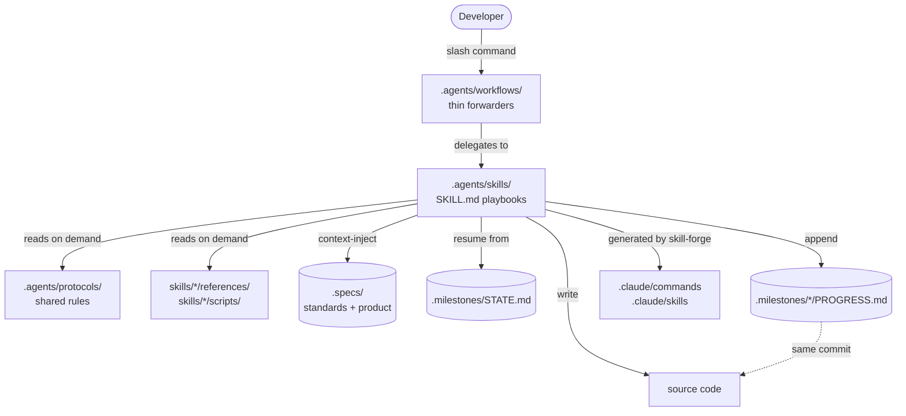

# The Agent Harness

How this repository is built by agents, and how the harness that drives them is
itself maintained.

Everything here is declarative Markdown and YAML. There is no framework to
install, no runtime to boot, and nothing is locked to one vendor's agent.

---

## 1. The four layers

| Layer | Path | Answers |
| --- | --- | --- |
| **Specs** | `.specs/` | What are the rules, and what are we building? |
| **Milestones** | `.milestones/` | Where does the work currently stand? |
| **Skills** | `.agents/skills/` | How is a specific job done? |
| **Workflows** | `.agents/workflows/` | What does the user type to start it? |

Two supporting layers make those four work:

| Layer | Path | Answers |
| --- | --- | --- |
| **Protocols** | `.agents/protocols/` | What rules do several skills share? |
| **Adapters** | `.claude/` | How does a host that does not read `.agents/` find any of this? |


```mermaid
graph TD
    User([Developer]) -->|slash command| WF[".agents/workflows/<br/>thin forwarders"]
    WF -->|delegates to| SK[".agents/skills/<br/>SKILL.md playbooks"]
    SK -->|reads on demand| PR[".agents/protocols/<br/>shared rules"]
    SK -->|reads on demand| RF["skills/*/references/<br/>skills/*/scripts/"]

    SK -->|context-inject| SPEC[(".specs/<br/>standards + product")]
    SK -->|resume from| STATE[(".milestones/STATE.md")]
    SK -->|append| JOURNAL[(".milestones/*/PROGRESS.md")]
    SK -->|write| CODE["source code"]
    JOURNAL -.->|same commit| CODE

    SK -->|generated by skill-forge| AD[".claude/commands<br/>.claude/skills"]
```

---

## 2. Progressive disclosure

The harness is layered so a token is spent only when it is about to be used.

| Tier | Content | Loaded |
| --- | --- | --- |
| **0** | Every skill's `name` + `description` | Always, every turn |
| **1** | The invoked skill's `SKILL.md` body | When that skill runs |
| **2** | `references/`, `scripts/`, `.agents/protocols/`, `.specs/standards/` | Only when tier 1 says to read it |

This is what keeps a comprehensive system cheap. Tier 0 is the routing table:
a description must let the model decide *whether* the skill applies without
reading anything else, which is why `description` is two parts — what it does,
then `Use when <concrete trigger>`.

Tier 1 carries the common path and nothing more. Anything that runs once per
milestone rather than once per task belongs in tier 2. Tier 2 is **referenced,
never inlined** — a copied reference is a second copy that drifts.

The budgets and the rest of the contract live in
[`.agents/protocols/skill-authoring.md`](.agents/protocols/skill-authoring.md),
and `skill-forge` enforces every one of them deterministically.

---

## 3. Portability

`.agents/` is canonical because two of the three target hosts read it natively.

| Host | Skills | Slash commands | Always-on rules |
| --- | --- | --- | --- |
| **Codex CLI** | `.agents/skills/<name>/SKILL.md` — native | via skills | `AGENTS.md` |
| **Antigravity** | `.agents/skills/` — native | `.agents/workflows/*.md` | `.agents/rules/` |
| **Claude Code** | `.claude/skills/<name>/SKILL.md` | `.claude/commands/<name>.md` | `AGENTS.md` / `CLAUDE.md` |

`AGENTS.md` is the always-on layer and the only file every host loads on every
turn. `.agents/rules/00-project.md` exists solely because Antigravity reads that
directory rather than the root file — it forwards to `AGENTS.md` and restates the
four rules that get broken most.

Claude Code does not scan `.agents/`, so its two directories are a **generated
adapter layer**: each file is a thin forwarder to the `.agents/` playbook, never a
copy of it. Regenerate with:

```bash
node .agents/skills/skill-forge/scripts/sync-adapters.mjs
```

Never hand-edit anything under `.claude/`. Fix `.agents/` and re-sync.

Two host limits shape the whole design, and both are enforced by the validator:

- **Antigravity truncates a workflow or rule file at 12,000 characters.** A longer
  skill is silently broken on that host — so 12,000 is a hard error, and 6,000 is
  a warning.
- **Codex truncates `AGENTS.md` above 32 KiB.** Keep the always-on layer small;
  it is the only text every host loads on every turn.

---

## 4. Delivery: milestones

Skills say *how* to work. Specs say *what the rules are*. Neither tells a fresh
session **where the work stands** — that is `.milestones/`.

```
.milestones/
├── STATE.md                        # entry point: active milestone, task in flight, ledger
├── MILESTONE-01-stabilize-the-build/
│   ├── MILESTONE.md                # goal, exit criteria, tasks with permanent ids
│   └── PROGRESS.md                 # append-only journal, one entry per task attempt
└── …
```

| Command | Purpose |
| --- | --- |
| `/milestone-status` | Read-only orientation, including detected drift. Cheap. |
| `/milestone-deliver [M0N]` | Deliver the next task, confirming each step. |
| `/milestone-deliver-auto [M0N]` | Deliver autonomously until done or blocked. |
| `/milestone-plan` | Add, split, re-scope or re-sequence milestones. |

**The resume contract** — three rules, non-negotiable:

1. **Atomic task commits.** Code, tests, the checked box, the journal entry and
   the `STATE.md` update land in one commit.
2. **Journal before work.** The entry is written `in-progress` *before*
   implementation starts, so an interrupted session leaves a record of what was
   underway.
3. **Never end dirty.** Uncommitted work is invisible to the next session.
   Partial work is committed as `WIP` with an `in-progress` entry.

Format: [`.specs/standards/milestone-standard.md`](.specs/standards/milestone-standard.md).

**Epics vs milestones**: a milestone task large enough to need architecture, UX
and a test plan spawns an epic and runs `/epic-run`; the epic's completion is that
task's verification. Everything else is implemented directly. `/epic-prioritize`
decides what the next epic should be when that is not obvious.

---

## 5. Standards: just-in-time, never bulk

Passing every rule to every task is expensive and causes lost-in-the-middle
failures. Instead:

1. `/standards-manage` mines the codebase for tribal knowledge, writes it as dense
   imperative bullets in `.specs/standards/`, and keeps `index.yml` exact.
2. The **routing table in `AGENTS.md` §3** maps a surface to at most two
   standards. It lives in the always-on layer on purpose: routing that requires
   reading a catalogue is routing that costs a file read, and routing that
   requires invoking a skill is routing that costs a turn. Neither is necessary
   for the common case.
3. `index.yml` remains the catalogue for surfaces the table does not name, and
   `/context-inject` handles the genuinely ambiguous case. In conversation it
   inlines the standards; in a plan or a skill it emits path references, because
   an inlined standard forks it.

The two-standard cap is deliberate. More context is not more compliance.

**Scope is per task, not per session.** A standard loaded for the previous task
does not bind the next one — re-select. Only `AGENTS.md` and
`.milestones/STATE.md` persist across a session, and a sub-agent gets paths and
its own brief, never the orchestrator's accumulated context. The failure mode is
additive loading: each step adds and nothing removes, so by the tenth step the
model reasons inside a window mostly full of rules that stopped applying at step
three. Full rules: `.agents/protocols/context-budget.md`.

---

## 6. The harness maintains itself

`/skill-forge` is the meta-skill. It creates skills, compresses bloated ones,
regenerates adapters, and audits the whole system.

```bash
node .agents/skills/skill-forge/scripts/validate.mjs
```

Deterministic, zero-dependency, and wired into `moon run :skills-check`, the
pre-commit hook and CI. It fails on:

- frontmatter that is missing, misnamed, or has a description that cannot route;
- a missing or out-of-order required section;
- a body over the host limit;
- **a referenced path that does not exist** — the class of bug that made
  `/gitnexus-watch` point at a skill that was never written;
- a workflow delegating to a skill that does not exist, or a skill no workflow reaches;
- an adapter that is missing, orphaned, or has drifted into a copy;
- a standard on disk that is missing from `index.yml`, or indexed but absent;
- shared protocol text copied into a skill instead of referenced;
- a heading that drifted (`# Execution Mode` where the schema says `# Modes`);
- an `-auto` workflow against a skill that never defines what autonomous means;
- `AskUserQuestion` used without following the autonomy protocol;
- a second lockfile inside a skill — `markdown-lint` shipped one for months.

`moon run :docs-lint` is the companion gate: every Markdown file in the harness,
the specs and the milestones, plus the Mermaid inside them. Conventions that
differ from markdownlint's defaults are recorded with their reasons in
`.markdownlint-cli2.jsonc` rather than silently ignored.

| Mode | Does |
| --- | --- |
| `audit` | Reports health. Default. Changes nothing. |
| `new` | Scaffolds a skill, after applying the quality gate. |
| `optimize` | Compresses a skill without losing a single rule. |
| `sync` | Regenerates the Claude Code adapter layer. |
| `evolve` | Turns recurring session friction into harness changes, then re-audits. |

The quality gate for a *new* skill is three questions, all of which must be yes:
could nobody work this out from public docs in five minutes; is it specific to
this repository; did discovering it take real effort? If not, it is documentation.

---

## 7. Extending the system

- **A new standard** — `/standards-manage create <topic>`. It writes the file and
  rebuilds the index in the same change.
- **A new skill** — `/skill-forge new`. It applies the quality gate, scaffolds to
  the contract, writes the workflow, generates adapters and validates.
- **A new host** — add its directory to `sync-adapters.mjs` and its parity check
  to `validate.mjs`. Never copy a playbook body; two copies diverge silently, and
  the divergence is invisible until an agent follows the stale one.

---

## 8. Layout

```
AGENTS.md                       # always-on rules, every host reads this
.agents/
├── protocols/                  # shared rules: autonomy, gates, context budget, authoring
├── skills/<name>/
│   ├── SKILL.md                # tier 1 — the playbook
│   ├── references/*.md         # tier 2 — read on demand
│   └── scripts/*               # tier 2 — deterministic work
└── workflows/<name>.md         # thin forwarder → the slash command
.claude/                        # GENERATED — do not edit
.specs/
├── product/                    # mission, roadmap, architecture, tech-stack, work-ledger
├── standards/                  # the rules + index.yml
├── design/                     # navigation, design system, layout manifest
└── specs/                      # shaped plans from /spec-shape
.milestones/                    # the delivery plan and its committed progress
.archive/                       # completed epics, test plans, council reports
```
